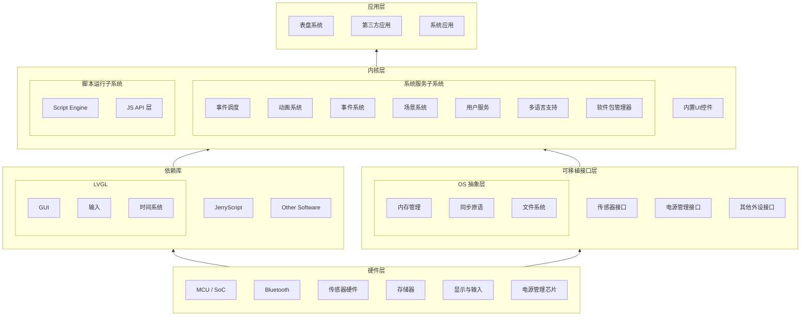

# 系统架构

ElenaOS 的系统架构图如下：

```mermaid
flowchart BT

    subgraph L1["应用层"]
        direction BT
        WATCHFACE["表盘系统"]
        APP["第三方应用"]
        SYSAPP["系统应用"]
    end

    subgraph L2["内核层"]
        direction BT

        subgraph R1["系统服务子系统"]
            direction BT
            DISPATHCER["事件调度"]
            ANIM["动画系统"]
            EVENT["事件系统"]
            SCENE["场景系统"]
            SERVICES["用户服务"]
            LANG["多语言支持"]
            PKG["软件包管理器"]
        end

        subgraph R2["脚本运行子系统"]
            direction BT
            SE["Script Engine"]
            JS_API["JS API 层"]
        end

        UI["内置UI控件"]
    end


    subgraph THIRD_PARTY["依赖库"]
        direction BT
        subgraph LVGL["LVGL"]
            GUI["GUI"]
            INPUT["输入"]
            TIME["时间系统"]
        end
        JERRYSCRIPT["JerryScript"]
        OtherSW["Other Software"]
    end


    subgraph L3["可移植接口层"]
        direction BT

        subgraph OSABS["OS 抽象层"]
            direction BT
            MEM["内存管理"]
            SEM["同步原语"]
            FS["文件系统"]
        end

        SENSOR["传感器接口"]
        POWER["电源管理接口"]
        OTHERDEVICES["其他外设接口"]
    end


    subgraph L4["硬件层"]
        direction BT
        MCU["MCU / SoC"]
        BLUETOOTH["Bluetooth"]
        SENSORS_HW["传感器硬件"]
        STORAGE["存储器"]
        DISPLAY_HW["显示与输入"]
        PMIC["电源管理芯片"]
    end


    L4 --> L3
    L4 --> THIRD_PARTY
    THIRD_PARTY --> L2
    L3 --> L2
    L2 --> L1

```
