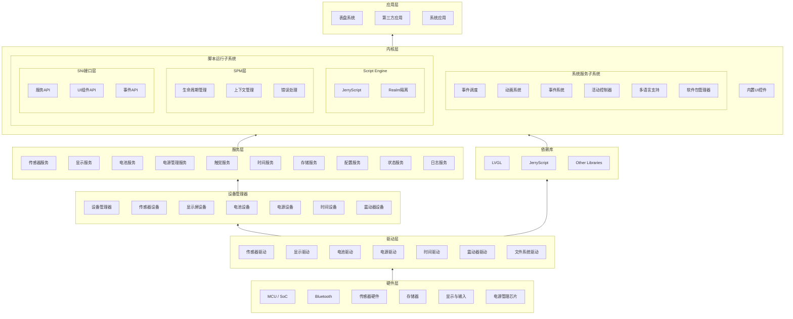
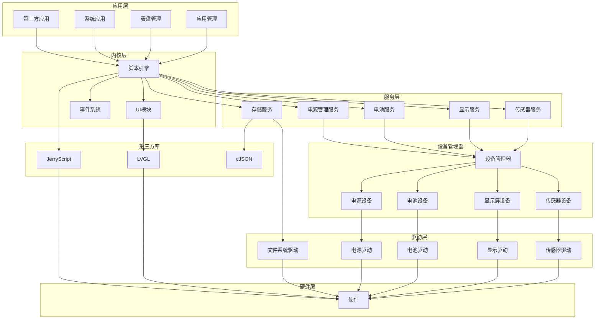
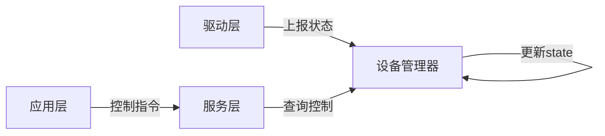
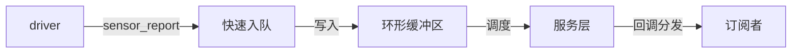
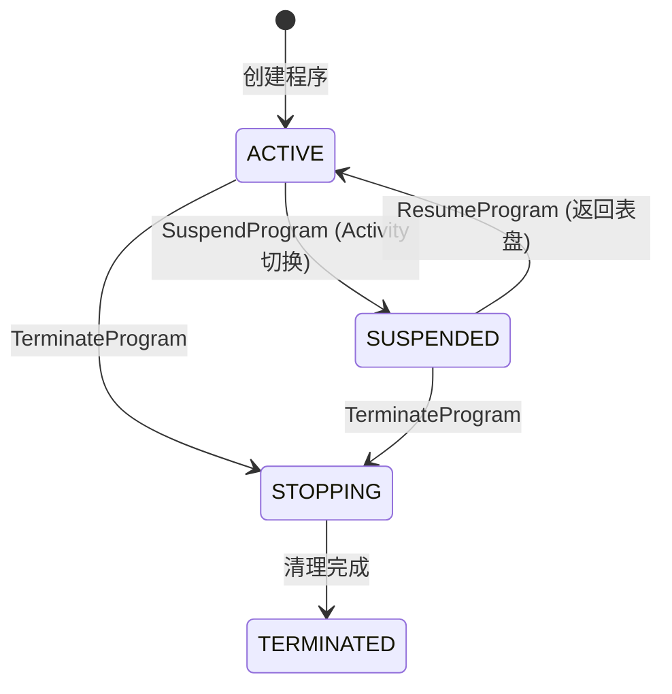

# 系统架构

## 整体架构

ElenixOS 采用分层架构设计，从底层到上层依次为硬件层、驱动层、设备管理器、服务层、框架层和应用层。系统内核功能整合到框架层中，包括脚本引擎、事件系统和 Activity 管理等核心组件。这种架构设计使得系统具有良好的可移植性和可扩展性。



## 模块依赖关系

### 核心模块依赖图



## 架构层次说明

### 1. 硬件层

硬件层包含各种硬件组件，如 MCU/SoC、蓝牙、传感器、存储器、显示屏和电源管理芯片等。这些硬件组件是 ElenixOS 运行的基础。

### 2. 驱动层

驱动层是硬件抽象的最底层，由移植方实现：
- 传感器驱动：加速度计、陀螺仪、心率传感器等
- 显示驱动：屏幕控制和显示输出
- 电池驱动：电池状态采集
- 电源驱动：电源管理芯片控制
- 文件系统驱动：存储设备访问

### 3. 设备管理器

设备管理器是上层获取设备实例的唯一路径：
- 统一管理设备实例的注册和查找
- 维护设备状态机
- 提供状态上报机制
- 支持单实例和多实例设备管理

### 4. 服务层

服务层向上提供标准 API 接口：

| 服务名称 | 功能描述 |
|---------|---------|
| 传感器服务 | 传感器采样与数据处理，支持 Pull/Push 模式 |
| 显示服务 | 屏幕亮度管理与电源控制 |
| 电池服务 | 电池状态监测与电量管理 |
| 电源管理服务 | 系统电源状态与睡眠管理 |
| 触觉服务 | 触觉反馈控制 |
| 时间服务 | 系统时间获取 |
| 存储服务 | 文件系统操作与 JSON 存储 |
| 配置服务 | 系统配置管理 |
| 状态服务 | 运行时持久化状态管理 |
| 日志服务 | 基于监听器的日志系统 |

### 5. 框架层

框架层是 ElenixOS 的核心，包含以下子系统：

- **系统服务子系统**：事件调度、动画系统、事件系统、活动控制器、多语言支持、软件包管理器等
- **脚本运行子系统**：包含三层架构
  - **核心引擎层（Script Engine）**：负责 JerryScript 的底层操作，包括 Realm 管理、编译执行、内存操作
  - **SPM层（Script Program Manager）**：作为中间层，管理程序生命周期（启动/挂起/恢复/终止）、JS回调门验证、错误快照持久化
  - **SNI接口层**：提供服务API、UI组件API、事件API等脚本接口
- **内置UI控件**：基于 LVGL 构建的各种UI组件

### 6. 应用层

应用层包含表盘系统、第三方应用和系统应用等。这些应用基于脚本引擎运行，使用 SNI 访问系统服务和UI组件。

## 核心设计原则

### 设备-服务交互原则

系统遵循"上层发控制指令，下层只做状态上报"的核心原则：



### 数据流

ElenixOS 的数据流如下：

1. **用户输入**：通过硬件层的输入设备（如触摸屏）获取用户输入
2. **事件处理**：输入事件通过驱动层传递到设备管理器
3. **状态上报**：设备管理器更新状态并通知服务层
4. **服务处理**：服务层处理业务逻辑并响应请求
5. **事件分发**：事件系统将事件分发给相应的处理程序
6. **应用响应**：应用根据事件执行相应的逻辑
7. **UI更新**：应用通过 UI 模块更新界面
8. **显示输出**：UI 模块将界面渲染到显示屏上

### 传感器数据上报流程



## 脚本执行流程

1. **脚本加载**：从文件系统加载应用或表盘的脚本文件
2. **脚本解析**：脚本引擎解析 JavaScript 代码
3. **SPM管理**：SPM层创建程序上下文，管理生命周期状态（IDLE/SUSPENDED/RUNNING）
4. **模块导入**：脚本通过 SPM 层导入所需的模块和 API
5. **脚本执行**：在 Realm 中执行脚本，通过 SPM 层调用 SNI
6. **原生调用**：SNI 调用原生代码，访问系统服务和硬件
7. **结果返回**：将执行结果通过 SPM 层返回给脚本

## 脚本程序管理器

脚本程序管理器（Script Program Manager，SPM）是脚本引擎的中间管理层，负责：

- **程序生命周期管理**：管理脚本程序的启动、挂起、恢复和终止
- **上下文保存/恢复**：支持脚本运行时上下文的保存和恢复，实现状态持久化
- **JS回调门验证**：验证 JavaScript 回调的合法性和安全性
- **错误快照持久化**：捕获脚本错误并保存快照信息，便于调试和分析
- **Realm隔离**：为每个程序提供独立的 Realm 环境，确保隔离性和安全性

### 脚本程序状态机

SPM管理的是脚本程序（Script Program）的生命周期状态：

```c
typedef enum
{
    SCRIPT_PROGRAM_STATE_TERMINATED,  // 终止态
    SCRIPT_PROGRAM_STATE_STOPPING,    // 停止中
    SCRIPT_PROGRAM_STATE_ACTIVE,      // 活跃态
    SCRIPT_PROGRAM_STATE_SUSPENDED,   // 暂停态
} script_program_state_t;
```



| 状态 | 说明 | 触发条件 |
|------|------|----------|
| **ACTIVE** | 活跃态，脚本程序存活且健康 | 创建程序 |
| **SUSPENDED** | 暂停态，程序暂停但可恢复 | Activity切换时调用 suspend() |
| **STOPPING** | 停止中，禁止调用任何回调 | 调用 terminate() |
| **TERMINATED** | 终止态，资源完全清理完成 | 清理完成 |

### 与内核状态的区别

SPM管理的是**脚本程序**的生命周期，而脚本引擎内核管理的是**单次JS执行**的状态：

| 层级 | 状态管理对象 | 关注点 |
|------|------------|--------|
| **SPM层** | 脚本程序 (Script Program) | 程序的启动/暂停/恢复/终止 |
| **Kernel层** | JS执行窗口 | 字节码的解析/执行/异常 |

内核状态机关注的是单次JS代码执行的状态转换（RUNNING/IDLE/SUSPENDED/EXCEPTION），而SPM关注的是脚本程序作为一个整体的生命周期管理。
