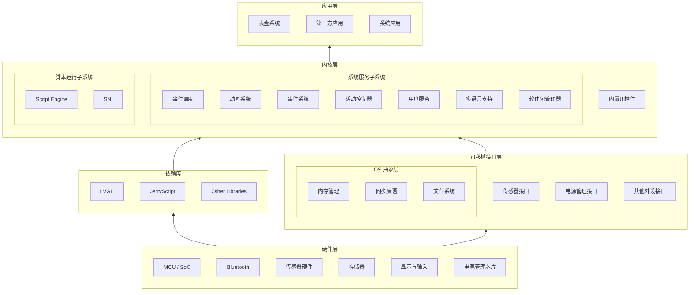
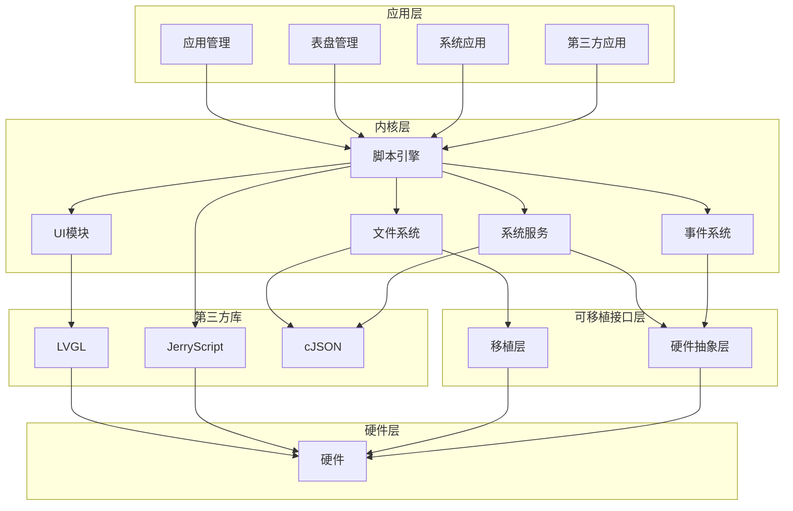

# 系统架构

## 整体架构

ElenixOS 采用分层架构设计，从底层到上层依次为硬件层、可移植接口层、内核层和应用层。这种架构设计使得系统具有良好的可移植性和可扩展性。

## 模块依赖关系

### 核心模块依赖图

## 架构层次说明

### 1. 硬件层

硬件层包含各种硬件组件，如 MCU/SoC、蓝牙、传感器、存储器、显示屏和电源管理芯片等。这些硬件组件是 ElenixOS 运行的基础。

### 2. 可移植接口层

可移植接口层提供了对硬件的抽象，包括：

- **OS 抽象层**：内存管理、同步原语、文件系统等
- **传感器接口**：统一的传感器访问接口
- **电源管理接口**：电源状态管理和控制
- **其他外设接口**：其他硬件外设的访问接口

这一层的设计使得 ElenixOS 能够在不同的硬件平台上运行，只需要实现相应的接口即可。

### 3. 内核层

内核层是 ElenixOS 的核心，包含以下子系统：

- **系统服务子系统**：事件调度、动画系统、事件系统、活动控制器、用户服务、多语言支持、软件包管理器等
- **脚本运行子系统**：脚本引擎、SNI 等
- **内置UI控件**：基于 LVGL 构建的各种UI组件

这一层实现了 ElenixOS 的核心功能，为应用层提供服务和接口。

### 4. 应用层

应用层包含表盘系统、第三方应用和系统应用等。这些应用基于脚本引擎运行，使用 SNI 访问系统服务和UI组件。

## 数据流

ElenixOS 的数据流如下：

1. **用户输入**：通过硬件层的输入设备（如触摸屏）获取用户输入
2. **事件处理**：输入事件通过可移植接口层传递到内核层的事件系统
3. **事件分发**：事件系统将事件分发给相应的处理程序
4. **应用响应**：应用根据事件执行相应的逻辑
5. **UI更新**：应用通过 UI 模块更新界面
6. **显示输出**：UI 模块将界面渲染到显示屏上

## 脚本执行流程

1. **脚本加载**：从文件系统加载应用或表盘的脚本文件
2. **脚本解析**：脚本引擎解析 JavaScript 代码
3. **模块导入**：脚本通过 ScriptEngine 导入所需的模块和 API
4. **脚本执行**：在 Realm 中执行脚本，调用 SNI
5. **原生调用**：SNI 调用原生代码，访问系统服务和硬件
6. **结果返回**：将执行结果返回给脚本

