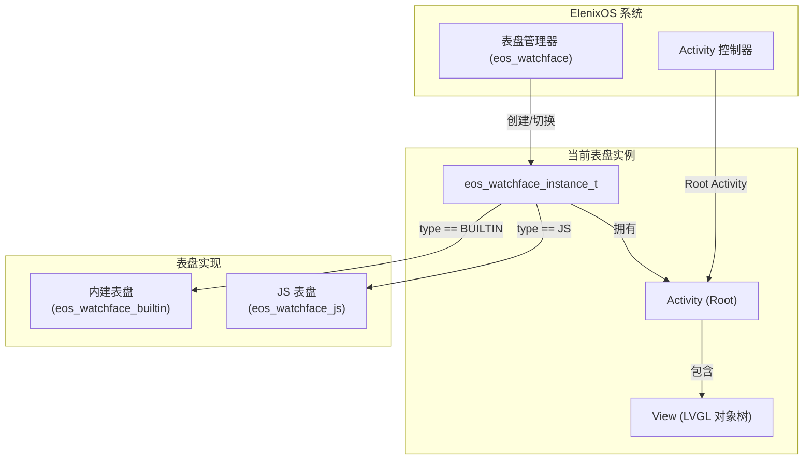
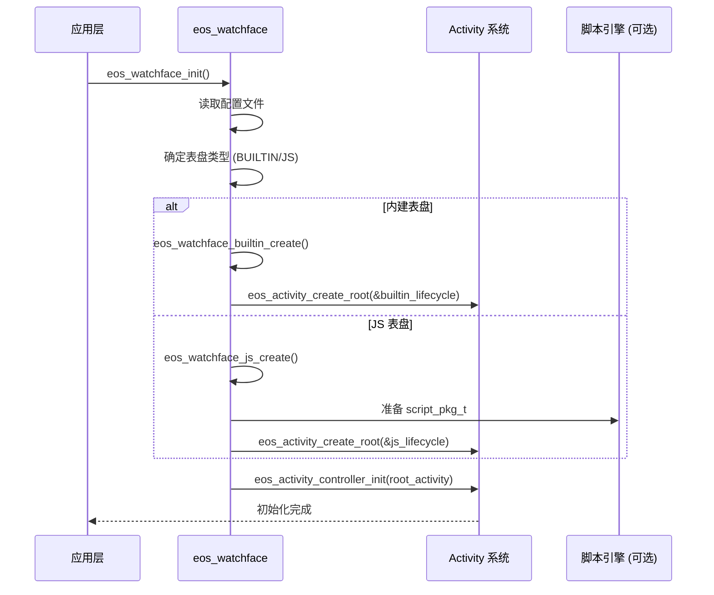
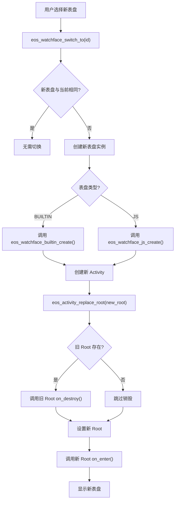
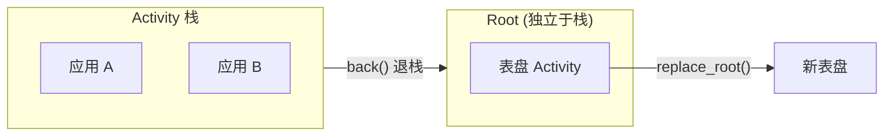
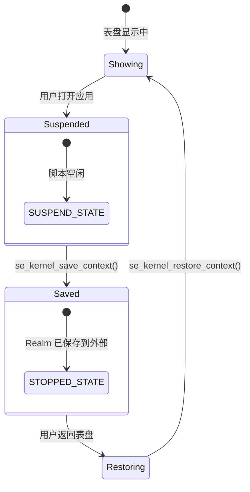

# Watchface 表盘系统

## 概述

表盘（Watchface）是 ElenixOS 的核心 UI 组件，作为系统的"首页"始终显示在屏幕上。表盘系统支持两种类型：

- **内建表盘（Builtin）**：使用 C 语言编写的备用表盘，不依赖脚本引擎
- **JS 表盘（JavaScript）**：使用 JavaScript 编写的动态表盘，通过脚本引擎运行

## 架构设计

### 表盘实例模型

每个表盘都是一个独立的 **实例（Instance）**，拥有自己的 Activity 和完整的生命周期管理：

```c
typedef struct eos_watchface_instance {
    eos_watchface_type_t type;           /**< 表盘类型 (BUILTIN/JS) */
    char id[EOS_WATCHFACE_ID_LEN_MAX];   /**< 表盘唯一标识 */

    eos_activity_t *activity;            /**< 拥有的 Activity (由实例创建和管理) */
    const eos_activity_lifecycle_t *lifecycle;  /**< Activity 生命周期回调 */

    union {
        struct {
            lv_timer_t *time_update_timer;  /**< 内建表盘的时间更新定时器 */
        } builtin;

        struct {
            script_pkg_t pkg;               /**< JS 表盘的脚本包信息 */
        } js;
    } data;
} eos_watchface_instance_t;
```

### 表盘类型枚举

```c
typedef enum {
    EOS_WATCHFACE_TYPE_BUILTIN,  /**< 内建备用表盘 */
    EOS_WATCHFACE_TYPE_JS,       /**< JavaScript 脚本表盘 */
} eos_watchface_type_t;
```

### 架构层次



## 核心功能

### 初始化流程



**代码示例**：
```c
// 初始化表盘系统（内部自动处理所有细节）
eos_result_t ret = eos_watchface_init();
if (ret != EOS_OK) {
    // 处理错误
}

// 获取表盘 Activity（用于控制器初始化）
eos_activity_t *watchface = eos_watchface_get_activity();
eos_activity_controller_init(watchface);
```

### 表盘切换机制

当用户选择新的表盘时，系统会执行完整的切换流程：



**关键 API**：
```c
/**
 * @brief 切换到指定表盘
 * @param watchface_id 目标表盘 ID
 * @note 此函数会替换 root activity 为新的表盘实例
 */
void eos_watchface_switch_to(const char *watchface_id);

/**
 * @brief 检查表盘配置是否变更并重新加载
 * @note 应在返回 root activity 时调用（例如在 on_resume 中）
 */
void eos_watchface_check_and_reload(void);
```

### 配置变更检测

表盘系统支持热重载，当配置文件发生变化时自动检测并应用：

```c
void eos_watchface_check_and_reload(void);
```

**典型使用场景**：
- 从应用返回表盘时（`on_resume` 回调中）
- 系统从睡眠唤醒时
- 用户在设置中更改了默认表盘

## 内建表盘与 JS 表盘

### 内建表盘实现

**文件**：`eos_watchface_builtin.c/h`

特点：
- 使用 `lv_timer_t` 定期更新时间显示
- 直接操作 LVGL API，无脚本引擎开销
- 作为系统 fallback，确保即使脚本引擎故障也能显示时间

**核心逻辑**：
```c
// 时间更新回调
static void builtin_time_update_cb(lv_timer_t *timer)
{
    eos_watchface_instance_t *instance = timer->user_data;
    // 更新时间显示（直接操作 LVGL 对象）
    lv_label_set_fmt(time_label, "%02d:%02d", hour, minute);
}
```

### JS 表盘实现

**文件**：`eos_watchface_js.c/h`

特点：
- 通过 `script_pkg_t` 定义脚本元数据和源码
- 使用脚本引擎的分层架构（Kernel + Manager）
- 支持上下文保存/恢复（切换应用时）

**核心逻辑**：
```c
// JS 表盘初始化
static eos_activity_t *eos_watchface_js_create(const char *watchface_id)
{
    // 1. 加载 manifest.json 获取脚本信息
    // 2. 读取 main.js 源码
    // 3. 构建 script_pkg_t 结构
    // 4. 创建 Root Activity（View 在 on_enter 中由脚本创建）

    return eos_activity_create_root(&js_lifecycle);
}
```

## 与 Activity 系统集成

### Root Activity 关系

表盘作为 **Root Activity** 具有特殊地位：



**生命周期对比**：

| 操作 | 普通 Activity | Root Activity (表盘) |
|------|--------------|---------------------|
| 创建 | `eos_activity_create()` | `eos_activity_create_root()` |
| 销毁 | `eos_activity_back()` 退栈时 | `eos_activity_replace_root()` 切换时 |
| View 创建 | 延迟（on_enter 中） | **立即**（create_root 时） |
| 持久性 | 随栈管理 | 始终存在直到被替换 |

### 上下文管理

对于 JS 表盘，切换到应用时会保存脚本上下文：



## 文件结构

```
src/framework/watchface/
├── eos_watchface.h              # 表盘系统公共接口
├── eos_watchface.c              # 表盘管理器实现
├── eos_watchface_list.c         # 表盘列表管理
├── eos_watchface_builtin.h      # 内建表盘接口
├── eos_watchface_builtin.c      # 内建表盘实现
├── eos_watchface_js.h           # JS 表盘接口
└── eos_watchface_js.c           # JS 表盘实现
```
