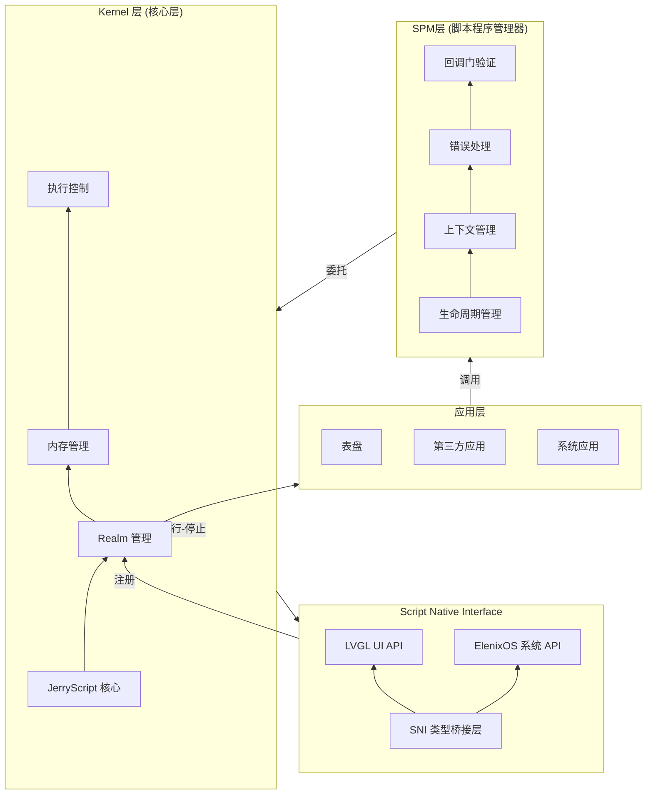
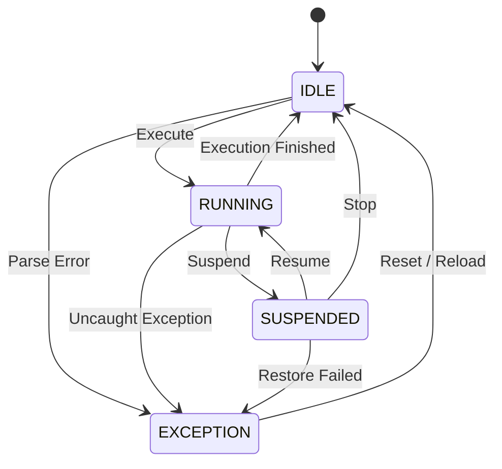
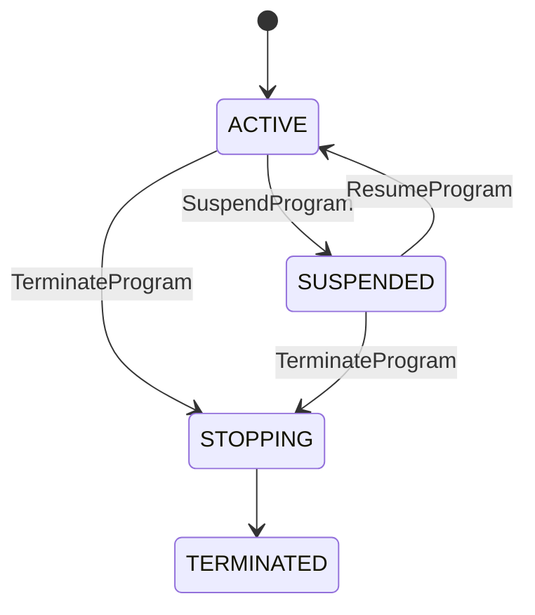
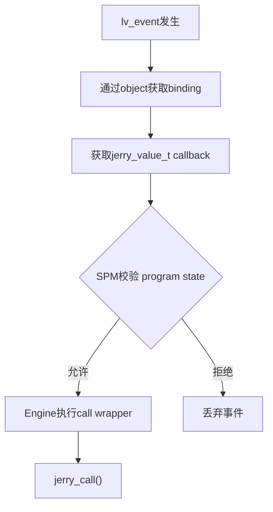
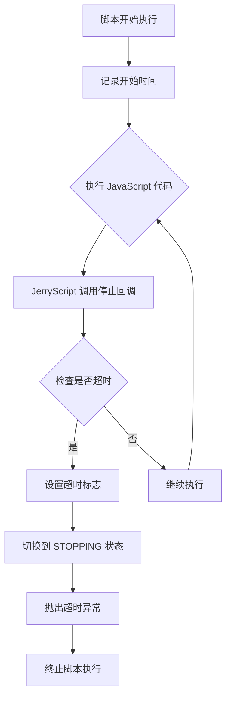
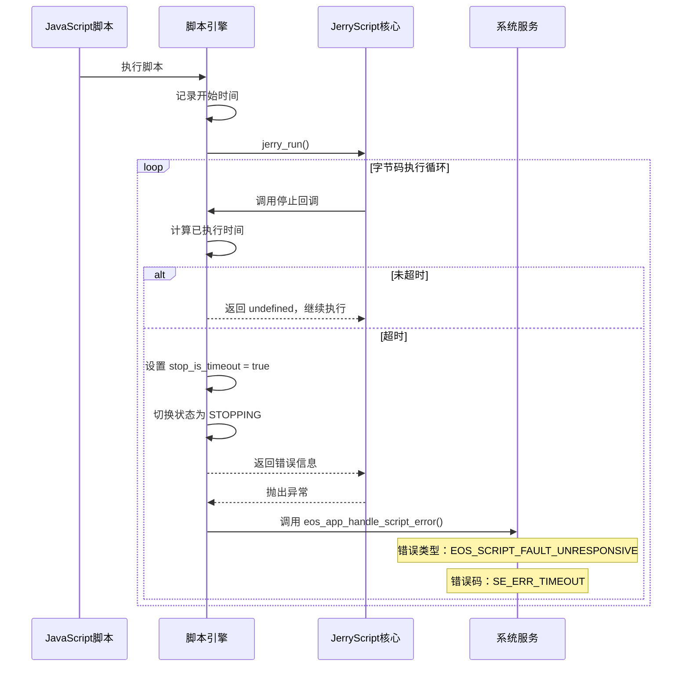

# Script Engine

## 概述

ElenixOS 的表盘与应用程序统一由脚本引擎（Script Engine）驱动，底层基于 [JerryScript](https://jerryscript.net) 对 JavaScript 代码进行编译与执行。

JerryScript 是一个轻量级的 JavaScript 引擎，旨在在资源受限的设备上运行，例如微控制器：

* 引擎可用的 RAM 很少（&lt;64 KB RAM）
* 引擎代码的 ROM 空间受限（&lt;200 KB ROM）

该引擎支持设备上的编译、执行，并提供 JavaScript 访问外设的功能。

开源地址：https://github.com/jerryscript-project/jerryscript


## 脚本引擎基础概念

脚本引擎在 ElenixOS 中负责管理 JerryScript，核心功能包括脚本解析、运行、停止以及多实例管理等。

脚本引擎可运行的最小单位是脚本程序（Script Program）。脚本程序可分为表盘（WatchFace）和应用（Application）。

```text
Script Program
├─ Application
└─ WatchFace
```

### 脚本工作目录

脚本工作目录是脚本程序开发者的工作区。最小脚本工作目录结构如下：

```text
com.elenixos.demo
├── main.js
└── manifest.json
```

即至少需要包含 `manifest.json` 和 `main.js` 两个文件。

其中：
- `main.js` 为脚本主入口；
- `manifest.json` 用于描述脚本程序的元数据。

开发者可以根据需要添加脚本模块，模块位置不受限制，只需确保 `main.js` 在导入时能够访问即可。

脚本程序只能访问其工作目录内的文件和目录，访问其他位置将被系统拦截。

### 脚本包

脚本工作目录使用打包工具 `eos_pkg_builder.py` 打包后即可生成脚本包。

打包工具会对目标目录进行结构校验，校验通过后生成脚本包。

当前脚本包仅用于分发，不包含压缩功能。

### 脚本程序的上下文

脚本程序的上下文（Context）是脚本程序一次运行的完整实例，存有 Realm、根 Activity、受控资源链表等数据。Context 是 Script Program 的运行实例，不应包含 Engine 全局状态。上下文的生命周期取决于脚本程序的类型，应用和表盘拥有不同的生命周期。

## 系统架构

脚本引擎（Script Engine）是 ElenixOS 的核心模块，负责表盘与应用程序的运行。

### 分层架构设计

脚本引擎采用**三层架构**设计，将系统分为核心层（Kernel）、SPM层（Script Program Manager）和SNI层（Script Native Interface），降低耦合度：



### 脚本引擎内核（SEC）

脚本引擎内核（Script Engine Core，SEC）负责管理 JerryScript、Realm、GC、Module、执行 JS，即负责"如何运行 JS"，它不知道 Activity、View、WatchFace、Application 这些概念。

引擎内核是单执行器模型，不支持并行执行多个脚本，内核实例必须在系统初始化阶段初始化。对应的，内核状态也只有一个。

#### 内核状态

```c
typedef enum
{
	SCRIPT_ENGINE_STATE_RUNNING,
	SCRIPT_ENGINE_STATE_IDLE,
	SCRIPT_ENGINE_STATE_SUSPENDED,
	SCRIPT_ENGINE_STATE_EXCEPTION,
} script_engine_state_t;
```

| 状态      | 名称   | 描述                                         |
| --------- | ------ | -------------------------------------------- |
| RUNNING   | 运行态 | 正在运行 JS 字节码                           |
| IDLE      | 空闲态 | `main.js` 主程序字节码执行完毕或还未开始运行 |
| SUSPENDED | 挂起态 | 脚本上下文已保存，可恢复执行                 |
| EXCEPTION | 错误态 | 存在多种异常状态                           |

可能的异常状态：
1. 字节码运行时出现未捕获的异常
2. 源代码解析为字节码时出现错误
3. 字节码运行时导致了系统级异常

异常类型会被记录到错误信息中



> [!note]
> Engine 状态仅描述"单次 JS 执行窗口状态"，不描述程序生命周期。

#### 脚本引擎运行时

运行时负责存储整个脚本引擎的全局引擎状态：

```c
typedef struct
{
	char error_info[SCRIPT_ERROR_INFO_MAX];             /**< Last run error information */
	eos_script_error_type_t error_type;  // 错误类型
    script_error_location_t error_location; /**< Error location info */
    script_error_location_t backtrace[SCRIPT_BACKTRACE_MAX_FRAMES]; /**< Error backtrace */
    uint32_t backtrace_count;     /**< Number of backtrace frames */
} script_error_t;

typedef struct  
{  
	bool initialized; 
	eos_cqueue_t *module_queue;
	script_engine_state_t state;
	script_program_t *current_program;
	jerry_value_t old_realm; // OPTIONAL 待定，需要根据 JerryScipt 判断是否需要
	
	// 脚本超时检测
	uint32_t script_start_time;   /**< Script execution start time (tick) */
    uint32_t script_timeout_ms;   /**< Script execution timeout (ms), 0 = no timeout */
	script_error_t error;	
} script_engine_runtime_t;
```

> [!warning]
> 从 `IDLE` 态到 `RUNNING` 态时必须重置 `script_start_time`
> 从 `EXCEPTION` 态到 `IDLE` 态必须重置 `error`

> [!note]
> `EXCEPTION` 表示"执行过程失败"，具体原因由 `error_type` 区分。

#### Realm 管理器

Realm 管理器是引擎内核的一个子模块，没有被分离为单独文件，但仍然持有必须的 Realm 切换 API，封装 JerryScript 的 Realm 操作，避免多处控制导致混乱。Realm Core 是轻量执行层接口，仅负责 JavaScript 运行时 Realm 的创建、销毁与切换，不包含任何生命周期语义。

Realm Manager 提供面向 Script Program 的 Realm 生命周期管理能力，并作为系统唯一 Realm 操作入口。

### 脚本程序管理器（SPM）

脚本程序管理器（Script Program Manager，SPM）负责脚本程序的启动与关闭以及多脚本程序之间的切换，最重要的，它还负责管理脚本程序的生命周期。

脚本程序管理器是一个单实例模块，内部有一个双向链表存储未停止脚本程序。

#### 脚本程序

前面已经介绍过，脚本程序包括应用和表盘。

##### 脚本程序的状态

脚本程序有如下状态：

```c
typedef enum
{
	SCRIPT_PROGRAM_STATE_TERMINATED,
	SCRIPT_PROGRAM_STATE_STOPPING,
	SCRIPT_PROGRAM_STATE_ACTIVE,
	SCRIPT_PROGRAM_STATE_SUSPENDED,
} script_program_state_t;
```

| 状态       | 名称   | 描述                                                     |
| ---------- | ------ | -------------------------------------------------------- |
| TERMINATED | 终止态 | 脚本程序已经完全终止运行，资源完全清理完成               |
| STOPPING   | 停止态 | 脚本程序正在停止，禁止调用任何回调，正在清理资源         |
| ACTIVE     | 活跃态 | 脚本程序存活且健康                                       |
| SUSPENDED  | 暂停态 | 脚本程序暂停，无法运行此程序的任何代码，但可以恢复活跃态 |



脚本程序结构体：

```c
typedef struct script_program
{
    // 双链表结构
	struct script_program *next;
	struct script_program *prev;
	
	script_pkg_type_t type;    // 脚本程序类型
	script_program_state_t state;    // 脚本程序状态
	sni_context_t *sni_ctx;    // SNI 上下文
	script_pkg_t *script;    // 脚本信息
	jerry_value_t realm;    // 持有的 Realm
	
	bool has_error;
	script_error_t error;    // 脚本错误，从内核拷贝而来保存
} script_program_t;
```

#### 程序的回调

回调是由 `jerry_call()` 实现从 C 回调到 JS 的。

**从技术实现上，`jerry_call()` 属于 Core。**
**从系统入口上，`jerry_call()` 应该经过 Program Manager。**

主要原因是 Script Core 提供脚本调用能力。

Script Program Manager 负责管理脚本程序生命周期，所有回调进入 JavaScript 前必须经过 Program Manager 校验，校验通过后再委托 Core 执行。

因此，程序管理器在调用 Core 执行前负责校验程序状态（ACTIVE / SUSPENDED 等），校验通过后委托 Core 执行 jerry_call。

### SNI 管理器

SNI 必须创建一个管理器来管理 SNI 上下文的生命周期。

SNI 上下文是多实例的，因为需要同时支持多个脚本程序存在。

SNI 管理器支持 SNI 上下文的创建与销毁。

```c
typedef struct sni_context
{
    sni_managed_resource_node_t *resource_heads[SNI_RESOURCE_CAT_COUNT];  /**< Categorized resource list heads */
    void *event_ctx_list;                                                  /**< Event callback context linked list */
	script_program_t *owner; // SNI 上下文所有者
} sni_context_t;
```

#### 事件回调

事件既不属于 Handle Object，也不属于 Value Object，JS 侧只能接收回调，无法拿到事件本身。

事件回调的核心在于从 C 调用到 JS，而这一步主要是靠回调的用户数据实现，能实现 O(1) 的时间复杂度访问。

事件绑定**用链表/双向链表统一管理（用于生命周期控制）**  
访问路径可以通过 **native_ptr / user_data / control block 实现 O(1) 定位**

事件回调只能调用程序管理器提供的 call 入口，完整路径如下：



## Realm

在 ElenixOS 中，每个脚本运行在独立的 ECMAScript Realm 中。Realm 是 ECMAScript 语言规范中的一个概念，用于实现 JavaScript 的多线程执行环境。Realm 是一个完整的 JavaScript 运行时环境，包括全局对象、内建对象、状态和 API。Realm 的作用是隔离不同脚本之间的运行环境，确保脚本之间不会互相干扰。系统将公共 API 挂载到每个 Realm 上，使脚本能够安全地访问 UI、系统服务和硬件接口，同时保持全局对象、内建对象和状态的隔离性，从而实现可靠、安全的多脚本运行时环境。

Realm 只能用于单线程环境，不能跨线程共享。每个 Realm 都有自己的全局对象和内建对象，脚本只能访问自己 Realm 中的对象，无法直接访问其他 Realm 中的对象。

## 应用

应用分为两类：
- 系统应用（System Application）
- 脚本应用（Script Application）

### 系统应用

由 C 语言编写，写入系统固件，无法被删除，无法在系统运行时动态创建。

典型的系统应用有：
- 设置（Settings）
- 手电筒（Flashlight）

### 脚本应用

由脚本语言 JS 编写，通常存储在 Flash 或其他外部存储设备中，可以被删除，在系统运行时可以动态安装与卸载。

### 应用的生命周期

应用的生命周期由脚本程序管理器全权掌控，与根 Activity 完全绑定。

#### 应用的创建

在应用创建时，脚本程序管理器为应用创建根 Activity，收集应用的脚本包信息 `script_pkg_t`（包括读取脚本源码和脚本名称等信息），然后创建脚本程序实例并初始化其 Realm。脚本程序进入 `ACTIVE` 状态，开始执行 `main.js`。

#### 应用的暂停

目前应用不支持暂停。

#### 应用的销毁

当应用的根 Activity 被销毁（Destroy），脚本程序进入 `STOPPING` 状态。脚本程序管理器会调用应用的 `on_destroy` 回调，清理资源并终止脚本程序，最终进入 `TERMINATED` 状态。

## 表盘

表盘与应用类似。

### 脚本表盘的生命周期

脚本表盘的生命周期由脚本程序管理器全权掌控，支持暂停和恢复。

#### 脚本表盘的创建

脚本表盘基于系统的根 Activity，位于栈底部，不可被 `activity_back` 删除，但可以替换。脚本程序管理器创建表盘的脚本程序实例并初始化其 Realm，脚本程序进入 `ACTIVE` 状态，开始执行 `main.js`。

#### 脚本表盘的暂停

当用户从表盘切换到应用时，脚本程序管理器将表盘脚本程序从 `ACTIVE` 状态切换到 `SUSPENDED` 状态，保存其上下文（包括 Realm），释放内核资源。

#### 脚本表盘的恢复

当用户从应用返回表盘时，脚本程序管理器将表盘脚本程序从 `SUSPENDED` 状态恢复到 `ACTIVE` 状态，恢复其 Realm 和上下文，重新激活脚本程序。

#### 脚本表盘的销毁

脚本表盘的销毁只会发生在表盘切换时。切换时，脚本程序管理器先将当前表盘脚本程序从 `ACTIVE` 状态切换到 `STOPPING` 状态，清理资源，然后启动新的表盘脚本程序。

## 启动流程

脚本引擎的启动流程如下：

1. **系统启动时**：初始化脚本引擎内核（Kernel），创建全局运行时环境
2. **脚本程序启动时**：脚本程序管理器（SPM）创建脚本程序实例，并请求内核创建新的 Realm 提供沙盒隔离
3. **API 注册**：内核在新的 Realm 中自动注册所有函数和符号，包括 LVGL UI API 和 ElenixOS 系统 API
4. **脚本执行**：脚本程序进入 `ACTIVE` 状态，内核开始执行 `main.js`，脚本通过 `eos.*` 访问函数和符号，进行 UI 绘制和系统调用

## 脚本使用方法

### 基本使用

脚本内直接调用 LVGL 的函数绘制 UI 即可，绘制完成后无需进行任何操作，由系统内部调用 `lv_timer_handler` 执行渲染操作。系统会自动管理 UI 的刷新和渲染，开发者只需要关注 UI 的创建和布局。

### 脚本停止

如果想关闭脚本，使用脚本程序管理器提供的 API。脚本程序管理器会负责清理相关资源并释放 Realm。

### 脚本使用注意事项

1. **禁止死循环**：脚本中禁止使用死循环，否则会阻塞 UI，导致系统无法响应用户操作
2. **资源管理**：脚本创建的对象和资源会在脚本停止时自动清理，但建议在适当的时候手动释放不再需要的资源
3. **回调函数**：在回调函数中应避免执行耗时操作，以免影响 UI 响应速度
4. **全局变量**：尽量避免使用过多的全局变量，以免占用过多内存
5. **错误处理**：建议在关键代码段添加错误处理逻辑，提高脚本的健壮性

## JS API 绑定层

JS API 层是脚本引擎（Script Engine）与底层硬件资源（如 UI 绘制、传感器、外设）的交互层，负责将底层硬件资源转换为 JS API，并绑定到 Realm 中。

### JS API 目录

1. ElenixOS 系统 API：[ElenixOS](/docs/architecture/script_engine/elenix_os)
2. LVGL UI API：[LVGL](/docs/architecture/script_engine/lvgl)

## 超时机制

### 概述

由于 JavaScript 是单线程执行的，如果脚本中存在死循环或长时间阻塞操作，会导致整个系统失去响应。为了防止这种情况发生，ElenixOS 脚本引擎实现了一套超时机制，能够自动检测并终止超时的脚本执行。

### 超时机制原理

脚本引擎的超时机制基于 JerryScript 的 `jerry_execution_stop_callback` 机制实现。JerryScript 在执行 JavaScript 代码时，会定期调用注册的停止回调函数，脚本引擎利用这个回调来检测执行时间是否超时。

**超时检测流程：**



### 核心实现

#### 超时检测回调函数

```c
static jerry_value_t _vm_exec_stop_callback(void *user_p)
{
    (void)user_p;

    if (engine_ctx.state == SCRIPT_STATE_STOPPING)
    {
        return jerry_string_sz("Script terminated by request");
    }

    if (engine_ctx.script_timeout_ms > 0 && engine_ctx.state == SCRIPT_STATE_RUNNING)
    {
        uint32_t elapsed = eos_tick_get() - engine_ctx.script_start_time;
        if (elapsed >= engine_ctx.script_timeout_ms)
        {
            EOS_LOG_W("Script execution timeout (%u ms)", elapsed);
            engine_ctx.stop_is_timeout = true;
            _change_state(SCRIPT_STATE_STOPPING);
            return jerry_string_sz("Script execution timeout");
        }
    }

    return jerry_undefined();
}
```

#### 关键数据结构

```c
typedef struct {
    script_state_t state;         /**< 当前状态 */
    uint32_t script_start_time;   /**< 脚本执行开始时间（tick） */
    uint32_t script_timeout_ms;   /**< 脚本执行超时时间（ms），0 = 无超时 */
    bool stop_is_timeout;         /**< 标志是否由超时导致停止 */
} script_engine_context_t;
```

### 超时配置

#### 默认超时时间

```c
#define SCRIPT_DEFAULT_TIMEOUT_MS 3000  // 默认超时时间：3秒
```

#### 设置超时时间

```c
void script_engine_set_timeout(uint32_t timeout_ms);
uint32_t script_engine_get_timeout(void);
```

**参数说明：**
- `timeout_ms`：超时时间（毫秒），设置为 0 表示禁用超时检测

### 死循环问题解决

#### 问题场景

JavaScript 脚本中如果存在无限循环，会导致脚本一直执行，无法响应系统事件：

```javascript
// 危险代码：无限循环
while (true) {
    // 执行某些操作
}

// 危险代码：长时间阻塞
function heavyCalculation() {
    let result = 0;
    for (let i = 0; i < 1000000000; i++) {
        result += i;
    }
    return result;
}
```

#### 解决方案

超时机制通过以下方式解决死循环问题：

1. **定期检测**：JerryScript 在执行字节码时，会在每执行一定数量的字节码后调用停止回调
2. **时间判断**：在回调中计算从脚本开始执行到当前的时间差
3. **超时处理**：如果时间差超过设定的超时时间，则：
   - 设置 `stop_is_timeout` 标志为 true
   - 将脚本状态切换为 `SCRIPT_STATE_STOPPING`
   - 返回错误信息，JerryScript 会抛出异常终止执行
4. **错误处理**：系统捕获超时异常后，调用 `eos_app_handle_script_error` 处理脚本错误

#### 超时处理流程



### 错误类型

脚本引擎定义了专门的超时错误类型：

| 错误类型                           | 错误码                   | 描述                |
| ---------------------------------- | ------------------------ | ------------------- |
| `EOS_SCRIPT_FAULT_UNRESPONSIVE`    | `SE_ERR_TIMEOUT`         | 脚本执行超时/无响应 |
| `EOS_SCRIPT_FAULT_ERROR_EXCEPTION` | `SE_ERR_JERRY_EXCEPTION` | 脚本执行异常        |

### 超时检测时机

超时检测发生在以下时机：

1. **脚本启动执行时**：记录开始时间 `script_start_time`
2. **回调函数调用时**：脚本从挂起状态恢复执行时，重新记录开始时间
3. **JerryScript 定期回调**：执行过程中定期检测

### 最佳实践

#### 避免长时间阻塞

```javascript
// 不推荐：长时间阻塞主线程
function processData(data) {
    for (let i = 0; i < data.length; i++) {
        // 处理每个数据项
        heavyProcessing(data[i]);
    }
}

// 推荐：使用定时器分批处理
function processDataAsync(data, index = 0) {
    if (index >= data.length) return;

    // 每次只处理一小部分
    const batchSize = 100;
    for (let i = index; i < Math.min(index + batchSize, data.length); i++) {
        heavyProcessing(data[i]);
    }

    // 在下一个事件循环中继续处理
    setTimeout(() => processDataAsync(data, index + batchSize), 0);
}
```

#### 使用 LVGL Timer 组件（SNI）

对于计算密集型任务，建议使用 LVGL Timer 组件将任务拆分为多个小任务，避免阻塞主线程。通过定时器分批执行，可以保持 UI 的响应性。

```javascript
// 使用 LVGL Timer 执行耗时操作
function heavyTask(data, total, current = 0) {
    // 每帧处理的数量
    const chunkSize = 100;
    let processed = 0;

    // 处理当前批次
    for (let i = current; i < current + chunkSize && i < total; i++) {
        // 执行单次处理
        processItem(data[i]);
        processed++;
    }

    // 更新进度
    const newCurrent = current + processed;

    if (newCurrent < total) {
        // 创建定时器，在下一帧继续处理
        const timer = new lv.timer();
        timer.setCb(() => {
            heavyTask(data, total, newCurrent);
            timer.delete(); // 完成后删除定时器
        });
        timer.setPeriod(0); // 尽快执行（在下一个 LVGL tick）
        timer.start();
    } else {
        // 任务完成
        eos.console.log("Heavy task completed");
    }
}

// 使用示例
const largeData = generateLargeData();
heavyTask(largeData, largeData.length);
```

#### 设置合理的超时时间

根据脚本的实际需求，调整超时时间：

```c
// 对于简单的 UI 脚本，使用默认超时时间
script_engine_set_timeout(3000);  // 3秒

// 对于需要长时间计算的脚本，适当延长超时时间
script_engine_set_timeout(10000); // 10秒

// 禁用超时检测（不推荐）
script_engine_set_timeout(0);
```
