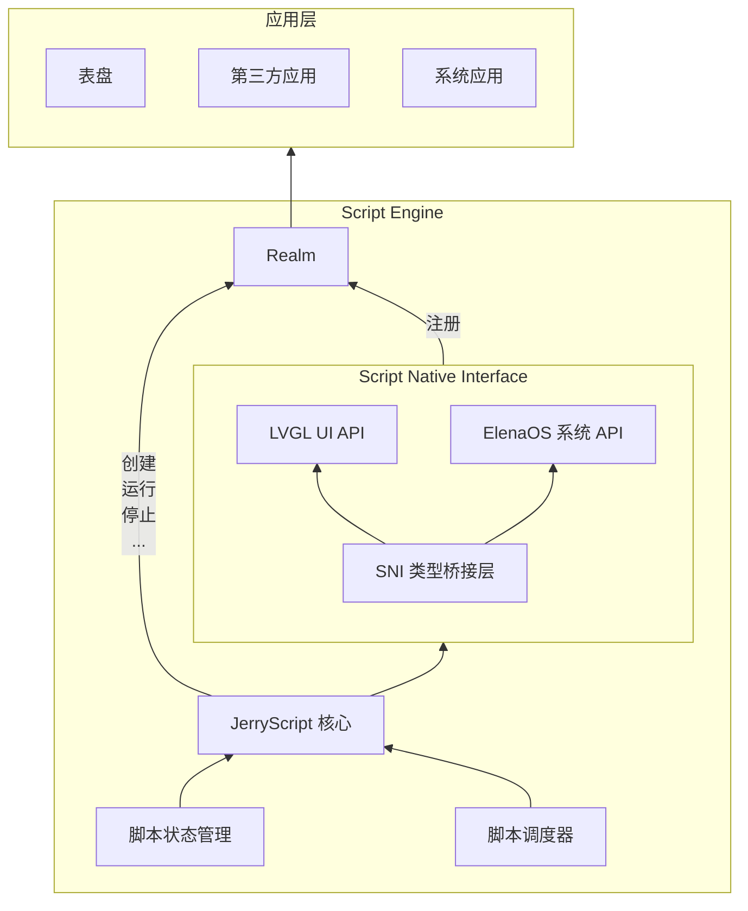

# Script Engine

## 概述

ElenaOS 的表盘与应用程序统一由脚本引擎（Script Engine）驱动，底层基于 [JerryScript](https://jerryscript.net) 对 JavaScript 代码进行编译与执行。

JerryScript 是一个轻量级的 JavaScript 引擎，旨在在资源受限的设备上运行，例如微控制器：

* 引擎可用的 RAM 很少（&lt;64 KB RAM）
* 引擎代码的 ROM 空间受限（&lt;200 KB ROM）

该引擎支持设备上的编译、执行，并提供 JavaScript 访问外设的功能。

开源地址：https://github.com/jerryscript-project/jerryscript

## 系统架构

脚本引擎（Script Engine）是 ElenaOS 的核心模块，负责表盘与应用程序的运行。

脚本引擎的架构如下：

## Realm

在 ElenaOS 中，每个脚本运行在独立的 ECMAScript Realm 中。Realm 是 ECMAScript 语言规范中的一个概念，用于实现 JavaScript 的多线程执行环境。Realm 是一个完整的 JavaScript 运行时环境，包括全局对象、内建对象、状态和 API。Realm 的作用是隔离不同脚本之间的运行环境，确保脚本之间不会互相干扰。系统将公共 API 挂载到每个 Realm 上，使脚本能够安全地访问 UI、系统服务和硬件接口，同时保持全局对象、内建对象和状态的隔离性，从而实现可靠、安全的多脚本运行时环境。

Realm 只能用于单线程环境，不能跨线程共享。每个 Realm 都有自己的全局对象和内建对象，脚本只能访问自己 Realm 中的对象，无法直接访问其他 Realm 中的对象。

## 脚本状态管理

脚本状态管理模块负责管理脚本的运行状态，包括脚本的创建、运行、停止等。

脚本的状态有：

| 状态名称              | 描述                         |
| --------------------- | ---------------------------- |
| SCRIPT_STATE_STOPPED  | 停止：脚本已停止并释放资源   |
| SCRIPT_STATE_RUNNING  | 运行：脚本正在运行           |
| SCRIPT_STATE_SUSPEND  | 挂起：脚本运行完成，等待回调 |
| SCRIPT_STATE_STOPPING | 停止中：正在停止脚本         |
| SCRIPT_STATE_ERROR    | 错误：脚本执行出错           |

由`script_state_t`定义的脚本状态枚举类型，用于描述脚本的运行状态。

### 脚本状态说明

#### SCRIPT_STATE_RUNNING

脚本正在运行，例如正在执行`eos.lv_label_create(eos_screen_active());`。在此状态下，脚本引擎正在执行 JavaScript 代码，可能会创建 UI 元素、调用系统 API 或执行其他操作。

#### SCRIPT_STATE_SUSPEND

一般来说绘制完成后，脚本进入挂起状态`SCRIPT_STATE_SUSPEND`，此时如果外部触发回调，可以正常调用。在此状态下，脚本引擎暂停执行，但保持所有变量和对象的状态，等待外部事件（如用户交互、定时器、传感器数据等）触发回调函数。

#### SCRIPT_STATE_STOPPED

脚本未启动以及脚本已关闭即为此状态，此时脚本的相关资源都已经被清理，沙盒已经被删除，不会再调用任何脚本内注册的回调。在此状态下，脚本引擎已完全释放所有资源，包括 Realm、全局对象和所有注册的回调函数。

## 启动流程

脚本引擎的启动流程如下：

1. **系统启动时**：需要调用`script_engine_init`初始化脚本引擎，创建必要的运行时环境
2. **脚本启动时**：会创建一个新的`realm`提供沙盒进行隔离，确保不同脚本之间的运行环境相互独立
3. **自动注册**：新的`realm`会自动注册所有函数和符号，包括 LVGL UI API 和 ElenaOS 系统 API
4. **脚本执行**：在脚本内使用`eos.*`访问函数和符号，进行 UI 绘制和系统调用

## 脚本使用方法

### 基本使用

脚本内直接调用 LVGL 的函数绘制 UI 即可，绘制完成后无需进行任何操作，由系统内部调用`lv_timer_handler`执行渲染操作。系统会自动管理 UI 的刷新和渲染，开发者只需要关注 UI 的创建和布局。

### 脚本停止

如果想关闭脚本，使用`script_engine_request_stop();`。此函数会请求停止当前运行的脚本，释放相关资源，并清理 Realm。

### 脚本使用注意事项

1. **禁止死循环**：脚本中禁止使用死循环，否则会阻塞 UI，导致系统无法响应用户操作
2. **资源管理**：脚本创建的对象和资源会在脚本停止时自动清理，但建议在适当的时候手动释放不再需要的资源
3. **回调函数**：在回调函数中应避免执行耗时操作，以免影响 UI 响应速度
4. **全局变量**：尽量避免使用过多的全局变量，以免占用过多内存
5. **错误处理**：建议在关键代码段添加错误处理逻辑，提高脚本的健壮性

## JS API 绑定层

JS API 层是脚本引擎（Script Engine）与底层硬件资源（如 UI 绘制、传感器、外设）的交互层，负责将底层硬件资源转换为 JS API，并绑定到 Realm 中。

### JS API 目录

1. ElenaOS 系统 API：[ElenaOS](../js-api/elena_os)
2. LVGL UI API：[LVGL](../js-api/lvgl)