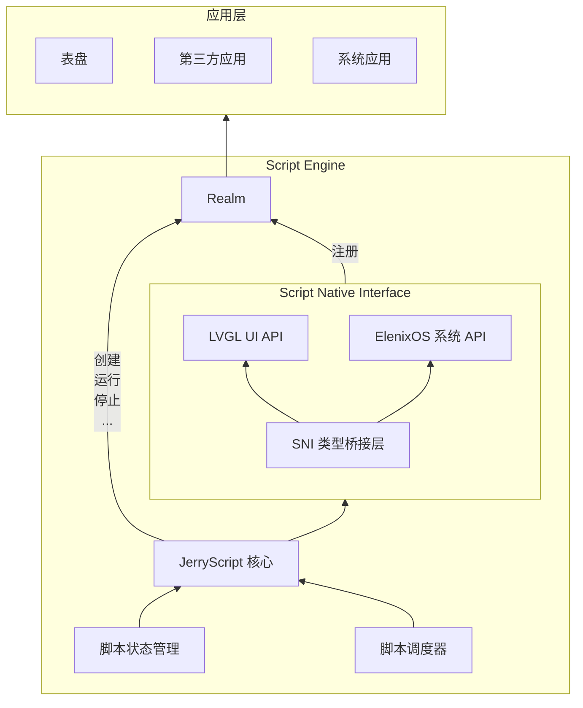
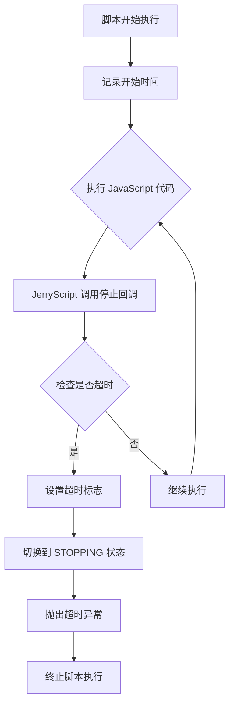
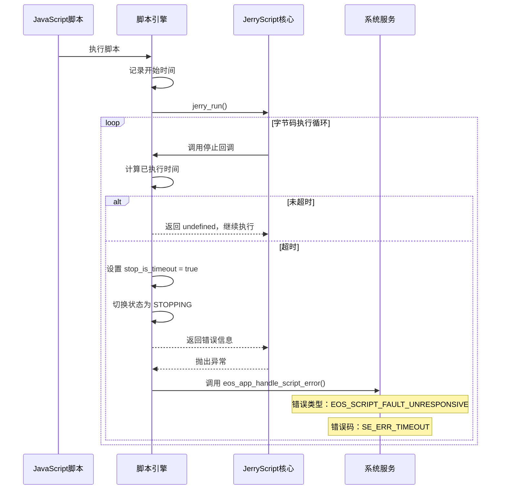

# Script Engine

## 概述

ElenixOS 的表盘与应用程序统一由脚本引擎（Script Engine）驱动，底层基于 [JerryScript](https://jerryscript.net) 对 JavaScript 代码进行编译与执行。

JerryScript 是一个轻量级的 JavaScript 引擎，旨在在资源受限的设备上运行，例如微控制器：

* 引擎可用的 RAM 很少（&lt;64 KB RAM）
* 引擎代码的 ROM 空间受限（&lt;200 KB ROM）

该引擎支持设备上的编译、执行，并提供 JavaScript 访问外设的功能。

开源地址：https://github.com/jerryscript-project/jerryscript


## 系统架构

脚本引擎（Script Engine）是 ElenixOS 的核心模块，负责表盘与应用程序的运行。

脚本引擎的架构如下：



## Realm

在 ElenixOS 中，每个脚本运行在独立的 ECMAScript Realm 中。Realm 是 ECMAScript 语言规范中的一个概念，用于实现 JavaScript 的多线程执行环境。Realm 是一个完整的 JavaScript 运行时环境，包括全局对象、内建对象、状态和 API。Realm 的作用是隔离不同脚本之间的运行环境，确保脚本之间不会互相干扰。系统将公共 API 挂载到每个 Realm 上，使脚本能够安全地访问 UI、系统服务和硬件接口，同时保持全局对象、内建对象和状态的隔离性，从而实现可靠、安全的多脚本运行时环境。

Realm 只能用于单线程环境，不能跨线程共享。每个 Realm 都有自己的全局对象和内建对象，脚本只能访问自己 Realm 中的对象，无法直接访问其他 Realm 中的对象。

## 脚本状态管理

脚本状态管理模块负责管理脚本的运行状态，包括脚本的创建、运行、停止等。

脚本的状态有：

| 状态名称              | 描述                         |
| --------------------- | ---------------------------- |
| SCRIPT_STATE_STOPPED  | 停止：脚本已停止并释放资源   |
| SCRIPT_STATE_RUNNING  | 运行：脚本正在运行           |
| SCRIPT_STATE_SUSPEND  | 挂起：脚本运行完成，等待回调 |
| SCRIPT_STATE_STOPPING | 停止中：正在停止脚本         |
| SCRIPT_STATE_ERROR    | 错误：脚本执行出错           |

由`script_state_t`定义的脚本状态枚举类型，用于描述脚本的运行状态。

### 脚本状态说明

#### SCRIPT_STATE_RUNNING

脚本正在运行，例如正在执行`eos.lv_label_create(eos_screen_active());`。在此状态下，脚本引擎正在执行 JavaScript 代码，可能会创建 UI 元素、调用系统 API 或执行其他操作。

#### SCRIPT_STATE_SUSPEND

一般来说绘制完成后，脚本进入挂起状态`SCRIPT_STATE_SUSPEND`，此时如果外部触发回调，可以正常调用。在此状态下，脚本引擎暂停执行，但保持所有变量和对象的状态，等待外部事件（如用户交互、定时器、传感器数据等）触发回调函数。

#### SCRIPT_STATE_STOPPED

脚本未启动以及脚本已关闭即为此状态，此时脚本的相关资源都已经被清理，沙盒已经被删除，不会再调用任何脚本内注册的回调。在此状态下，脚本引擎已完全释放所有资源，包括 Realm、全局对象和所有注册的回调函数。

## 启动流程

脚本引擎的启动流程如下：

1. **系统启动时**：需要调用`script_engine_init`初始化脚本引擎，创建必要的运行时环境
2. **脚本启动时**：会创建一个新的`realm`提供沙盒进行隔离，确保不同脚本之间的运行环境相互独立
3. **自动注册**：新的`realm`会自动注册所有函数和符号，包括 LVGL UI API 和 ElenixOS 系统 API
4. **脚本执行**：在脚本内使用`eos.*`访问函数和符号，进行 UI 绘制和系统调用

## 脚本使用方法

### 基本使用

脚本内直接调用 LVGL 的函数绘制 UI 即可，绘制完成后无需进行任何操作，由系统内部调用`lv_timer_handler`执行渲染操作。系统会自动管理 UI 的刷新和渲染，开发者只需要关注 UI 的创建和布局。

### 脚本停止

如果想关闭脚本，使用`script_engine_request_stop();`。此函数会请求停止当前运行的脚本，释放相关资源，并清理 Realm。

### 脚本使用注意事项

1. **禁止死循环**：脚本中禁止使用死循环，否则会阻塞 UI，导致系统无法响应用户操作
2. **资源管理**：脚本创建的对象和资源会在脚本停止时自动清理，但建议在适当的时候手动释放不再需要的资源
3. **回调函数**：在回调函数中应避免执行耗时操作，以免影响 UI 响应速度
4. **全局变量**：尽量避免使用过多的全局变量，以免占用过多内存
5. **错误处理**：建议在关键代码段添加错误处理逻辑，提高脚本的健壮性

## JS API 绑定层

JS API 层是脚本引擎（Script Engine）与底层硬件资源（如 UI 绘制、传感器、外设）的交互层，负责将底层硬件资源转换为 JS API，并绑定到 Realm 中。

### JS API 目录

1. ElenixOS 系统 API：[ElenixOS](/docs/architecture/script_engine/elenix_os)
2. LVGL UI API：[LVGL](/docs/architecture/script_engine/lvgl)

## 超时机制

### 概述

由于 JavaScript 是单线程执行的，如果脚本中存在死循环或长时间阻塞操作，会导致整个系统失去响应。为了防止这种情况发生，ElenixOS 脚本引擎实现了一套超时机制，能够自动检测并终止超时的脚本执行。

### 超时机制原理

脚本引擎的超时机制基于 JerryScript 的 `jerry_execution_stop_callback` 机制实现。JerryScript 在执行 JavaScript 代码时，会定期调用注册的停止回调函数，脚本引擎利用这个回调来检测执行时间是否超时。

**超时检测流程：**



### 核心实现

#### 超时检测回调函数

```c
static jerry_value_t _vm_exec_stop_callback(void *user_p)
{
    (void)user_p;

    if (engine_ctx.state == SCRIPT_STATE_STOPPING)
    {
        return jerry_string_sz("Script terminated by request");
    }

    if (engine_ctx.script_timeout_ms > 0 && engine_ctx.state == SCRIPT_STATE_RUNNING)
    {
        uint32_t elapsed = eos_tick_get() - engine_ctx.script_start_time;
        if (elapsed >= engine_ctx.script_timeout_ms)
        {
            EOS_LOG_W("Script execution timeout (%u ms)", elapsed);
            engine_ctx.stop_is_timeout = true;
            _change_state(SCRIPT_STATE_STOPPING);
            return jerry_string_sz("Script execution timeout");
        }
    }

    return jerry_undefined();
}
```

#### 关键数据结构

```c
typedef struct {
    script_state_t state;         /**< 当前状态 */
    uint32_t script_start_time;   /**< 脚本执行开始时间（tick） */
    uint32_t script_timeout_ms;   /**< 脚本执行超时时间（ms），0 = 无超时 */
    bool stop_is_timeout;         /**< 标志是否由超时导致停止 */
} script_engine_context_t;
```

### 超时配置

#### 默认超时时间

```c
#define SCRIPT_DEFAULT_TIMEOUT_MS 3000  // 默认超时时间：3秒
```

#### 设置超时时间

```c
void script_engine_set_timeout(uint32_t timeout_ms);
uint32_t script_engine_get_timeout(void);
```

**参数说明：**
- `timeout_ms`：超时时间（毫秒），设置为 0 表示禁用超时检测

### 死循环问题解决

#### 问题场景

JavaScript 脚本中如果存在无限循环，会导致脚本一直执行，无法响应系统事件：

```javascript
// 危险代码：无限循环
while (true) {
    // 执行某些操作
}

// 危险代码：长时间阻塞
function heavyCalculation() {
    let result = 0;
    for (let i = 0; i < 1000000000; i++) {
        result += i;
    }
    return result;
}
```

#### 解决方案

超时机制通过以下方式解决死循环问题：

1. **定期检测**：JerryScript 在执行字节码时，会在每执行一定数量的字节码后调用停止回调
2. **时间判断**：在回调中计算从脚本开始执行到当前的时间差
3. **超时处理**：如果时间差超过设定的超时时间，则：
   - 设置 `stop_is_timeout` 标志为 true
   - 将脚本状态切换为 `SCRIPT_STATE_STOPPING`
   - 返回错误信息，JerryScript 会抛出异常终止执行
4. **错误处理**：系统捕获超时异常后，调用 `eos_app_handle_script_error` 处理脚本错误

#### 超时处理流程



### 错误类型

脚本引擎定义了专门的超时错误类型：

| 错误类型 | 错误码 | 描述 |
|---------|-------|------|
| `EOS_SCRIPT_FAULT_UNRESPONSIVE` | `SE_ERR_TIMEOUT` | 脚本执行超时/无响应 |
| `EOS_SCRIPT_FAULT_ERROR_EXCEPTION` | `SE_ERR_JERRY_EXCEPTION` | 脚本执行异常 |

### 超时检测时机

超时检测发生在以下时机：

1. **脚本启动执行时**：记录开始时间 `script_start_time`
2. **回调函数调用时**：脚本从挂起状态恢复执行时，重新记录开始时间
3. **JerryScript 定期回调**：执行过程中定期检测

### 最佳实践

#### 避免长时间阻塞

```javascript
// 不推荐：长时间阻塞主线程
function processData(data) {
    for (let i = 0; i < data.length; i++) {
        // 处理每个数据项
        heavyProcessing(data[i]);
    }
}

// 推荐：使用定时器分批处理
function processDataAsync(data, index = 0) {
    if (index >= data.length) return;
    
    // 每次只处理一小部分
    const batchSize = 100;
    for (let i = index; i < Math.min(index + batchSize, data.length); i++) {
        heavyProcessing(data[i]);
    }
    
    // 在下一个事件循环中继续处理
    setTimeout(() => processDataAsync(data, index + batchSize), 0);
}
```

#### 使用 LVGL Timer 组件（SNI）

对于计算密集型任务，建议使用 LVGL Timer 组件将任务拆分为多个小任务，避免阻塞主线程。通过定时器分批执行，可以保持 UI 的响应性。

```javascript
// 使用 LVGL Timer 执行耗时操作
function heavyTask(data, total, current = 0) {
    // 每帧处理的数量
    const chunkSize = 100;
    let processed = 0;
    
    // 处理当前批次
    for (let i = current; i < current + chunkSize && i < total; i++) {
        // 执行单次处理
        processItem(data[i]);
        processed++;
    }
    
    // 更新进度
    const newCurrent = current + processed;
    
    if (newCurrent < total) {
        // 创建定时器，在下一帧继续处理
        const timer = new lv.timer();
        timer.setCb(() => {
            heavyTask(data, total, newCurrent);
            timer.delete(); // 完成后删除定时器
        });
        timer.setPeriod(0); // 尽快执行（在下一个 LVGL tick）
        timer.start();
    } else {
        // 任务完成
        eos.console.log("Heavy task completed");
    }
}

// 使用示例
const largeData = generateLargeData();
heavyTask(largeData, largeData.length);
```

#### 设置合理的超时时间

根据脚本的实际需求，调整超时时间：

```c
// 对于简单的 UI 脚本，使用默认超时时间
script_engine_set_timeout(3000);  // 3秒

// 对于需要长时间计算的脚本，适当延长超时时间
script_engine_set_timeout(10000); // 10秒

// 禁用超时检测（不推荐）
script_engine_set_timeout(0);
```

### 总结

超时机制是 ElenixOS 脚本引擎的重要安全保障，通过定期检测脚本执行时间，能够有效防止死循环或长时间阻塞导致的系统无响应问题。当检测到超时后，系统会优雅地终止脚本执行，并通知应用管理模块进行错误处理，确保系统的稳定性和可靠性。