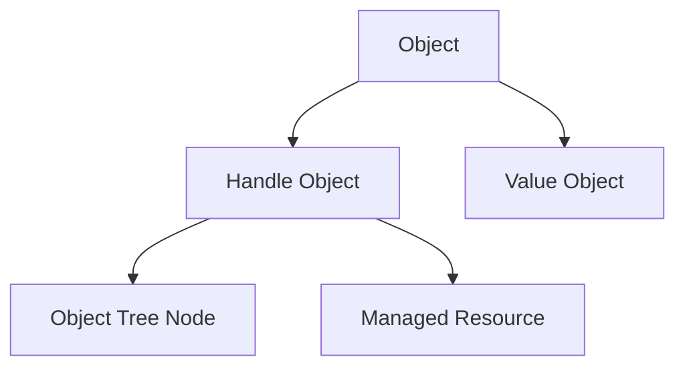
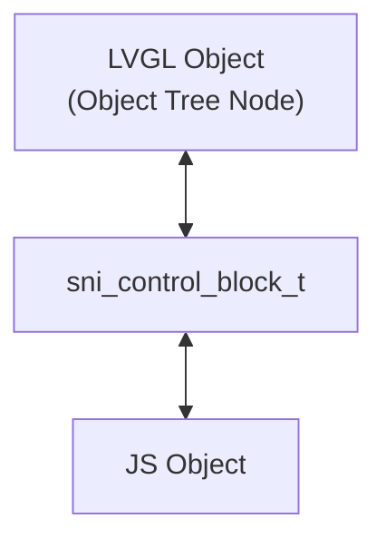
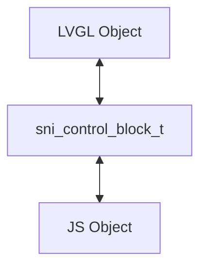
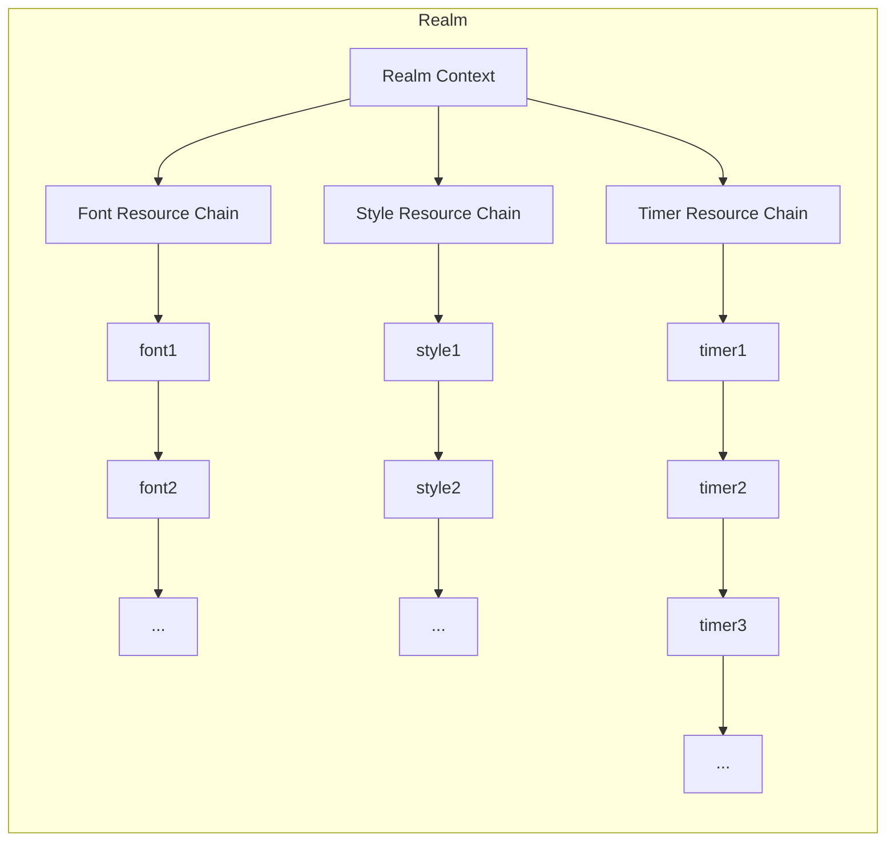

# 脚本原生接口（SNI）

脚本原生接口（**Script Native Interface**，简称SNI）是一种用于在脚本中调用 C 函数的接口。

## 类型桥接层（SNI Type Bridge Layer）

SNI 将结构体分为两类：Value Object 与 Handle Object。

为了更好地管理句柄对象的生命周期，SNI 对 Handle Object 进行了进一步的模型建立和细分。

### 模型建立

一个SNI对象分为句柄对象（Handle Object）和值对象（Value Object）。
句柄对象又分类为：
1. 对象树结点（Object Tree Node）
2. 受控资源（Managed Resource）



如此分类是为了更好的管理其生命周期，本质原因是两类资源的生命周期不同：对象树结点的生命周期严格依赖LVGL对象树，脚本停止运行时会随着对象树一并清理；而受控资源在创建后会持续存在，直到Realm销毁时才会统一清理这些资源。

下面是一个形象的类比：

| JS Runtime       | 类似于计算机的    |
| ---------------- | ---------- |
| Object Tree Node | 栈（结构化生命周期） |
| Managed Resource | 堆（自由生命周期）  |

### 基本数据类型

基本数据类型有：
- 数值（Number）
- 布尔（Boolean）
- 字符串（String）

SNI 直接使用 JerryScript 的 API 来处理基本数据类型。

### 值对象（Value Object）

**值对象**是一种不独立拥有底层资源的运行时对象，用于表示纯数据或配置值。

值对象不需要显式创建或销毁，其生命周期通常受限于一次函数调用或表达式求值过程。它在桥接层会被直接封装为 JS 对象，其成员变量会被直接映射为 JS 对象的属性。
它们不会被运行时登记或追踪，也不会参与 Realm 级别的资源管理。

值对象的生命周期为**栈生命周期（Stack-Scoped）**。

栈生命周期：由 JS 引擎自动管理，当函数调用结束时，栈上的值对象会被自动销毁。

### 句柄对象（Handle Object）

**句柄对象**是一种表示底层资源引用的运行时对象，其本身并不包含资源数据，而是作为对底层分配实体的间接访问入口。

句柄对象可以通过显式创建获得，也可以获取系统已有的句柄对象（例如获取活动视图），并支持显式销毁。
其生命周期由脚本逻辑直接控制，但运行时在 Realm 结束时提供统一的兜底回收，以防止资源泄漏。

句柄对象的生命周期为**堆生命周期（Heap-Scoped）**。

堆生命周期：由脚本逻辑显式创建，通过调用特定的销毁函数来释放底层资源。当所有对句柄对象的引用都被释放时，运行时会自动触发其销毁过程。在本系统中，堆生命周期的对象会在 Realm 结束时被统一销毁。

#### 对象树结点（Object Tree Node）

对象树结点（简称树结点）是指会被挂载到LVGL对象树上的一类对象，例如`lv.obj`类和`lv.button`类创建的实例都属于对象树结点。它们都有对应的创建函数`lv_obj_create`。

树结点的生命周期较为复杂，下面将统一阐述。

##### 树结点的创建
在创建树结点时，例如`lv_obj`：
```js
let parent = eos.view.active()    // 获取当前活动视图
let obj = new lv.obj(parent);     // 创建树结点`lv.obj`
```
这段代码在SNI内部会对传入参数进行类型校验和有效性校验后调用`lv_obj_create()`。

##### 树结点的销毁
树结点的销毁有两种方式：
1. 自动销毁：当Realm退出后，自动清理Realm的资源，同时会删除根View；而资源树上的资源会自动清理资源，这部分是由LVGL完成的。
2. 手动销毁：在Realm运行时，允许调用实例的方法`delete()`来删除该树结点。

##### 树结点的查找
###### 核心思想
树结点通常在JS中会被大量访问，因此必须确保JS与C之间能达到O(1)复杂度，尽可能降低开销。
因此SNI在JS对象与LVGL对象之间引入了一层独立的“控制块（Control Block）”。
两者都会引入一个独立的“控制块（Control Block）”用于协调：
- 对象身份（Identity）
- 生命周期（Lifetime）
- 资源状态（State）
- 双向访问关系（Bidirectional Access）
其结构类似：

控制块本身并不等于底层对象，而是作为“JS 与 Native 之间的中间协调层”存在。
这样可以实现：
- 强一致性（Strong Identity）
- O(1)双向查找
- 生命周期同步
- 对象有效性校验
其中：
- JS对象通过`native_ptr`访问control block
- LVGL对象通过`user_data`访问control block
两侧最终共享同一个`sni_control_block_t`。

关于共享指针控制块的更多信息可参考：
- https://en.cppreference.com/cpp/memory/shared_ptr
- https://en.wikipedia.org/wiki/Smart_pointer
###### C 的查找

树结点通常拥有`user_data`字段，它会被SNI接管。而JS侧不需要`user_data`，因为JS对象本身就可以存储内容。
SNI接管的`user_data`数据类型定义：
```c
typedef struct{
    void *ptr;              // C 指针
    jerry_value_t obj;      // JS 对象
    sni_type_t type;        // 类型
    bool alive;             // 指针存活标记，避免JS侧use after free
    ...
} sni_control_block_t;
```
其中：
- `ptr`用于JS侧以O(1)复杂度访问底层C对象。
- `obj`用于C侧以O(1)复杂度反查JS对象。
- `type`用于运行时类型校验，防止错误类型访问。
- `alive`用于标记底层对象是否仍然存活。
SNI会完全接管对象树结点的`user_data`字段：
```text
lv_obj_t
 └─ user_data
     └─ sni_control_block_t
```
同时，JS对象的`native_ptr`也会指向同一个`sni_control_block_t`：
```text
JS Object
 └─ native_ptr
     └─ sni_control_block_t
```
因此：
```text
JS ↔ ControlBlock ↔ LVGL
```
形成了双向O(1)访问结构。
###### JS → C 查找
当JS调用实例方法时：
```js
obj.setSize(100, 50);
```
SNI会：
1. 从JS对象获取`native_ptr`
2. 将其转换为`sni_control_block_t *`
3. 校验：
    - control block是否存在
    - `alive`是否为`true`
    - 类型是否匹配
4. 获取底层`ptr`
5. 调用对应LVGL API
伪代码：
```c
sni_control_block_t *cb =
    jerry_object_get_native_ptr(js_obj, &sni_native_info);

if(!cb || !cb->alive){
    return SNI_ERR_DEAD_OBJECT;
}

if(cb->type != SNI_TYPE_OBJ){
    return SNI_ERR_INVALID_TYPE;
}

lv_obj_set_size((lv_obj_t *)cb->ptr, 100, 50);
```
由于control block直接由JS对象持有，因此整个查找过程为O(1)。
###### C → JS 查找
当C侧需要获取对应JS对象时：
例如：
- 事件回调
- 子对象查找
- 对象树遍历
- native事件转发

SNI会：
1. 获取LVGL对象
2. 读取其`user_data`
3. 转换为`sni_control_block_t *`
4. 直接获取其中的`obj`

伪代码：
```c
sni_control_block_t *cb =
    lv_obj_get_user_data(obj);

if(!cb || !cb->alive){
    return jerry_undefined();
}

return cb->obj;
```
由于LVGL对象直接持有control block，因此查找同样为O(1)。
###### 强一致性（Strong Identity）
SNI保证：
```text
一个LVGL对象
只对应一个JS对象
```
即：
```js
a === b
```
在底层为同一个LVGL对象时始终成立。
这是通过`sni_control_block_t`实现的：

任何一方都不会重复创建新的包装对象，而是始终复用已有control block中的`obj`。
这样可以保证：
- JS对象身份一致性
- Map/Set行为正确
- 事件target稳定
- child查找稳定
- 缓存逻辑稳定
###### 生命周期同步
树结点的生命周期由LVGL决定。
因此：
- JS对象无法决定底层对象是否存活
- JS仅能观察对象是否仍有效
当LVGL对象被删除时会触发`LV_EVENT_DELETE`

SNI会：

1. 将：
```c
cb->alive = false;
```
2. 清理：
```c
cb->ptr = NULL;
```
3. 后续JS访问时抛出对象失效异常
从而避免`use after free`问题。

#### 受控资源（Managed Resource）

受控资源的生命周期必须被SNI完全接管，严格受SNI控制。

受控资源在创建后会持续存在，直到Realm销毁时才会统一清理这些资源。

受控资源往往没有`user_data`字段，因此难以实现O(1)复杂度访问。因此使用链表分类存储受控资源：



##### 受控资源的创建
受控资源一般来说与树结点创建类似，直接使用原生创建函数，但有些资源没有创建函数，但存在初始化函数，例如样式资源`lv.stlye`，SNI将这样资源的管理统一了语义，都可以通过new创建。SNI在底层会通过某些方法（例如直接调用`eos_malloc`创建到堆内存或获取预分配的连续内存）来分配这些资源，然后进行初始化，使得new返回的对象是立即可用的，无需init初始化对象。

##### 受控资源的销毁
受控资源都会提供方法`delete()`来销毁资源，如果在JS生命周期结束后资源没有被销毁，则会由SNI统一回收这个上下文的所有受控资源。

##### 受控资源的查找
资源查找难以实现$O(1)$的时间复杂度，因此SNI直接采用分类链表的方式来存储受控资源。受控资源在查找时，先根据分类得到资源链表表头，然后遍历链表查找资源。这样分类能大大缩小查找范围，从所有资源混在一条链表的$O(n)$复杂度降低到按类型过滤的$O(\frac nk)$。

## API 导出层（SNI API Export Layer）

API 导出层（**SNI API Export Layer**）负责将 API 导出给 JS Realm，使它们在脚本中可直接调用，API 是通过描述表（**API Description Table**）来定义的。

描述表内包括：
- 函数
- 枚举
- 常量
- 子命名空间

该层主要负责 API 结构组织。

### API 描述表（API Description Table）

API 描述表是一个 C 语言结构体数组，每个元素表示一个 API 条目。

每个 API 条目包含以下字段：
- 名称（Name）
- 类型（Type）
- 值（Value）

:::danger
数组最后一个元素中，名称字段必须为 NULL，用于标识数组结束。
:::

**API的类型**

目前 SNI 支持的 API 类型有：
- 函数：`jerry_external_handler_t` 类型的函数指针
- 常量：整数常量、浮点数常量、字符串常量
- 子条目：指向子条目的指针，用于实现命名空间的递归结构

#### 函数 API

函数类型实际上就是 `jerry_external_handler_t` 类型的函数指针，您需要实现该类型的函数，用于处理 JS 调用。

该函数的参数和返回值都需要符合 JerryScript 引擎的要求，具体可以参考 https://jerryscript.net/api-reference/#jerry_external_handler_t。

#### 常量 API

常量 API 是指在描述表中定义的整数值、浮点数常量和字符串常量，它们会被直接导出为 JS 中的常量。
它们在 C 代码中通常是枚举类型或由宏定义的常量。

#### 子条目 API

子条目 API 是指在描述表中定义的指向子条目的指针，用于实现命名空间的递归结构。

例如：

```c
jerry_value_t my_lv_obj_create(const jerry_call_info_t *call_info_p,
                               const jerry_value_t args_p[],
                               const jerry_length_t args_count)
{
    // 参数检查
    // ...
    // 参数类型转换
    // ...
    // 执行 C 函数
    // ...
    // 检查返回值
    // ...
    // 返回创建的 Handle Object
}

const struct sni_api_entry_t lvgl_api_desc[] = {
    { "obj", SNI_ENTRY_NAMESPACE, { .sub_entries = lvgl_obj_api_desc } },
    // 其他子条目...
};

const struct sni_api_entry_t lvgl_obj_api_desc[] = {
    { "create", SNI_ENTRY_FUNCTION, { .function = my_lv_obj_create } },
    // 其他子条目...
};
```

这样，您就可以在 JS 中通过 `lv.obj.create()` 来调用 C 函数 `my_lv_obj_create()` 了。

### API 的导出过程

API 导出由以下过程组成：
1. 获取描述表代码
2. 描述表的解析
3. API 的挂载

#### 获取描述表代码

描述表代码一般通过 Python 脚本生成。

例如，LVGL API的描述表代码可以通过以下命令生成：

```bash
python3 generate_lvgl_desc.py
```

当然，您也可以根据需求自行编写描述表代码。

#### 描述表的解析

描述表的解析只需要调用`sni_api_build()`函数即可构建 API 描述表，若构建成功则会返回一个`jerry_value_t`类型的 JS 对象，此对象下挂载了所有 API 条目，此对象通常称为全局原生对象（Global Native Capability Object），例如`lv`就是一个全局原生对象。

#### API 的挂载

API 的挂载过程相对简单，只需要调用`sni_api_mount()`函数即可将 API 描述表挂载到指定的 JS Realm 中。

例如，挂载 LVGL API 描述表到指定 Realm 中可以通过以下代码实现：

```c
jerry_value_t lvgl_api_obj = sni_api_build(lvgl_api_desc);
sni_api_mount(jerry_realm, lvgl_api_obj, "lv");
```

挂载成功后，JS Realm 中就可以直接调用 LVGL API 了。

例如：

```js
lv.obj.create();
```
