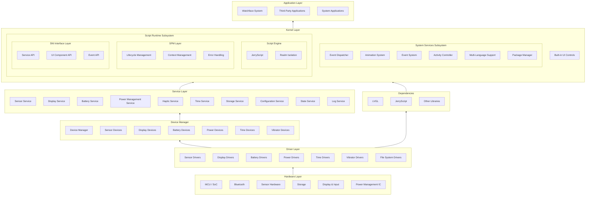
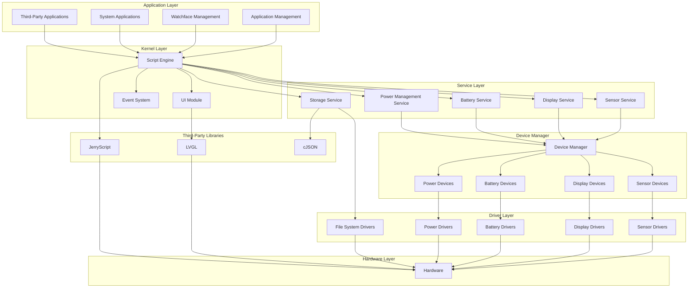
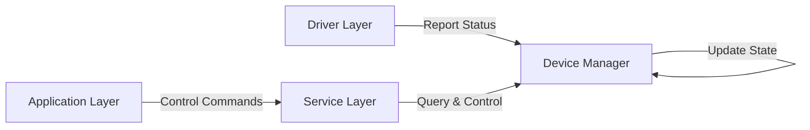
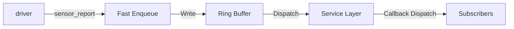
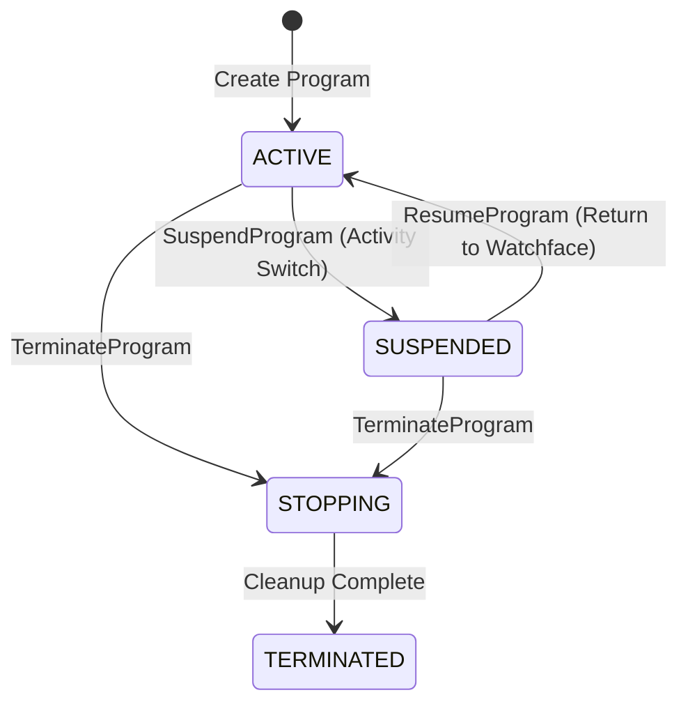

# System Architecture

## Overall Architecture

ElenixOS adopts a layered architecture design, from bottom to top: hardware layer, driver layer, device manager, service layer, framework layer, and application layer. The kernel functions are integrated into the framework layer, including core components such as script engine, event system, and Activity management. This architecture design provides good portability and scalability.



## Module Dependencies

### Core Module Dependency Diagram



## Architecture Layer Description

### 1. Hardware Layer

The hardware layer contains various hardware components such as MCU/SoC, Bluetooth, sensors, storage, display, and power management IC. These hardware components form the foundation for ElenixOS to run.

### 2. Driver Layer

The driver layer is the lowest level of hardware abstraction, implemented by the porting party:
- Sensor drivers: accelerometer, gyroscope, heart rate sensor, etc.
- Display driver: screen control and display output
- Battery driver: battery status collection
- Power driver: power management IC control
- File system driver: storage device access

### 3. Device Manager

The device manager is the only path for upper layers to obtain device instances:
- Unified management of device instance registration and lookup
- Maintenance of device state machines
- Provides state reporting mechanism
- Supports single-instance and multi-instance device management

### 4. Service Layer

The service layer provides standard API interfaces to the upper layers:

| Service Name | Function Description |
|-------------|---------------------|
| Sensor Service | Sensor sampling and data processing, supporting Pull/Push modes |
| Display Service | Screen brightness management and power control |
| Battery Service | Battery status monitoring and power management |
| Power Management Service | System power state and sleep management |
| Haptic Service | Haptic feedback control |
| Time Service | System time retrieval |
| Storage Service | File system operations and JSON storage |
| Configuration Service | System configuration management |
| State Service | Runtime persistent state management |
| Log Service | Listener-based logging system |

### 5. Framework Layer

The framework layer is the core of ElenixOS, containing the following subsystems:

- **System Services Subsystem**: event dispatching, animation system, event system, activity controller, multi-language support, package manager, etc.
- **Script Runtime Subsystem**: contains three-layer architecture
  - **Core Engine Layer (Script Engine)**: responsible for JerryScript's underlying operations, including Realm management, compilation execution, memory operations
  - **SPM Layer (Script Program Manager)**: as the intermediate layer, manages program lifecycle (start/suspend/resume/terminate), JS callback gate validation, error snapshot persistence
  - **SNI Interface Layer**: provides script interfaces such as service API, UI component API, event API
- **Built-in UI Controls**: various UI components built on LVGL

### 6. Application Layer

The application layer contains the watchface system, third-party applications, and system applications. These applications run based on the script engine and use SNI to access system services and UI components.

## Core Design Principles

### Device-Service Interaction Principle

The system follows the core principle of "upper layers send control commands, lower layers only report status":



### Data Flow

The data flow of ElenixOS is as follows:

1. **User Input**: Obtain user input through hardware layer input devices (such as touchscreen)
2. **Event Processing**: Input events are passed to the device manager through the driver layer
3. **Status Reporting**: Device manager updates status and notifies the service layer
4. **Service Processing**: Service layer processes business logic and responds to requests
5. **Event Dispatching**: Event system dispatches events to corresponding handlers
6. **Application Response**: Applications execute corresponding logic based on events
7. **UI Update**: Applications update the interface through the UI module
8. **Display Output**: UI module renders the interface to the display

### Sensor Data Reporting Flow



## Script Execution Flow

1. **Script Loading**: Load application or watchface script files from the file system
2. **Script Parsing**: Script engine parses JavaScript code
3. **SPM Management**: SPM layer creates program context, manages lifecycle states (IDLE/SUSPENDED/RUNNING)
4. **Module Import**: Script imports required modules and APIs through the SPM layer
5. **Script Execution**: Execute script in Realm, call SNI through SPM layer
6. **Native Call**: SNI calls native code to access system services and hardware
7. **Result Return**: Return execution result to script through SPM layer

## Script Program Manager

The Script Program Manager (SPM) is the intermediate management layer of the script engine, responsible for:

- **Program Lifecycle Management**: Manage script program startup, suspend, resume, and termination
- **Context Save/Restore**: Support saving and restoring script runtime context for state persistence
- **JS Callback Gate Validation**: Validate the legitimacy and security of JavaScript callbacks
- **Error Snapshot Persistence**: Capture script errors and save snapshot information for debugging and analysis
- **Realm Isolation**: Provide independent Realm environment for each program to ensure isolation and security

### Script Program State Machine

SPM manages the lifecycle states of script programs:

```c
typedef enum
{
    SCRIPT_PROGRAM_STATE_TERMINATED,  // Terminated
    SCRIPT_PROGRAM_STATE_STOPPING,    // Stopping
    SCRIPT_PROGRAM_STATE_ACTIVE,      // Active
    SCRIPT_PROGRAM_STATE_SUSPENDED,   // Suspended
} script_program_state_t;
```



| State | Description | Trigger Condition |
|-------|-------------|-------------------|
| **ACTIVE** | Active state, script program is alive and healthy | Program creation |
| **SUSPENDED** | Suspended state, program is paused but can be resumed | Call suspend() during Activity switch |
| **STOPPING** | Stopping state, callbacks are prohibited | Call terminate() |
| **TERMINATED** | Terminated state, resources are completely cleaned | Cleanup complete |

### Difference from Kernel State

SPM manages the **script program** lifecycle, while the script engine kernel manages **single JS execution** states:

| Layer | State Management Object | Focus |
|-------|------------------------|-------|
| **SPM Layer** | Script Program | Program start/pause/resume/terminate |
| **Kernel Layer** | JS Execution Window | Bytecode parsing/execution/exception |

The kernel state machine focuses on state transitions for single JS code execution (RUNNING/IDLE/SUSPENDED/EXCEPTION), while SPM focuses on the lifecycle management of script programs as a whole.