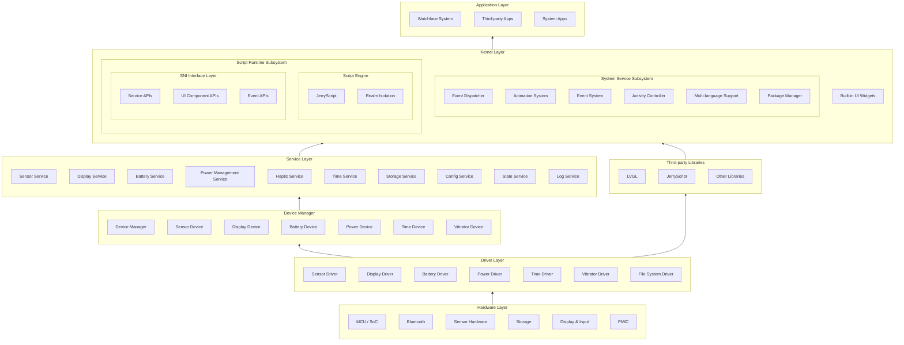
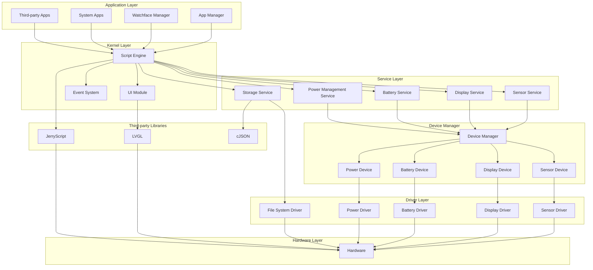
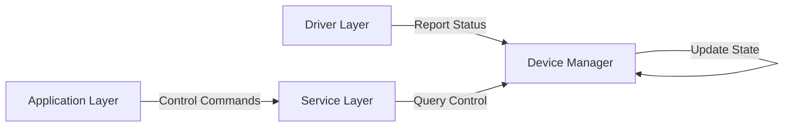

# System Architecture

## Overall Architecture

ElenixOS adopts a layered architecture design, from bottom to top: Hardware Layer, Driver Layer, Device Manager, Service Layer, Kernel Layer, and Application Layer. This architecture provides good portability and scalability.

## Module Dependencies

### Core Module Dependency Graph

## Architecture Layer Description

### 1. Hardware Layer

The hardware layer includes various hardware components such as MCU/SoC, Bluetooth, sensors, storage, display, and power management chips. These hardware components form the foundation for ElenixOS operation.

### 2. Driver Layer

The driver layer is the lowest level of hardware abstraction, implemented by the porting party:
- Sensor drivers: accelerometer, gyroscope, heart rate sensor, etc.
- Display driver: screen control and display output
- Battery driver: battery status collection
- Power driver: power management chip control
- File system driver: storage device access

### 3. Device Manager

The device manager is the only path for upper layers to obtain device instances:
- Unified management of device instance registration and lookup
- Maintains device state machines
- Provides status reporting mechanism
- Supports single-instance and multi-instance device management

### 4. Service Layer

The service layer provides standard API interfaces to upper layers:

| Service Name | Description |
|-------------|-------------|
| Sensor Service | Sensor sampling and data processing, supports Pull/Push modes |
| Display Service | Screen brightness management and power control |
| Battery Service | Battery status monitoring and power management |
| Power Management Service | System power state and sleep management |
| Haptic Service | Haptic feedback control |
| Time Service | System time retrieval |
| Storage Service | File system operations and JSON storage |
| Config Service | System configuration management |
| State Service | Runtime persistent state management |
| Log Service | Listener-based logging system |

### 5. Kernel Layer

The kernel layer is the core of ElenixOS, containing the following subsystems:

- **System Service Subsystem**: Event dispatching, animation system, event system, activity controller, multi-language support, package manager, etc.
- **Script Runtime Subsystem**: Script engine, SNI, etc.
- **Built-in UI Widgets**: Various UI components built on LVGL

### 6. Application Layer

The application layer includes the watchface system, third-party applications, and system applications. These applications run on the script engine and use SNI to access system services and UI components.

## Core Design Principles

### Device-Service Interaction Principle

The system follows the core principle of "upper layers send control commands, lower layers only report status":

### Data Flow

The data flow in ElenixOS is as follows:

1. **User Input**: Obtain user input through hardware input devices (e.g., touchscreen)
2. **Event Processing**: Input events are passed to the device manager through the driver layer
3. **Status Reporting**: Device manager updates status and notifies the service layer
4. **Service Processing**: Service layer processes business logic and responds to requests
5. **Event Dispatching**: Event system distributes events to corresponding handlers
6. **Application Response**: Applications execute corresponding logic based on events
7. **UI Update**: Applications update the interface through the UI module
8. **Display Output**: UI module renders the interface to the display

### Sensor Data Reporting Flow

## Script Execution Flow

1. **Script Loading**: Load application or watchface script files from the file system
2. **Script Parsing**: Script engine parses JavaScript code
3. **Module Import**: Script imports required modules and APIs through ScriptEngine
4. **Script Execution**: Execute script in Realm, call SNI
5. **Native Call**: SNI calls native code to access system services and hardware
6. **Result Return**: Return execution results to the script
