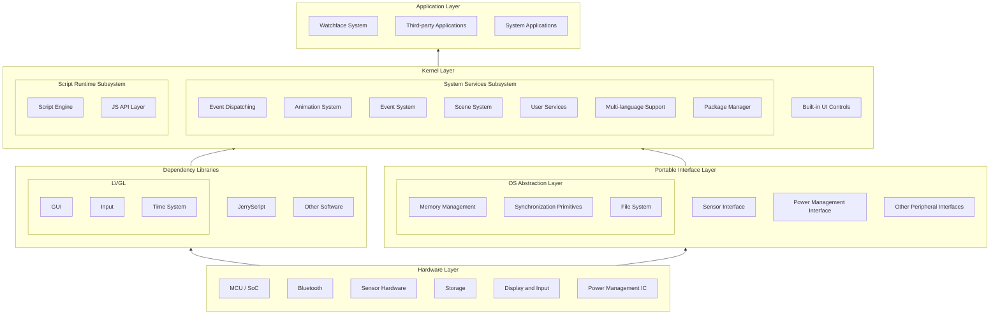
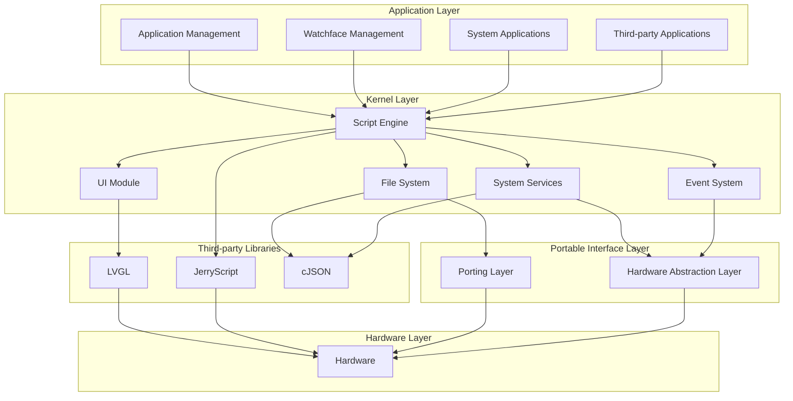

# System Architecture

## Overall Architecture

ElenaOS adopts a layered architecture design, from bottom to top: hardware layer, portable interface layer, kernel layer, and application layer. This architecture design gives the system good portability and scalability.

## Module Dependencies

### Core Module Dependency Graph

## Architecture Layer Description

### 1. Hardware Layer

The hardware layer includes various hardware components such as MCU/SoC, Bluetooth, sensors, storage, display, and power management ICs. These hardware components are the foundation for ElenaOS to run.

### 2. Portable Interface Layer

The portable interface layer provides hardware abstraction, including:

- **OS Abstraction Layer**: Memory management, synchronization primitives, file system, etc.
- **Sensor Interface**: Unified sensor access interface
- **Power Management Interface**: Power state management and control
- **Other Peripheral Interfaces**: Access interfaces for other hardware peripherals

This layer's design allows ElenaOS to run on different hardware platforms by simply implementing the corresponding interfaces.

### 3. Kernel Layer

The kernel layer is the core of ElenaOS, containing the following subsystems:

- **System Services Subsystem**: Event dispatching, animation system, event system, scene system, user services, multi-language support, package manager, etc.
- **Script Runtime Subsystem**: Script engine, JS API layer, etc.
- **Built-in UI Controls**: Various UI components built based on LVGL

This layer implements the core functions of ElenaOS and provides services and interfaces for the application layer.

### 4. Application Layer

The application layer includes watchface system, third-party applications, and system applications. These applications run based on the script engine and use JS API to access system services and UI components.

## Data Flow

The data flow of ElenaOS is as follows:

1. **User Input**: Obtain user input through hardware layer input devices (such as touch screen)
2. **Event Processing**: Input events are passed through the portable interface layer to the kernel layer's event system
3. **Event Dispatching**: The event system distributes events to corresponding handlers
4. **Application Response**: Applications execute corresponding logic based on events
5. **UI Update**: Applications update the interface through the UI module
6. **Display Output**: The UI module renders the interface to the display

## Script Execution Process

1. **Script Loading**: Load application or watchface script files from the file system
2. **Script Parsing**: The script engine parses JavaScript code
3. **Script Execution**: Execute scripts in Realm, call JS API
4. **Native Call**: JS API calls native code to access system services and hardware
5. **Result Return**: Return execution results to the script

## Architecture Advantages

1. **Layered Design**: Clear layered structure makes the system easy to understand and maintain
2. **Portability**: The portable interface layer allows the system to run on different hardware platforms
3. **Scalability**: Modular design makes the system easy to extend and customize
4. **Script-driven**: Scripted development makes application development more flexible and efficient
5. **Unified Interface**: Unified API design makes application development simpler