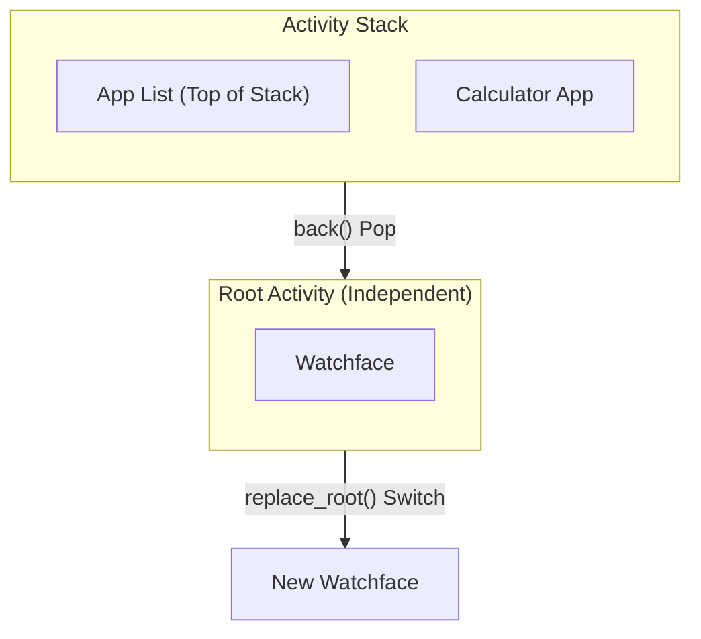
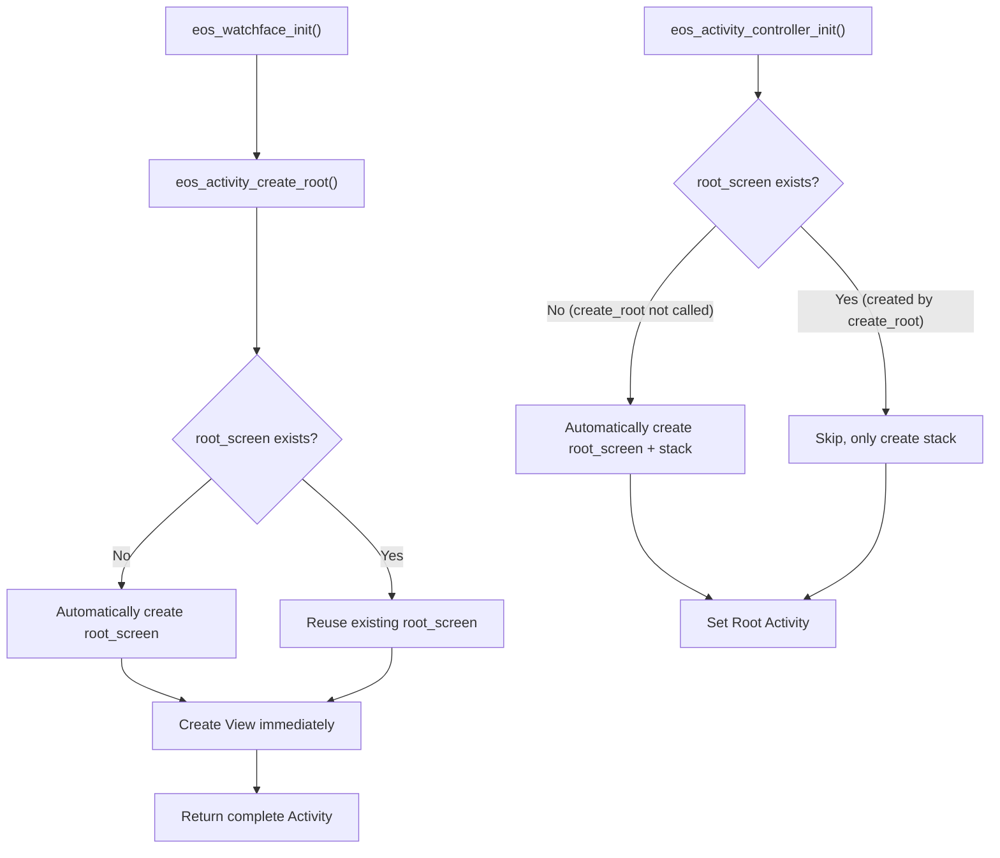

# Activity and View

Activity is the core component for managing pages and user interfaces in ElenixOS. Each Activity represents an independent screen page (such as application page, watchface page), containing an associated View and complete lifecycle management.

## Activity Overview

Activity is the core abstraction for page navigation and lifecycle management in ElenixOS. Each Activity contains:

- An associated **View** (LVGL object tree), which is the UI content of the page
- Complete **lifecycle callbacks** (enter, destroy, pause, resume)
- UI properties such as **title** and **title color**
- **Type** identifier (application, watchface, application list, etc.)
- **AppHeader** visibility control

### Activity Types

```c
typedef enum {
    EOS_ACTIVITY_TYPE_NULL = 0,            // Null type
    EOS_ACTIVITY_TYPE_APP,                 // Application page
    EOS_ACTIVITY_TYPE_APP_LIST,            // Application list
    EOS_ACTIVITY_TYPE_WATCHFACE,           // Watchface page
    EOS_ACTIVITY_TYPE_WATCHFACE_LIST,      // Watchface list
    EOS_ACTIVITY_TYPE_COUNT
} eos_activity_type_t;
```

## Lifecycle

Activity has a complete lifecycle managed by the following callback functions:

```c
typedef struct {
    eos_activity_on_enter_t on_enter;      // Called when entering
    eos_activity_on_destroy_t on_destroy;  // Called when destroying
    eos_activity_on_pause_t on_pause;      // Called when pausing
    eos_activity_on_resume_t on_resume;    // Called when resuming
} eos_activity_lifecycle_t;
```

### Lifecycle Flow

```
Create Activity (eos_activity_create)
    │
    ▼
Enter Activity (eos_activity_enter)
    │
    ├── on_enter()  ── Enter callback
    │
    ▼
Activity visible (visible)
    │
    ├── on_resume()  ── Resume callback (when returning from other Activity)
    │
    ▼
Leave Activity
    │
    ├── on_pause()  ── Pause callback (when switching to other Activity)
    │
    ▼
Return Activity ──► on_resume()
    │
    ▼
Destroy Activity (eos_activity_back)
    │
    └── on_destroy() ── Destroy callback
```

### Lifecycle Callback Description

| Callback | Trigger Condition | Typical Use Case |
|----------|-------------------|------------------|
| `on_enter` | When Activity first displays | Initialize UI, load data |
| `on_resume` | When returning from other Activity | Refresh data, resume animations |
| `on_pause` | When switching to other Activity | Save state, pause animations |
| `on_destroy` | When Activity is destroyed | Release resources, unsubscribe |

## Activity Stack Management

ElenixOS uses a stack structure to manage Activities. The watchface (Watchface) Activity is fixed at the bottom of the stack, and newly opened Activities are pushed to the top of the stack.

### Root Activity Mechanism

**Important Concept**: The watchface serves as the **Root Activity**, managed independently of the Activity stack and has a special status:



**Root Activity Characteristics**:

| Feature | Normal Activity | Root Activity |
|---------|----------------|---------------|
| **Location** | In stack | Independent of stack |
| **Lifecycle** | Created/destroyed with push/pop | Persists until switched |
| **Creation** | `eos_activity_create()` | `eos_activity_create_root()` |
| **View Creation** | Lazy creation (in on_enter) | **Immediate creation** (at create_root) |
| **Pop Effect** | Destroyed and released | Not affected by pop |
| **Switch Method** | N/A | `eos_activity_replace_root()` |

**Root Activity Use Cases**:
- Watchfaces (built-in or JS)
- Serves as the system's "home page", always present
- Switched via `replace_root()` instead of push/pop

### Stack Structure Diagram

```
Top of Stack  
      ┌──────────────────┐
      │  Activity C      │  ← Currently visible Activity
      ├──────────────────┤
      │  Activity B      │  ← Paused state
      ├──────────────────┤
      │  Activity A      │  ← Paused state
      └──────────────────┘
           │
           │ (Independent of stack)
           ▼
     ┌─────────────┐
     │  Watchface  │  ← Root Activity (Always present)
     └─────────────┘
```

### Navigation Operations

#### Enter New Activity

```c
eos_activity_enter(activity);
```

Pushes the Activity onto the stack and displays it. The previous Activity automatically enters the paused state.

#### Return to Previous Activity

```c
eos_result_t ret = eos_activity_back();
```

Destroys the current top Activity and resumes the previous one. Returns `EOS_OK` on success.

#### Return to Watchface

```c
eos_result_t ret = eos_activity_back_to_watchface();
```

Destroys all Activities in the stack and returns directly to the watchface.

#### Return in Event Callback

```c
void eos_activity_back_cb(lv_event_t *e);
```

Convenient wrapper for use in LVGL event callbacks.

## Core API

### Creation and Initialization

```c
// Normal Activity (for applications, lists, etc.)
eos_result_t eos_activity_controller_init(eos_activity_t *initial_activity);
void eos_activity_controller_deinit(void);
eos_activity_t *eos_activity_create(const eos_activity_lifecycle_t *lifecycle);

// Root Activity (for watchfaces only)
eos_activity_t *eos_activity_create_root(const eos_activity_lifecycle_t *lifecycle);
eos_result_t eos_activity_replace_root(eos_activity_t *new_root);
```

| Function | Description |
|----------|-------------|
| `eos_activity_controller_init` | Initialize Activity controller, requires Root Activity (watchface) as parameter |
| `eos_activity_controller_deinit` | Deinitialize, release all Activities |
| `eos_activity_create` | Create normal Activity, View is lazily created |
| **`eos_activity_create_root`** | **Create Root Activity (watchface), View is created immediately** |
| **`eos_activity_replace_root`** | **Replace current Root Activity (switch watchface)** |

#### Smart Lazy Loading Mechanism

The Activity system adopts a **smart lazy loading** design to simplify initialization:



### Activity Query

```c
eos_activity_t *eos_activity_get_current(void);
eos_activity_t *eos_activity_get_visible(void);
eos_activity_t *eos_activity_get_previous(void);
eos_activity_t *eos_activity_get_bottom(void);
eos_activity_t *eos_activity_get_watchface(void);
bool eos_activity_is_transition_in_progress(void);
```

| Function | Description |
|----------|-------------|
| `eos_activity_get_current` | Get current Activity (top of stack) |
| `eos_activity_get_visible` | Get currently fully displayed Activity |
| `eos_activity_get_previous` | Get previous Activity (used in event callbacks to get source page) |
| `eos_activity_get_bottom` | Get bottom Activity (usually watchface) |
| `eos_activity_get_watchface` | Get watchface Activity |
| `eos_activity_is_transition_in_progress` | Check if transition animation is in progress |

### View Management

```c
lv_obj_t *eos_activity_get_view(eos_activity_t *activity);
void eos_activity_set_view(eos_activity_t *activity, lv_obj_t *view);
lv_obj_t *eos_activity_get_root_screen(void);
lv_obj_t *eos_view_active(void);
```

| Function | Description |
|----------|-------------|
| `eos_activity_get_view` | Get View object associated with Activity |
| `eos_activity_set_view` | Set View object for Activity |
| `eos_activity_get_root_screen` | Get root screen object |
| `eos_view_active` | Get View of current Activity (convenient method) |

### Title Management

```c
const char *eos_activity_get_title(eos_activity_t *activity);
void eos_activity_set_title(eos_activity_t *activity, const char *title);
void eos_activity_set_title_id(eos_activity_t *activity, lang_string_id_t id);
lv_color_t eos_activity_get_title_color(eos_activity_t *activity);
void eos_activity_set_title_color(eos_activity_t *activity, lv_color_t color);
```

| Function | Description |
|----------|-------------|
| `eos_activity_get_title` | Get Activity title |
| `eos_activity_set_title` | Set Activity title (string) |
| `eos_activity_set_title_id` | Set title via internationalization string ID |
| `eos_activity_get_title_color` | Get title color |
| `eos_activity_set_title_color` | Set title color |

### Type Management

```c
void eos_activity_set_type(eos_activity_t *activity, eos_activity_type_t type);
eos_activity_type_t eos_activity_get_type(eos_activity_t *activity);
```

### AppHeader Visibility Control

```c
void eos_activity_set_app_header_visible(eos_activity_t *activity, bool visible);
void eos_activity_set_app_header_visible_animated(eos_activity_t *activity, bool visible, uint32_t duration_ms);
bool eos_activity_is_app_header_visible(eos_activity_t *activity);
void eos_activity_set_app_header_time_only(eos_activity_t *activity, bool time_only);
bool eos_activity_is_app_header_time_only(eos_activity_t *activity);
void eos_activity_set_app_header_time_only_text_color(eos_activity_t *activity, lv_color_t color);
lv_color_t eos_activity_get_app_header_time_only_text_color(eos_activity_t *activity);
```

| Function | Description |
|----------|-------------|
| `eos_activity_set_app_header_visible` | Set AppHeader visibility |
| `eos_activity_set_app_header_visible_animated` | Set AppHeader visibility with animation, `duration_ms` of 0 switches immediately |
| `eos_activity_is_app_header_visible` | Check if AppHeader is visible |
| `eos_activity_set_app_header_time_only` | Set AppHeader to show only time |
| `eos_activity_is_app_header_time_only` | Check if AppHeader shows only time |
| `eos_activity_set_app_header_time_only_text_color` | Set font color for time-only mode |
| `eos_activity_get_app_header_time_only_text_color` | Get font color for time-only mode |

### User Data

```c
void *eos_activity_get_user_data(eos_activity_t *activity);
void eos_activity_set_user_data(eos_activity_t *activity, void *user_data);
```

### Snapshot

```c
lv_obj_t *eos_activity_take_snapshot(eos_activity_t *activity, bool include_header);
```

Get snapshot image of Activity view. `include_header` controls whether to include AppHeader.

**Note**: Snapshot image resources are automatically released when the object is deleted.

### Transition Animation

```c
eos_result_t eos_activity_register_anim_route(
    eos_activity_type_t from_type,
    eos_activity_type_t to_type,
    eos_activity_anim_cb_t cb);

eos_activity_anim_cb_t eos_activity_get_anim_route(
    eos_activity_type_t from_type,
    eos_activity_type_t to_type);
```

Register and query transition animation routes between pages.

## View Details

View is the LVGL object associated with Activity, serving as the root container for the Activity page's UI content. Each Activity should set a View after creation.

### Create View

```c
// Create Activity
eos_activity_t *activity = eos_activity_create(&lifecycle);

// Create View (based on root screen)
lv_obj_t *view = lv_obj_create(eos_activity_get_root_screen());
lv_obj_remove_style_all(view);
lv_obj_set_size(view, EOS_DISPLAY_WIDTH, EOS_DISPLAY_HEIGHT);

// Associate View with Activity
eos_activity_set_view(activity, view);
```

### Get Current View

```c
// Method 1: Via Activity
lv_obj_t *view = eos_activity_get_view(activity);

// Method 2: Convenient method (get current Activity's View)
lv_obj_t *active_view = eos_view_active();
```

### View Layout Recommendations

Since ElenixOS targets small-screen devices like smartwatches (typically 390x450), View layout should follow these principles:

- Use `lv_obj_remove_style_all(view)` to clear default styles
- Set View size to screen dimensions: `lv_obj_set_size(view, EOS_DISPLAY_WIDTH, EOS_DISPLAY_HEIGHT)`
- Use LVGL's Flex layout or manual positioning to arrange child components

## AppHeader

AppHeader is ElenixOS's unified top navigation bar component, displayed in the `lv_layer_top()` layer, above all Views.

### AppHeader API

```c
void eos_app_header_init(void);
void eos_app_header_hide(void);
void eos_app_header_show(eos_activity_t *a);
void eos_app_header_set_visible_animated(eos_activity_t *a, bool visible, uint32_t duration_ms);
bool eos_app_header_is_visible(void);
```

| Function | Description |
|----------|-------------|
| `eos_app_header_init` | Initialize AppHeader (can only be called once) |
| `eos_app_header_hide` | Hide AppHeader |
| `eos_app_header_show` | Show AppHeader, refresh title of current Activity |
| `eos_app_header_set_visible_animated` | Show/hide AppHeader with animation |
| `eos_app_header_is_visible` | Check if AppHeader is visible |

## Usage Examples

### Create Standard Application Activity

```c
// Define lifecycle callbacks
static void on_enter(eos_activity_t *activity) {
    lv_obj_t *view = lv_obj_create(eos_activity_get_root_screen());
    lv_obj_remove_style_all(view);
    lv_obj_set_size(view, EOS_DISPLAY_WIDTH, EOS_DISPLAY_HEIGHT);
    eos_activity_set_view(activity, view);

    // Set title
    eos_activity_set_title(activity, "My App");

    // Add UI components
    lv_obj_t *label = lv_label_create(view);
    lv_label_set_text(label, "Hello, ElenixOS!");
    lv_obj_center(label);
}

static void on_destroy(eos_activity_t *activity) {
    // Clean up resources
}

// Create Activity
const eos_activity_lifecycle_t lifecycle = {
    .on_enter = on_enter,
    .on_destroy = on_destroy,
    .on_pause = NULL,
    .on_resume = NULL,
};

eos_activity_t *activity = eos_activity_create(&lifecycle);
eos_activity_set_type(activity, EOS_ACTIVITY_TYPE_APP);
```

### Page Navigation

```c
// Enter new page from current page
eos_activity_enter(new_activity);

// Return to previous page
eos_activity_back();

// Return directly to watchface
eos_activity_back_to_watchface();
```

### Control AppHeader

```c
// Hide AppHeader
eos_activity_set_app_header_visible(activity, false);

// Hide with animation
eos_activity_set_app_header_visible_animated(activity, false, 300);

// Show only time
eos_activity_set_app_header_time_only(activity, true);
```

### Register Transition Animation

```c
static void my_anim_cb(lv_anim_timeline_t *at, eos_activity_t *from, eos_activity_t *to) {
    // Custom transition animation
    lv_obj_t *from_view = eos_activity_get_view(from);
    lv_obj_t *to_view = eos_activity_get_view(to);

    // Create animation timeline
    // ...
}

// Register transition animation from application to application
eos_activity_register_anim_route(
    EOS_ACTIVITY_TYPE_APP,
    EOS_ACTIVITY_TYPE_APP,
    my_anim_cb);
```

## Activity and Event System

The Activity system is tightly integrated with the [Event System](/docs/architecture/kernel/event/events). When Activity page switching is complete, the `EOS_EVENT_ACTIVITY_SCREEN_SWITCHED` event is broadcast:

```c
// Listen for page switch complete event
eos_event_add_cb(some_obj, my_cb, EOS_EVENT_ACTIVITY_SCREEN_SWITCHED, NULL);

static void my_cb(lv_event_t *e) {
    lv_obj_t *current_view = lv_event_get_param(e);
    // Page switch complete, current_view is the View of current page
}
```

## Activity System Initialization Flow

```
System Startup
    │
    ▼
eos_activity_controller_init(watchface_activity)
    │
    ├── Create Activity stack
    ├── Get root screen
    ├── Set watchface Activity as current
    └── Call on_enter()
    │
    ▼
eos_app_header_init()
    │
    ├── Create AppHeader UI
    └── Place in lv_layer_top() layer
    │
    ▼
System Running
```

## Error Handling

| Condition | Return Value |
|-----------|--------------|
| Activity controller not initialized | Function returns `EOS_FAILED` |
| NULL Activity passed | Function checks internally and returns directly |
| Activity stack is empty | `eos_activity_get_current` returns NULL |
| Transition animation in progress | `eos_activity_is_transition_in_progress` returns true |

## Performance Recommendations

1. **Lazy Initialization**: Create UI in `on_enter` callback, avoid time-consuming operations in constructor
2. **Resource Release**: Release all dynamically allocated resources in `on_destroy` callback
3. **Snapshot Management**: Snapshots consume additional memory, avoid holding snapshots for multiple Activities simultaneously
4. **Transition Animation**: Animation duration should be controlled between 200-500ms to avoid affecting user experience