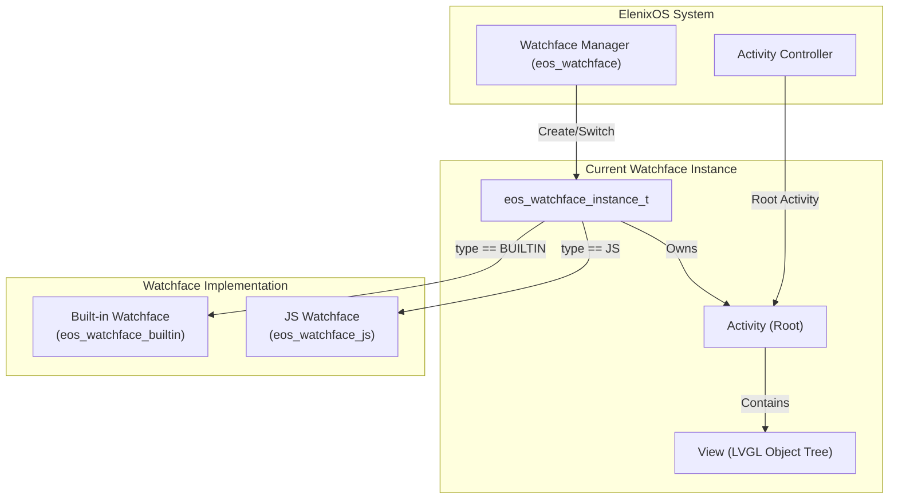
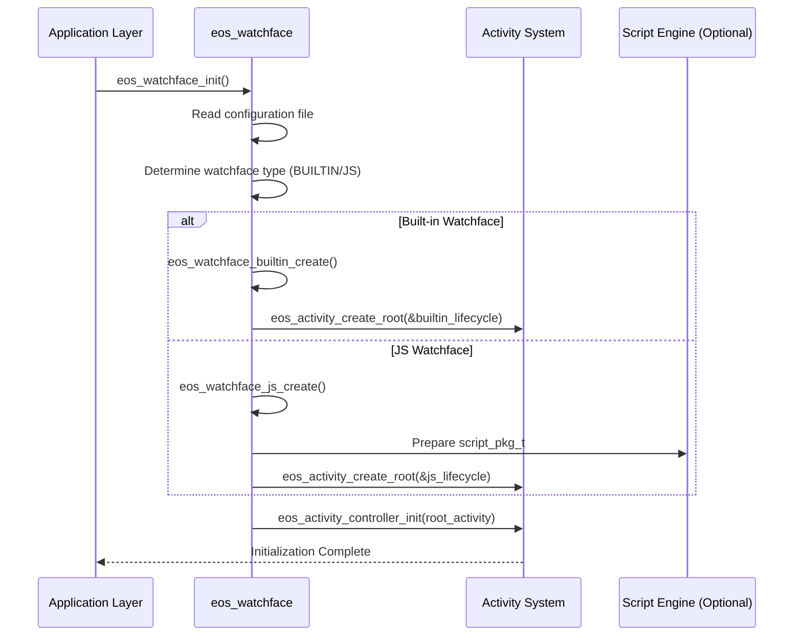
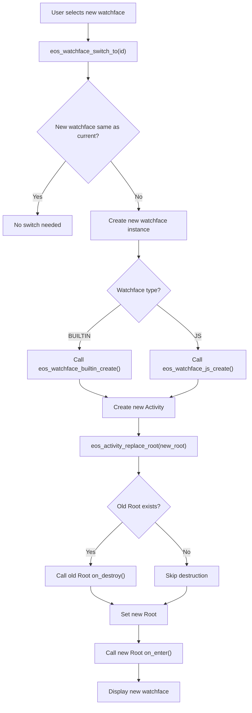
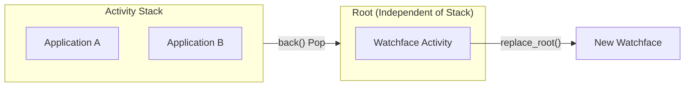
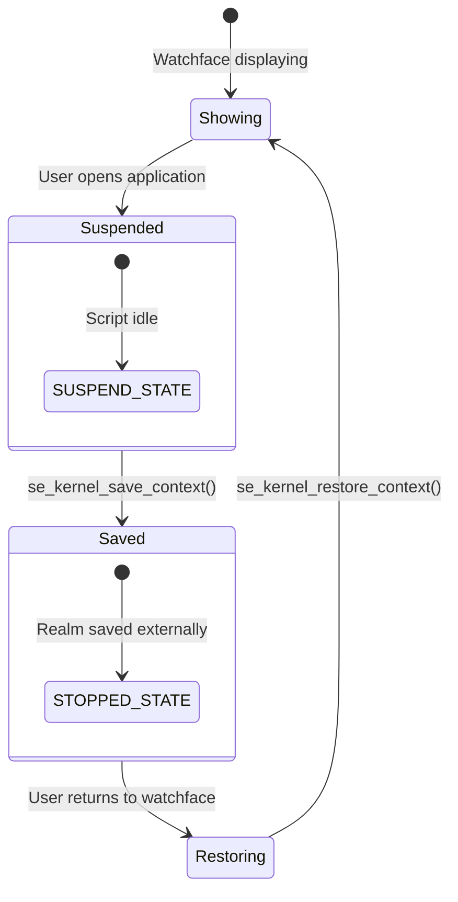

# Watchface System

## Overview

The watchface is the core UI component of ElenixOS, always displayed as the system's "home page". The watchface system supports two types:

- **Built-in Watchface**: A backup watchface written in C, independent of the script engine
- **JS Watchface**: A dynamic watchface written in JavaScript, running through the script engine

## Architecture Design

### Watchface Instance Model

Each watchface is an independent **Instance**, with its own Activity and complete lifecycle management:

```c
typedef struct eos_watchface_instance {
    eos_watchface_type_t type;           /**< Watchface type (BUILTIN/JS) */
    char id[EOS_WATCHFACE_ID_LEN_MAX];   /**< Unique watchface identifier */

    eos_activity_t *activity;            /**< Owned Activity (created and managed by the instance) */
    const eos_activity_lifecycle_t *lifecycle;  /**< Activity lifecycle callbacks */

    union {
        struct {
            lv_timer_t *time_update_timer;  /**< Time update timer for built-in watchface */
        } builtin;

        struct {
            script_pkg_t pkg;               /**< Script package information for JS watchface */
        } js;
    } data;
} eos_watchface_instance_t;
```

### Watchface Type Enum

```c
typedef enum {
    EOS_WATCHFACE_TYPE_BUILTIN,  /**< Built-in backup watchface */
    EOS_WATCHFACE_TYPE_JS,       /**< JavaScript script watchface */
} eos_watchface_type_t;
```

### Architecture Layers



## Core Functions

### Initialization Flow



**Code Example**:
```c
// Initialize watchface system (all details handled internally)
eos_result_t ret = eos_watchface_init();
if (ret != EOS_OK) {
    // Handle error
}

// Get watchface Activity (for controller initialization)
eos_activity_t *watchface = eos_watchface_get_activity();
eos_activity_controller_init(watchface);
```

### Watchface Switching Mechanism

When the user selects a new watchface, the system executes the complete switching process:



**Key API**:
```c
/**
 * @brief Switch to specified watchface
 * @param watchface_id Target watchface ID
 * @note This function replaces root activity with the new watchface instance
 */
void eos_watchface_switch_to(const char *watchface_id);

/**
 * @brief Check if watchface configuration has changed and reload
 * @note Should be called when returning to root activity (e.g., in on_resume)
 */
void eos_watchface_check_and_reload(void);
```

### Configuration Change Detection

The watchface system supports hot reload and automatically detects and applies changes when the configuration file changes:

```c
void eos_watchface_check_and_reload(void);
```

**Typical Use Cases**:
- When returning to watchface from application (in `on_resume` callback)
- When system wakes from sleep
- When user changes default watchface in settings

## Built-in vs JS Watchfaces

### Built-in Watchface Implementation

**File**: `eos_watchface_builtin.c/h`

Features:
- Uses `lv_timer_t` to periodically update time display
- Directly operates LVGL API without script engine overhead
- Serves as system fallback to ensure time display even if script engine fails

**Core Logic**:
```c
// Time update callback
static void builtin_time_update_cb(lv_timer_t *timer)
{
    eos_watchface_instance_t *instance = timer->user_data;
    // Update time display (directly manipulate LVGL objects)
    lv_label_set_fmt(time_label, "%02d:%02d", hour, minute);
}
```

### JS Watchface Implementation

**File**: `eos_watchface_js.c/h`

Features:
- Uses `script_pkg_t` to define script metadata and source code
- Uses script engine's layered architecture (Kernel + Manager)
- Supports context save/restore (when switching applications)

**Core Logic**:
```c
// JS watchface initialization
static eos_activity_t *eos_watchface_js_create(const char *watchface_id)
{
    // 1. Load manifest.json to get script information
    // 2. Read main.js source code
    // 3. Build script_pkg_t structure
    // 4. Create Root Activity (View created by script in on_enter)

    return eos_activity_create_root(&js_lifecycle);
}
```

## Integration with Activity System

### Root Activity Relationship

The watchface, as the **Root Activity**, has a special status:



**Lifecycle Comparison**:

| Operation | Normal Activity | Root Activity (Watchface) |
|-----------|----------------|---------------------------|
| Create | `eos_activity_create()` | `eos_activity_create_root()` |
| Destroy | `eos_activity_back()` on pop | `eos_activity_replace_root()` on switch |
| View Creation | Lazy (in on_enter) | **Immediate** (at create_root) |
| Persistence | Managed with stack | Always exists until replaced |

### Context Management

For JS watchfaces, the script context is saved when switching to an application:



## File Structure

```
src/framework/watchface/
├── eos_watchface.h              # Watchface system public interface
├── eos_watchface.c              # Watchface manager implementation
├── eos_watchface_list.c         # Watchface list management
├── eos_watchface_builtin.h      # Built-in watchface interface
├── eos_watchface_builtin.c      # Built-in watchface implementation
├── eos_watchface_js.h           # JS watchface interface
└── eos_watchface_js.c           # JS watchface implementation
```