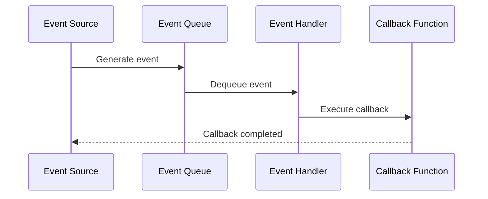

# Event System

The event system of ElenixOS is a core component responsible for handling event transmission, distribution, and processing within the system. It provides a complete event registration, dispatching, and broadcasting mechanism, supporting both synchronous and asynchronous event processing.

## Event Registration and Dispatching

### Event Registration

The event system allows components to register event listeners to be notified when specific events occur:

```c
// Register event listener
eos_event_handler_t handler = eos_event_register("event.name", event_callback, user_data);

// Event callback function
void event_callback(const char *event_name, void *data, void *user_data) {
    // Handle event
}
```

### Event Dispatching

The event system is responsible for dispatching events to the corresponding listeners:

```c
// Dispatch event
eos_event_t event = {
    .name = "event.name",
    .data = event_data,
    .data_size = sizeof(event_data)
};
eos_event_dispatch(&event);
```

### Event Unregistration

When event listening is no longer needed, event listeners can be unregistered:

```c
// Unregister event listener
eos_event_unregister(handler);
```

## Global Broadcast Mechanism

ElenixOS supports a global event broadcast mechanism, allowing events to propagate throughout the entire system:

### Broadcast Events

```c
// Broadcast event
eos_event_broadcast("system.event", event_data, sizeof(event_data));
```

### Subscribe to Broadcasts

```c
// Subscribe to broadcast event
eos_event_handler_t handler = eos_event_subscribe("system.event", event_callback, user_data);
```

### Broadcast Levels

The event system supports different levels of broadcasting:

1. **System-level broadcast**: Broadcast throughout the entire system
2. **Module-level broadcast**: Broadcast within a specific module
3. **Application-level broadcast**: Broadcast within a specific application

## UI Events and System Events

### UI Events

UI events are events related to the user interface, such as touch, click, swipe, etc.:

| Event Type | Description | Trigger Condition |
|------------|-------------|-------------------|
| `ui.touch` | Touch event | User touches the screen |
| `ui.click` | Click event | User clicks a control |
| `ui.swipe` | Swipe event | User swipes the screen |
| `ui.long_press` | Long press event | User long presses the screen |

### System Events

System events are events related to system status, such as battery status changes, system startup, etc.:

| Event Type | Description | Trigger Condition |
|------------|-------------|-------------------|
| `system.startup` | System startup | System startup completed |
| `system.shutdown` | System shutdown | System about to shut down |
| `battery.change` | Battery status change | Battery level or charging status change |
| `sensor.data` | Sensor data | Sensor data update |

## Asynchronous Callback Timing

ElenixOS's event system supports asynchronous callbacks to ensure system responsiveness and stability:

### Asynchronous Event Processing

```c
// Asynchronously dispatch event
eos_event_dispatch_async(&event);

// Asynchronous callback function
void async_callback(void *data) {
    // Handle asynchronous event
}
```

### Callback Timing

1. **Event generation**: Event source generates an event
2. **Event enqueue**: Event is added to the event queue
3. **Event processing**: Event handler processes events in order
4. **Callback execution**: Callback function executes at the appropriate time



## Event Priority

The event system supports event priorities to ensure important events are processed first:

| Priority | Description | Application Scenario |
|----------|-------------|---------------------|
| `EOS_EVENT_PRIORITY_HIGH` | High priority | System emergency events |
| `EOS_EVENT_PRIORITY_NORMAL` | Normal priority | Normal user events |
| `EOS_EVENT_PRIORITY_LOW` | Low priority | Non-emergency system events |

### Setting Event Priority

```c
// Set event priority
event.priority = EOS_EVENT_PRIORITY_HIGH;
eos_event_dispatch(&event);
```

## Event Filtering

The event system supports event filtering, allowing listeners to only receive specific types of events:

### Event Filter

```c
// Create event filter
eos_event_filter_t filter = eos_event_filter_create("event.*");

// Register filtered listener
eos_event_handler_t handler = eos_event_register_filtered("event.name", event_callback, user_data, filter);

// Destroy filter
eos_event_filter_destroy(filter);
```

## Event System Implementation

### Core Components

1. **Event manager**: Manages event registration, dispatching, and unregistration
2. **Event queue**: Stores pending events
3. **Event handler**: Processes events and executes callbacks
4. **Event filter**: Filters events, only passing events that meet conditions

### Implementation Details

- **Thread safety**: The event system is thread-safe and can be used in multi-threaded environments
- **Memory management**: The event system automatically manages event-related memory
- **Error handling**: The event system handles errors during event processing

## Usage Examples

### Registering and Handling Events

```c
// Register event listener
void battery_change_callback(const char *event_name, void *data, void *user_data) {
    battery_info_t *info = (battery_info_t *)data;
    printf("Battery level: %d%%, Charging: %s\n", info->level, info->charging ? "yes" : "no");
}

// Register in initialization function
void app_init(void) {
    eos_event_register("battery.change", battery_change_callback, NULL);
}

// Dispatch event
void update_battery_status(void) {
    battery_info_t info = {
        .level = 80,
        .charging = true
    };
    eos_event_dispatch("battery.change", &info, sizeof(info));
}
```

### Asynchronous Event Processing

```c
// Asynchronous callback function
void async_task(void *data) {
    printf("Async task executed: %s\n", (char *)data);
}

// Dispatch asynchronous event
void schedule_async_task(void) {
    char *message = "Hello from async task";
    eos_event_dispatch_async("async.task", message, strlen(message) + 1);
}
```

## Best Practices

1. **Use events appropriately**: Only use events when necessary, avoid overuse
2. **Event naming conventions**: Use clear, unambiguous event names, such as `module.event`
3. **Callback function design**: Callback functions should be concise and avoid time-consuming operations
4. **Error handling**: Properly handle errors in callback functions
5. **Resource management**: Timely unregister event listeners when no longer needed

## Summary

ElenixOS's event system is a powerful and flexible component that implements efficient internal system communication through a unified event registration, dispatching, and broadcasting mechanism. By using the event system properly, developers can build more modular and maintainable applications.