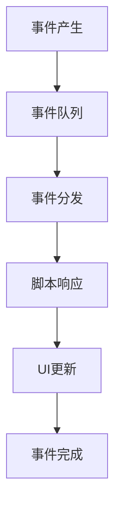

# 运行时总览

ElenaOS 的运行时系统基于 JerryScript 引擎，负责管理脚本的执行、调度和资源分配。本文档将详细介绍 ElenaOS 的运行时机制、调度器、状态管理和 Realm 生命周期。

## 脚本生命周期

ElenaOS 中的脚本（应用和表盘）具有完整的生命周期，从加载到执行再到销毁：

### 1. 加载阶段

1. **脚本加载**：从文件系统加载应用或表盘的脚本文件
2. **解析清单**：解析 `manifest.json` 文件，获取应用信息
3. **创建 Realm**：为脚本创建独立的 ECMAScript Realm
4. **注册 API**：向 Realm 中注册系统 API

### 2. 执行阶段

1. **初始化**：执行脚本的初始化代码
2. **运行**：执行脚本的主逻辑
3. **事件处理**：处理用户输入和系统事件
4. **UI 更新**：更新用户界面

### 3. 销毁阶段

1. **清理资源**：释放脚本使用的资源
2. **销毁 Realm**：销毁脚本的 Realm 环境
3. **释放内存**：释放分配的内存

## 调度与事件流程

ElenaOS 使用事件驱动的调度机制，处理用户输入、系统事件和脚本执行：

### 调度器

调度器负责管理脚本的执行和事件的分发，确保系统的响应性和稳定性：

1. **事件队列**：维护事件队列，按优先级处理事件
2. **时间管理**：管理定时器和定时事件
3. **资源调度**：合理分配系统资源

### 事件流程

1. **事件产生**：用户输入、系统状态变化等产生事件
2. **事件分发**：事件系统将事件分发给相应的处理程序
3. **脚本响应**：脚本根据事件执行相应的逻辑
4. **UI 更新**：更新用户界面

## 资源管理策略

ElenaOS 在资源受限的环境中运行，采用了以下资源管理策略：

### 内存管理

1. **内存分配**：使用动态内存分配，按需分配内存
2. **内存回收**：定期回收未使用的内存
3. **内存限制**：对每个脚本设置内存使用限制

### CPU 资源管理

1. **时间片分配**：为每个脚本分配时间片
2. **优先级调度**：根据脚本的重要性分配 CPU 时间
3. **休眠机制**：在无事件时进入休眠状态，减少功耗

### 存储管理

1. **文件系统**：使用文件系统存储应用和数据
2. **缓存策略**：合理使用缓存，提高访问速度
3. **存储限制**：对每个应用设置存储使用限制

## 运行时错误处理

ElenaOS 采用多层错误处理机制，确保系统的稳定性：

### 错误捕获

1. **脚本错误**：捕获脚本执行过程中的错误
2. **系统错误**：捕获系统级错误
3. **硬件错误**：捕获硬件相关错误

### 错误处理策略

1. **错误隔离**：确保一个脚本的错误不会影响其他脚本
2. **错误恢复**：在错误发生后尝试恢复系统状态
3. **错误日志**：记录错误信息，便于调试

### 错误类型

| 错误类型 | 描述 | 处理方式 |
|---------|------|---------|
| 脚本语法错误 | 脚本代码语法不正确 | 停止脚本执行，显示错误信息 |
| 脚本运行时错误 | 脚本执行过程中出现错误 | 捕获错误，尝试恢复 |
| 系统资源错误 | 系统资源不足 | 释放资源，尝试继续执行 |
| 硬件错误 | 硬件操作失败 | 记录错误，尝试降级操作 |

## Realm 生命周期

Realm 是 ECMAScript 语言规范中的一个概念，用于实现 JavaScript 的多线程执行环境。在 ElenaOS 中，每个脚本运行在独立的 Realm 中：

### Realm 创建

1. **初始化**：初始化 JerryScript 引擎
2. **创建 Realm**：创建新的 Realm 实例
3. **注册 API**：向 Realm 中注册系统 API
4. **加载脚本**：加载脚本代码到 Realm 中

### Realm 运行

1. **执行脚本**：在 Realm 中执行脚本代码
2. **处理事件**：处理脚本产生的事件
3. **管理状态**：管理脚本的运行状态

### Realm 销毁

1. **停止执行**：停止脚本的执行
2. **清理资源**：清理脚本使用的资源
3. **销毁 Realm**：销毁 Realm 实例
4. **释放内存**：释放分配的内存

## 运行时优化

ElenaOS 采用了多种优化策略，提高运行时性能：

1. **字节码缓存**：缓存编译后的字节码，减少重复编译
2. **惰性加载**：按需加载脚本和资源
3. **预编译**：预编译常用脚本，提高启动速度
4. **内存池**：使用内存池管理内存分配，减少内存碎片

## 运行时安全

ElenaOS 重视运行时安全，采取了以下措施：

1. **沙箱隔离**：每个脚本运行在独立的沙箱中
2. **权限控制**：对脚本的权限进行严格控制
3. **资源限制**：限制脚本的资源使用
4. **输入验证**：验证用户输入，防止恶意输入

## 总结

ElenaOS 的运行时系统是一个复杂而高效的系统，它通过合理的调度机制、资源管理策略和错误处理机制，确保了系统的稳定性和响应性。同时，它也为应用开发提供了一个安全、高效的运行环境。

通过了解 ElenaOS 的运行时机制，开发者可以更好地理解系统的工作原理，从而开发出更高效、更稳定的应用。