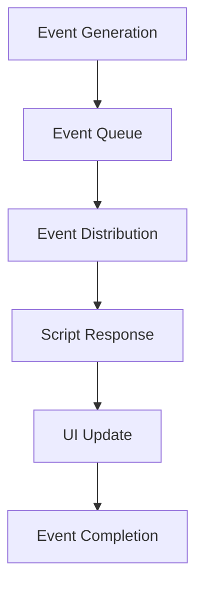

# Runtime Overview

ElenixOS's runtime system is based on the JerryScript engine, responsible for managing script execution, scheduling, and resource allocation. This document will detail ElenixOS's runtime mechanisms, scheduler, state management, and Realm lifecycle.

## Script Lifecycle

Scripts (applications and watchfaces) in ElenixOS have a complete lifecycle, from loading to execution to destruction:

### 1. Loading Phase

1. **Script Loading**: Load application or watchface script files from the file system
2. **Manifest Parsing**: Parse the `manifest.json` file to get application information
3. **Create Realm**: Create an independent ECMAScript Realm for the script
4. **Register API**: Register system APIs into the Realm

### 2. Execution Phase

1. **Initialization**: Execute the script's initialization code
2. **Running**: Execute the script's main logic
3. **Event Handling**: Handle user input and system events
4. **UI Update**: Update the user interface

### 3. Destruction Phase

1. **Resource Cleanup**: Release resources used by the script
2. **Destroy Realm**: Destroy the script's Realm environment
3. **Memory Release**: Release allocated memory

## Scheduling and Event Flow

ElenixOS uses an event-driven scheduling mechanism to handle user input, system events, and script execution:

### Scheduler

The scheduler is responsible for managing script execution and event distribution, ensuring system responsiveness and stability:

1. **Event Queue**: Maintain an event queue, process events by priority
2. **Time Management**: Manage timers and timed events
3. **Resource Scheduling**: Reasonably allocate system resources

### Event Flow

1. **Event Generation**: User input, system state changes, etc. generate events
2. **Event Distribution**: The event system distributes events to corresponding handlers
3. **Script Response**: Scripts execute corresponding logic based on events
4. **UI Update**: Update the user interface

## Resource Management Strategy

ElenixOS runs in resource-constrained environments and adopts the following resource management strategies:

### Memory Management

1. **Memory Allocation**: Use dynamic memory allocation, allocate memory on demand
2. **Memory Recycling**: Regularly recycle unused memory
3. **Memory Limit**: Set memory usage limits for each script

### CPU Resource Management

1. **Time Slice Allocation**: Allocate time slices for each script
2. **Priority Scheduling**: Allocate CPU time based on script importance
3. **Sleep Mechanism**: Enter sleep state when there are no events to reduce power consumption

### Storage Management

1. **File System**: Use file system to store applications and data
2. **Cache Strategy**: Use cache reasonably to improve access speed
3. **Storage Limit**: Set storage usage limits for each application

## Runtime Error Handling

ElenixOS adopts a multi-layer error handling mechanism to ensure system stability:

### Error Capture

1. **Script Errors**: Capture errors during script execution
2. **System Errors**: Capture system-level errors
3. **Hardware Errors**: Capture hardware-related errors

### Error Handling Strategy

1. **Error Isolation**: Ensure errors in one script do not affect other scripts
2. **Error Recovery**: Attempt to recover system state after an error occurs
3. **Error Logging**: Record error information for debugging

### Error Types

| Error Type | Description | Handling Method |
|------------|-------------|------------------|
| Script syntax error | Script code has incorrect syntax | Stop script execution, display error information |
| Script runtime error | Error occurs during script execution | Capture error, attempt recovery |
| System resource error | Insufficient system resources | Release resources, attempt to continue execution |
| Hardware error | Hardware operation failure | Record error, attempt degraded operation |

## Realm Lifecycle

Realm is a concept in the ECMAScript language specification used to implement JavaScript's multi-threaded execution environment. In ElenixOS, each script runs in an independent Realm:

### Realm Creation

1. **Initialization**: Initialize the JerryScript engine
2. **Create Realm**: Create a new Realm instance
3. **Register API**: Register system APIs into the Realm
4. **Load Script**: Load script code into the Realm

### Realm Running

1. **Execute Script**: Execute script code in the Realm
2. **Handle Events**: Handle events generated by the script
3. **Manage State**: Manage the script's running state

### Realm Destruction

1. **Stop Execution**: Stop script execution
2. **Cleanup Resources**: Clean up resources used by the script
3. **Destroy Realm**: Destroy the Realm instance
4. **Release Memory**: Release allocated memory

## Runtime Optimization

ElenixOS adopts multiple optimization strategies to improve runtime performance:

1. **Bytecode Caching**: Cache compiled bytecode to reduce repeated compilation
2. **Lazy Loading**: Load scripts and resources on demand
3. **Precompilation**: Precompile common scripts to improve startup speed
4. **Memory Pool**: Use memory pool to manage memory allocation, reduce memory fragmentation

## Runtime Security

ElenixOS values runtime security and has taken the following measures:

1. **Sandbox Isolation**: Each script runs in an independent sandbox
2. **Permission Control**: Strictly control script permissions
3. **Resource Limitation**: Limit script resource usage
4. **Input Validation**: Validate user input to prevent malicious input

## Summary

ElenixOS's runtime system is a complex and efficient system that ensures system stability and responsiveness through reasonable scheduling mechanisms, resource management strategies, and error handling mechanisms. At the same time, it provides a safe and efficient runtime environment for application development.

By understanding ElenixOS's runtime mechanisms, developers can better understand how the system works, thereby developing more efficient and stable applications.