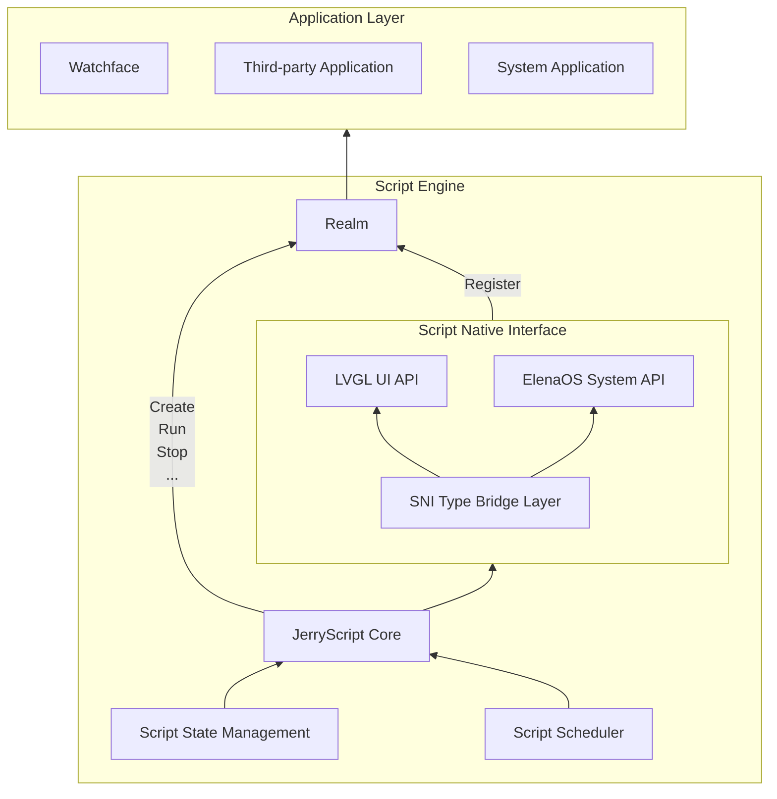

# Script Engine

## Overview

ElenaOS's watchfaces and applications are uniformly driven by the Script Engine, which is based on [JerryScript](https://jerryscript.net) for compiling and executing JavaScript code.

JerryScript is a lightweight JavaScript engine designed to run on resource-constrained devices, such as microcontrollers:

* Very little RAM available for the engine (&lt;64 KB RAM)
* Limited ROM space for the engine code (&lt;200 KB ROM)

The engine supports on-device compilation, execution, and provides JavaScript access to peripherals.

Open source address: https://github.com/jerryscript-project/jerryscript

## System Architecture

The Script Engine is the core module of ElenaOS, responsible for the operation of watchfaces and applications.

The architecture of the Script Engine is as follows:

## Realm

In ElenaOS, each script runs in an independent ECMAScript Realm. Realm is a concept in the ECMAScript language specification used to implement JavaScript's multi-threaded execution environment. Realm is a complete JavaScript runtime environment, including global objects, built-in objects, state, and APIs. The role of Realm is to isolate the runtime environments between different scripts, ensuring that scripts do not interfere with each other. The system mounts public APIs to each Realm, enabling scripts to safely access UI, system services, and hardware interfaces while maintaining isolation of global objects, built-in objects, and state, thereby achieving a reliable and secure multi-script runtime environment.

## Script State Management

The script state management module is responsible for managing the running state of scripts, including script creation, running, stopping, etc.

Script states include:

| State Name | Description |
|------------|-------------|
| SCRIPT_STATE_STOPPED | Stopped: Script has stopped and resources are released |
| SCRIPT_STATE_RUNNING | Running: Script is running |
| SCRIPT_STATE_SUSPEND | Suspended: Script has completed running, waiting for callback |
| SCRIPT_STATE_STOPPING | Stopping: Script is being stopped |
| SCRIPT_STATE_ERROR | Error: Script execution error |

Script state enum type defined by `script_state_t`, used to describe the running state of the script.

## JS API Binding Layer

The JS API layer is the interaction layer between the Script Engine and underlying hardware resources (such as UI drawing, sensors, peripherals), responsible for converting underlying hardware resources into JS APIs and binding them to the Realm.

### JS API Directory

1. ElenaOS System API: [ElenaOS](../js-api/elena_os)
2. LVGL UI API: [LVGL](../js-api/lvgl)