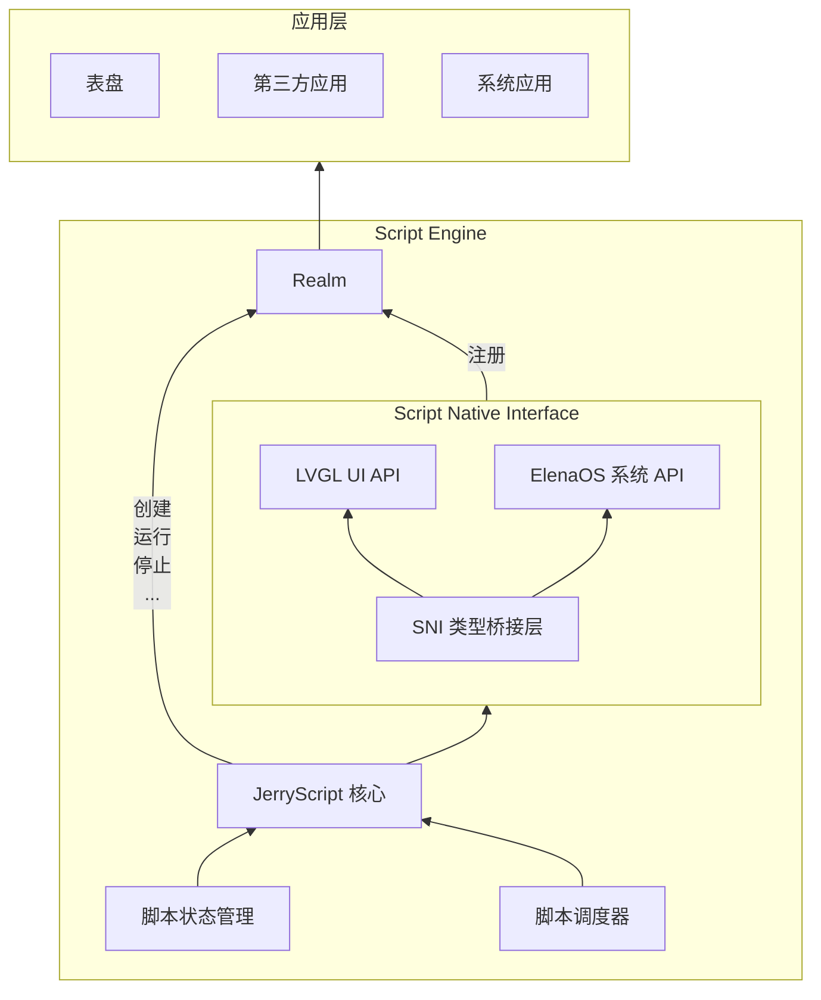

# Script Engine

## 概述

ElenaOS 的表盘与应用程序统一由脚本引擎（Script Engine）驱动，底层基于 [JerryScript](https://jerryscript.net) 对 JavaScript 代码进行编译与执行。

JerryScript 是一个轻量级的 JavaScript 引擎，旨在在资源受限的设备上运行，例如微控制器：

* 引擎可用的 RAM 很少（&lt;64 KB RAM）
* 引擎代码的 ROM 空间受限（&lt;200 KB ROM）

该引擎支持设备上的编译、执行，并提供 JavaScript 访问外设的功能。

开源地址：https://github.com/jerryscript-project/jerryscript

## 系统架构

脚本引擎（Script Engine）是 ElenaOS 的核心模块，负责表盘与应用程序的运行。

脚本引擎的架构如下：

## Realm

在 ElenaOS 中，每个脚本运行在独立的 ECMAScript Realm 中。Realm 是 ECMAScript 语言规范中的一个概念，用于实现 JavaScript 的多线程执行环境。Realm 是一个完整的 JavaScript 运行时环境，包括全局对象、内建对象、状态和 API。Realm 的作用是隔离不同脚本之间的运行环境，确保脚本之间不会互相干扰。系统将公共 API 挂载到每个 Realm 上，使脚本能够安全地访问 UI、系统服务和硬件接口，同时保持全局对象、内建对象和状态的隔离性，从而实现可靠、安全的多脚本运行时环境。

## 脚本状态管理

脚本状态管理模块负责管理脚本的运行状态，包括脚本的创建、运行、停止等。

脚本的状态有：

| 状态名称              | 描述                         |
| --------------------- | ---------------------------- |
| SCRIPT_STATE_STOPPED  | 停止：脚本已停止并释放资源   |
| SCRIPT_STATE_RUNNING  | 运行：脚本正在运行           |
| SCRIPT_STATE_SUSPEND  | 挂起：脚本运行完成，等待回调 |
| SCRIPT_STATE_STOPPING | 停止中：正在停止脚本         |
| SCRIPT_STATE_ERROR    | 错误：脚本执行出错           |

由`script_state_t`定义的脚本状态枚举类型，用于描述脚本的运行状态。

## JS API 绑定层

JS API 层是脚本引擎（Script Engine）与底层硬件资源（如 UI 绘制、传感器、外设）的交互层，负责将底层硬件资源转换为 JS API，并绑定到 Realm 中。

### JS API 目录

1. ElenaOS 系统 API：[ElenaOS](../js-api/elena_os)
2. LVGL UI API：[LVGL](../js-api/lvgl)
