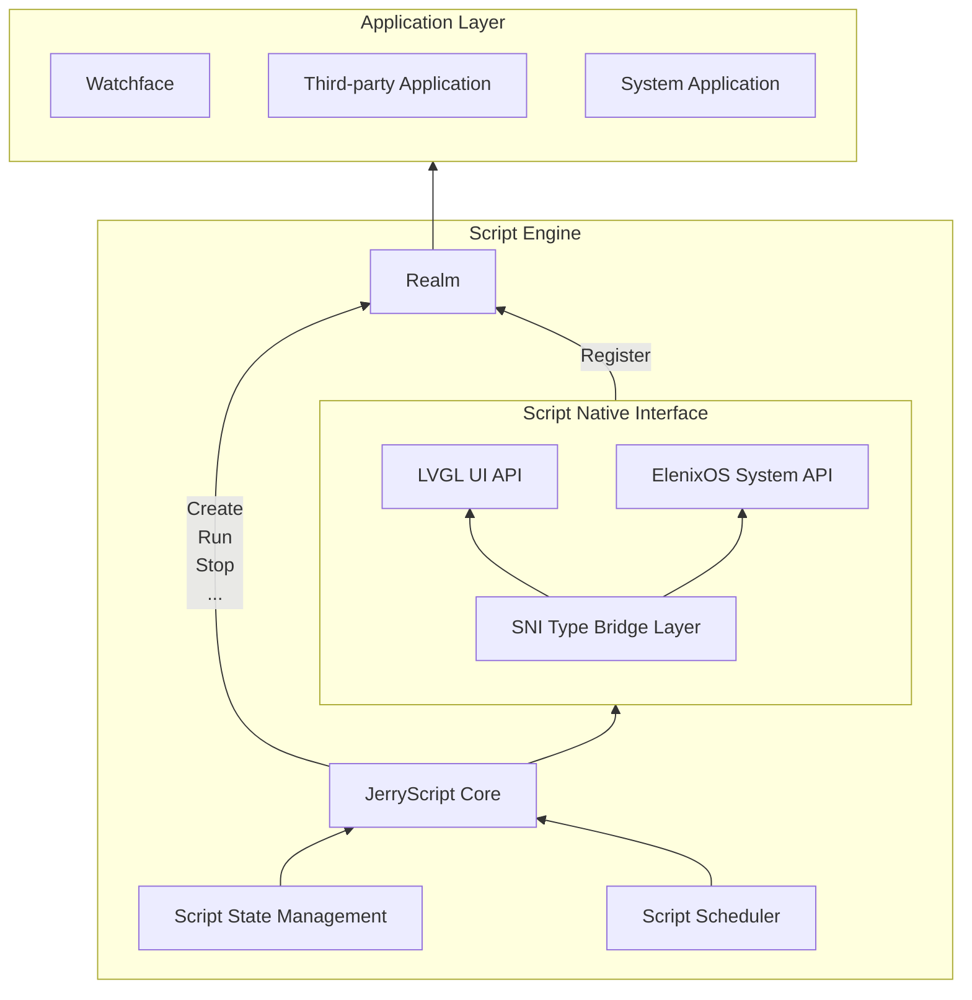

# Script Engine

## Overview

ElenixOS's watchfaces and applications are uniformly driven by Script Engine, which is based on [JerryScript](https://jerryscript.net) for compiling and executing JavaScript code.

JerryScript is a lightweight JavaScript engine designed to run on resource-constrained devices, such as microcontrollers:

* Very little RAM available for engine (&lt;64 KB RAM)
* Limited ROM space for engine code (&lt;200 KB ROM)

The engine supports on-device compilation, execution, and provides JavaScript access to peripherals.

Open source address: https://github.com/jerryscript-project/jerryscript

## System Architecture

The Script Engine is core module of ElenixOS, responsible for operation of watchfaces and applications.

The architecture of Script Engine is as follows:

## Realm

In ElenixOS, each script runs in an independent ECMAScript Realm. Realm is a concept in ECMAScript language specification used to implement JavaScript's multi-threaded execution environment. Realm is a complete JavaScript runtime environment, including global objects, built-in objects, state, and APIs. The role of Realm is to isolate runtime environments between different scripts, ensuring that scripts do not interfere with each other. The system mounts public APIs to each Realm, enabling scripts to safely access UI, system services, and hardware interfaces while maintaining isolation of global objects, built-in objects, and state, thereby achieving a reliable and secure multi-script runtime environment.

Realm can only be used in single-threaded environment and cannot be shared across threads. Each Realm has its own global objects and built-in objects, and scripts can only access objects in their own Realm, cannot directly access objects in other Realms.

## Script State Management

The script state management module is responsible for managing running state of scripts, including script creation, running, stopping, etc.

Script states include:

| State Name | Description |
|------------|-------------|
| SCRIPT_STATE_STOPPED | Stopped: Script has stopped and resources are released |
| SCRIPT_STATE_RUNNING | Running: Script is running |
| SCRIPT_STATE_SUSPEND | Suspended: Script has completed running, waiting for callback |
| SCRIPT_STATE_STOPPING | Stopping: Script is being stopped |
| SCRIPT_STATE_ERROR | Error: Script execution error |

Script state enum type defined by `script_state_t`, used to describe running state of script.

### Script State Description

#### SCRIPT_STATE_RUNNING

Script is running, for example executing `eos.lv_label_create(eos_screen_active());`. In this state, the script engine is executing JavaScript code, which may create UI elements, call system APIs, or perform other operations.

#### SCRIPT_STATE_SUSPEND

Generally, after drawing is completed, the script enters suspended state `SCRIPT_STATE_SUSPEND`. At this time, if external callback is triggered, it can be called normally. In this state, the script engine pauses execution but maintains state of all variables and objects, waiting for external events (such as user interaction, timers, sensor data, etc.) to trigger callback functions.

#### SCRIPT_STATE_STOPPED

Script not started and script closed are in this state. At this time, related resources of the script have been cleaned up, sandbox has been deleted, and no callbacks registered in the script will be called anymore. In this state, the script engine has completely released all resources, including Realm, global objects, and all registered callback functions.

## Startup Process

The startup process of script engine is as follows:

1. **During system startup**: Need to call `script_engine_init` to initialize script engine and create necessary runtime environment
2. **During script startup**: Will create a new `realm` to provide sandbox for isolation, ensuring that runtime environments between different scripts are independent
3. **Automatic registration**: New `realm` will automatically register all functions and symbols, including LVGL UI API and ElenixOS system API
4. **Script execution**: Use `eos.*` in script to access functions and symbols for UI drawing and system calls

## Script Usage

### Basic Usage

Directly call LVGL functions in script to draw UI. After drawing is completed, no operation is needed. System internally calls `lv_timer_handler` to perform rendering operations. System automatically manages UI refresh and rendering, developers only need to focus on UI creation and layout.

### Script Stop

If you want to close the script, use `script_engine_request_stop();`. This function will request to stop currently running script, release related resources, and clean up Realm.

### Script Usage Notes

1. **No Dead Loops**: Dead loops are prohibited in scripts, otherwise they will block UI and cause system unable to respond to user operations
2. **Resource Management**: Objects and resources created by scripts will be automatically cleaned up when script stops, but it is recommended to manually release resources that are no longer needed at appropriate times
3. **Callback Functions**: Avoid executing time-consuming operations in callback functions to avoid affecting UI response speed
4. **Global Variables**: Try to avoid using too many global variables to avoid occupying too much memory
5. **Error Handling**: It is recommended to add error handling logic in key code segments to improve script robustness

## JS API Binding Layer

The JS API layer is interaction layer between Script Engine and underlying hardware resources (such as UI drawing, sensors, peripherals), responsible for converting underlying hardware resources into JS APIs and binding them to Realm.

### JS API Directory

1. ElenixOS System API: [ElenixOS](../js-api/elenix_os)
2. LVGL UI API: [LVGL](../js-api/lvgl)