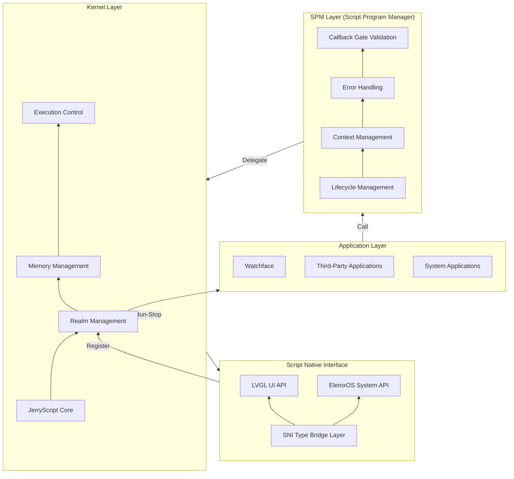
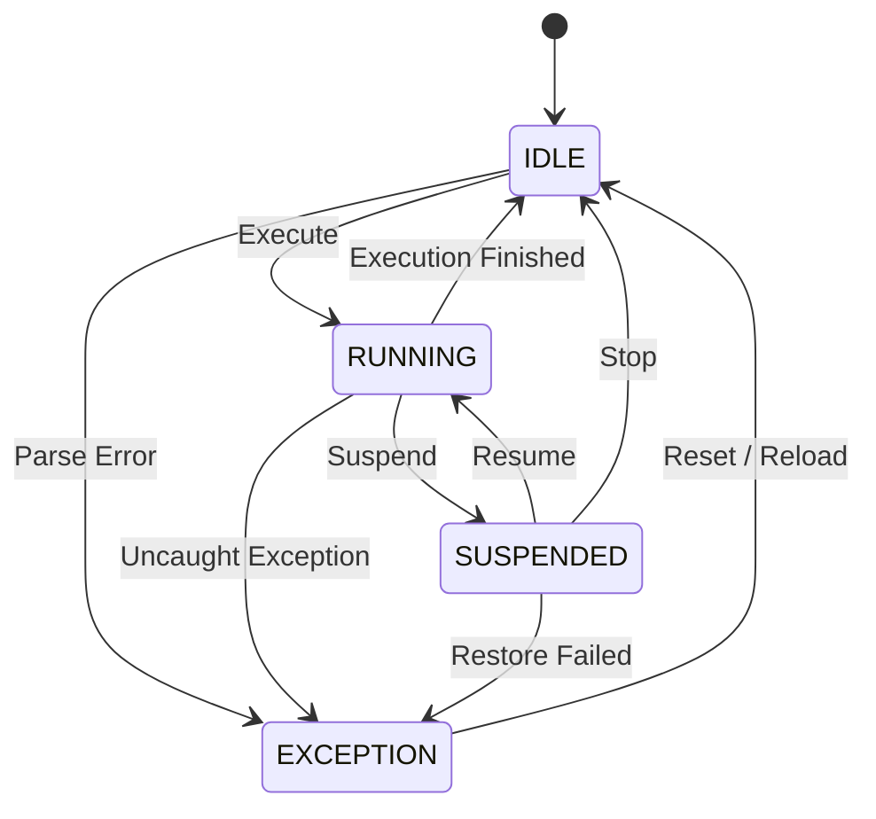
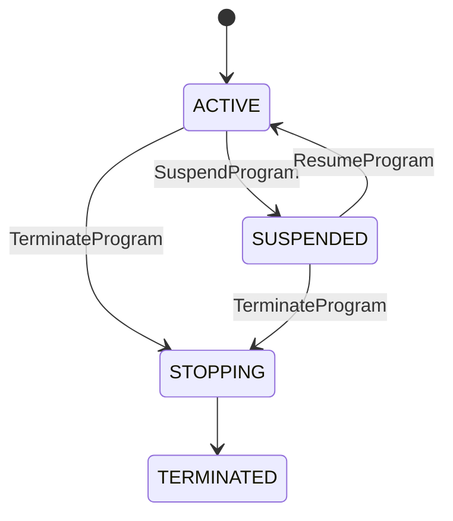
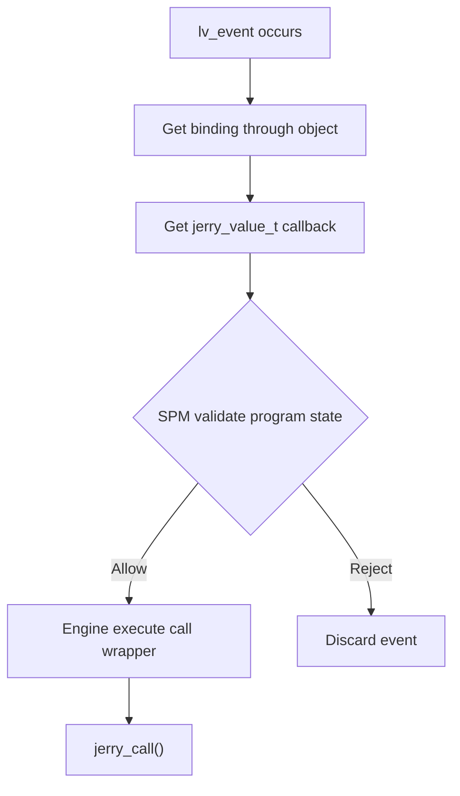
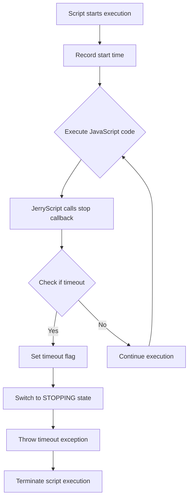

# Script Engine

## Overview

ElenixOS watchfaces and applications are uniformly driven by the Script Engine, which is based on [JerryScript](https://jerryscript.net) for JavaScript code compilation and execution.

JerryScript is a lightweight JavaScript engine designed to run on resource-constrained devices, such as microcontrollers:

* The engine has very little RAM available (&lt;64 KB RAM)
* The engine code has limited ROM space (&lt;200 KB ROM)

The engine supports on-device compilation, execution, and provides JavaScript access to peripherals.

Open Source URL: https://github.com/jerryscript-project/jerryscript


## Script Engine Basic Concepts

The script engine is responsible for managing JerryScript in ElenixOS, with core functions including script parsing, running, stopping, and multi-instance management.

The smallest unit that the script engine can run is a Script Program. Script programs can be divided into WatchFace and Application.

```text
Script Program
├─ Application
└─ WatchFace
```

### Script Working Directory

The script working directory is the workspace for script program developers. The minimum script working directory structure is as follows:

```text
com.elenixos.demo
├── main.js
└── manifest.json
```

That is, it must contain at least two files: `manifest.json` and `main.js`.

Where:
- `main.js` is the script entry point;
- `manifest.json` is used to describe the metadata of the script program.

Developers can add script modules as needed. The module location is not restricted, as long as `main.js` can access it during import.

Script programs can only access files and directories within their working directory. Accessing other locations will be blocked by the system.

### Script Package

The script working directory can be packaged using the `eos_pkg_builder.py` tool to generate a script package.

The packaging tool will validate the structure of the target directory and generate a script package after validation passes.

Currently, script packages are only used for distribution and do not include compression.

### Script Program Context

The script program's Context is a complete instance of a script program's run, storing data such as Realm, root Activity, and controlled resource linked list. Context is the runtime instance of Script Program and should not contain Engine global state. The lifecycle of the context depends on the type of script program - applications and watchfaces have different lifecycles.

## System Architecture

The Script Engine is the core module of ElenixOS, responsible for running watchfaces and applications.

### Layered Architecture Design

The script engine adopts a **three-layer architecture** design, dividing the system into Kernel layer, SPM layer (Script Program Manager), and SNI layer (Script Native Interface) to reduce coupling:



### Script Engine Core (SEC)

The Script Engine Core (SEC) is responsible for managing JerryScript, Realm, GC, Module, and executing JS. It is responsible for "how to run JS" and does not know about concepts like Activity, View, WatchFace, or Application.

The engine kernel is a single-executor model and does not support parallel execution of multiple scripts. The kernel instance must be initialized during system initialization. Correspondingly, there is only one kernel state.

#### Kernel State

```c
typedef enum
{
	SCRIPT_ENGINE_STATE_RUNNING,
	SCRIPT_ENGINE_STATE_IDLE,
	SCRIPT_ENGINE_STATE_SUSPENDED,
	SCRIPT_ENGINE_STATE_EXCEPTION,
} script_engine_state_t;
```

| State | Name | Description |
|-------|------|-------------|
| RUNNING | Running | Executing JS bytecode |
| IDLE | Idle | Main program bytecode execution completed or not yet started |
| SUSPENDED | Suspended | Script context saved, can resume execution |
| EXCEPTION | Exception | Multiple exception states exist |

Possible exception states:
1. Uncaught exception during bytecode execution
2. Error when parsing source code to bytecode
3. System-level exception caused during bytecode execution

The exception type will be recorded in the error information.



> [!note]
> Engine state only describes "single JS execution window state", not program lifecycle.

#### Script Engine Runtime

The runtime is responsible for storing the global engine state of the entire script engine:

```c
typedef struct
{
	char error_info[SCRIPT_ERROR_INFO_MAX];             /**< Last run error information */
	eos_script_error_type_t error_type;  // Error type
    script_error_location_t error_location; /**< Error location info */
    script_error_location_t backtrace[SCRIPT_BACKTRACE_MAX_FRAMES]; /**< Error backtrace */
    uint32_t backtrace_count;     /**< Number of backtrace frames */
} script_error_t;

typedef struct  
{  
	bool initialized; 
	eos_cqueue_t *module_queue;
	script_engine_state_t state;
	script_program_t *current_program;
	jerry_value_t old_realm; // OPTIONAL pending, need to determine based on JerryScript
	
	// Script timeout detection
	uint32_t script_start_time;   /**< Script execution start time (tick) */
    uint32_t script_timeout_ms;   /**< Script execution timeout (ms), 0 = no timeout */
	script_error_t error;	
} script_engine_runtime_t;
```

> [!warning]
> Must reset `script_start_time` when transitioning from `IDLE` to `RUNNING`
> Must reset `error` when transitioning from `EXCEPTION` to `IDLE`

> [!note]
> `EXCEPTION` indicates "execution failure", with the specific reason distinguished by `error_type`.

#### Realm Manager

The Realm Manager is a sub-module of the engine kernel, not separated into a separate file, but still holds the necessary Realm switching API. It encapsulates JerryScript's Realm operations to avoid confusion caused by multiple controls. Realm Core is a lightweight execution layer interface, only responsible for the creation, destruction, and switching of JavaScript runtime Realm, without any lifecycle semantics.

Realm Manager provides Realm lifecycle management capabilities for Script Programs and serves as the system's only Realm operation entry point.

### Script Program Manager (SPM)

The Script Program Manager (SPM) is responsible for starting and closing script programs, switching between multiple script programs, and most importantly, managing the lifecycle of script programs.

The Script Program Manager is a single-instance module with a doubly linked list internally storing non-stopped script programs.

#### Script Program

As introduced earlier, script programs include applications and watchfaces.

##### Script Program State

Script programs have the following states:

```c
typedef enum
{
	SCRIPT_PROGRAM_STATE_TERMINATED,
	SCRIPT_PROGRAM_STATE_STOPPING,
	SCRIPT_PROGRAM_STATE_ACTIVE,
	SCRIPT_PROGRAM_STATE_SUSPENDED,
} script_program_state_t;
```

| State | Name | Description |
|-------|------|-------------|
| TERMINATED | Terminated | Script program has completely stopped running, resources fully cleaned |
| STOPPING | Stopping | Script program is stopping, callbacks are prohibited, resources are being cleaned |
| ACTIVE | Active | Script program is alive and healthy |
| SUSPENDED | Suspended | Script program is paused, cannot run any code of this program, but can resume to active state |



Script program structure:

```c
typedef struct script_program
{
    // Doubly linked list structure
	struct script_program *next;
	struct script_program *prev;
	
	script_pkg_type_t type;    // Script program type
	script_program_state_t state;    // Script program state
	sni_context_t *sni_ctx;    // SNI context
	script_pkg_t *script;    // Script information
	jerry_value_t realm;    // Held Realm
	
	bool has_error;
	script_error_t error;    // Script error, copied from kernel and saved
} script_program_t;
```

#### Program Callbacks

Callbacks are implemented from C to JS via `jerry_call()`.

**Technically, `jerry_call()` belongs to Core.**
**From a system entry perspective, `jerry_call()` should pass through Program Manager.**

The main reason is that Script Core provides script calling capabilities.

Script Program Manager is responsible for managing script program lifecycle. All callbacks must pass through Program Manager validation before entering JavaScript, and only after validation passes will it delegate to Core for execution.

Therefore, before calling Core to execute, the program manager is responsible for validating the program state (ACTIVE/SUSPENDED, etc.), and after validation passes, delegates Core to execute jerry_call.

### SNI Manager

SNI must create a manager to manage the lifecycle of SNI contexts.

SNI contexts are multi-instance because they need to support multiple script programs simultaneously.

The SNI manager supports creation and destruction of SNI contexts.

```c
typedef struct sni_context
{
    sni_managed_resource_node_t *resource_heads[SNI_RESOURCE_CAT_COUNT];  /**< Categorized resource list heads */
    void *event_ctx_list;                                                  /**< Event callback context linked list */
	script_program_t *owner; // SNI context owner
} sni_context_t;
```

#### Event Callbacks

Events belong neither to Handle Object nor Value Object. On the JS side, only callbacks can be received, and the event itself cannot be obtained.

The core of event callbacks lies in calling from C to JS, which is mainly achieved through the user data of the callback, enabling O(1) time complexity access.

Event binding **uses linked list/doubly linked list for unified management (for lifecycle control)**
Access path can achieve O(1) positioning through **native_ptr / user_data / control block**

Event callbacks can only call the call entry provided by the program manager. The complete path is as follows:



## Realm

In ElenixOS, each script runs in an independent ECMAScript Realm. Realm is a concept in the ECMAScript language specification, used to implement JavaScript's multi-threaded execution environment. A Realm is a complete JavaScript runtime environment, including global objects, built-in objects, state, and APIs. The role of Realm is to isolate the runtime environments between different scripts, ensuring that scripts do not interfere with each other. The system mounts public APIs on each Realm, enabling scripts to safely access UI, system services, and hardware interfaces while maintaining the isolation of global objects, built-in objects, and state, thereby achieving a reliable and secure multi-script runtime environment.

Realm can only be used in a single-threaded environment and cannot be shared across threads. Each Realm has its own global objects and built-in objects. Scripts can only access objects in their own Realm and cannot directly access objects in other Realms.

## Applications

Applications are divided into two categories:
- System Applications
- Script Applications

### System Applications

Written in C language, written into system firmware, cannot be deleted, and cannot be dynamically created during system runtime.

Typical system applications include:
- Settings
- Flashlight

### Script Applications

Written in JavaScript, usually stored in Flash or other external storage devices, can be deleted, and can be dynamically installed and uninstalled during system runtime.

### Application Lifecycle

The application lifecycle is fully controlled by the script program manager and is completely bound to the root Activity.

#### Application Creation

When creating an application, the script program manager creates a root Activity for the application, collects the script package information `script_pkg_t` (including reading script source code and script name), then creates a script program instance and initializes its Realm. The script program enters the `ACTIVE` state and starts executing `main.js`.

#### Application Suspension

Currently, applications do not support suspension.

#### Application Destruction

When the application's root Activity is destroyed (Destroy), the script program enters the `STOPPING` state. The script program manager will call the application's `on_destroy` callback, clean up resources, and terminate the script program, finally entering the `TERMINATED` state.

## Watchface

Watchfaces are similar to applications.

### Script Watchface Lifecycle

The lifecycle of script watchfaces is fully controlled by the script program manager and supports suspension and resumption.

#### Script Watchface Creation

Script watchfaces are based on the system's root Activity, located at the bottom of the stack, cannot be deleted by `activity_back`, but can be replaced. The script program manager creates the script program instance for the watchface and initializes its Realm. The script program enters the `ACTIVE` state and starts executing `main.js`.

#### Script Watchface Suspension

When the user switches from the watchface to an application, the script program manager switches the watchface script program from `ACTIVE` state to `SUSPENDED` state, saves its context (including Realm), and releases kernel resources.

#### Script Watchface Resumption

When the user returns to the watchface from an application, the script program manager resumes the watchface script program from `SUSPENDED` state to `ACTIVE` state, restores its Realm and context, and reactivates the script program.

#### Script Watchface Destruction

Script watchface destruction only occurs during watchface switching. During switching, the script program manager first switches the current watchface script program from `ACTIVE` state to `STOPPING` state, cleans up resources, and then starts the new watchface script program.

## Startup Process

The startup process of the script engine is as follows:

1. **During system startup**: Initialize the script engine kernel (Kernel), create a global runtime environment
2. **During script program startup**: The Script Program Manager (SPM) creates a script program instance and requests the kernel to create a new Realm for sandbox isolation
3. **API Registration**: The kernel automatically registers all functions and symbols in the new Realm, including LVGL UI API and ElenixOS system API
4. **Script Execution**: The script program enters the `ACTIVE` state, the kernel starts executing `main.js`, and the script accesses functions and symbols through `eos.*` for UI drawing and system calls

## Script Usage

### Basic Usage

Directly call LVGL functions in the script to draw UI. No additional operations are required after drawing. The system internally calls `lv_timer_handler` to perform rendering operations. The system automatically manages UI refreshing and rendering; developers only need to focus on UI creation and layout.

### Script Stopping

If you want to close a script, use the API provided by the script program manager. The script program manager will be responsible for cleaning up related resources and releasing the Realm.

### Script Usage Notes

1. **No Infinite Loops**: Scripts are prohibited from using infinite loops, as this will block the UI and cause the system to become unresponsive to user operations
2. **Resource Management**: Objects and resources created by scripts will be automatically cleaned up when the script stops, but it is recommended to manually release resources that are no longer needed
3. **Callback Functions**: Avoid performing time-consuming operations in callback functions to avoid affecting UI response speed
4. **Global Variables**: Try to avoid using too many global variables to avoid occupying too much memory
5. **Error Handling**: It is recommended to add error handling logic in critical code sections to improve script robustness

## JS API Binding Layer

The JS API layer is the interaction layer between the Script Engine and underlying hardware resources (such as UI drawing, sensors, peripherals). It is responsible for converting underlying hardware resources into JS APIs and binding them to Realm.

### JS API Directory

1. ElenixOS System API: [ElenixOS](/docs/architecture/script_engine/elenix_os)
2. LVGL UI API: [LVGL](/docs/architecture/script_engine/lvgl)

## Timeout Mechanism

### Overview

Since JavaScript is single-threaded, if there are infinite loops or long blocking operations in the script, the entire system will become unresponsive. To prevent this, the ElenixOS script engine implements a timeout mechanism that can automatically detect and terminate timed-out script execution.

### Timeout Mechanism Principle

The script engine's timeout mechanism is implemented based on JerryScript's `jerry_execution_stop_callback` mechanism. When JerryScript executes JavaScript code, it periodically calls the registered stop callback function. The script engine uses this callback to detect whether the execution time has timed out.

**Timeout Detection Flow:**



### Core Implementation

#### Timeout Detection Callback Function

```c
static jerry_value_t _vm_exec_stop_callback(void *user_p)
{
    (void)user_p;

    if (engine_ctx.state == SCRIPT_STATE_STOPPING)
    {
        return jerry_string_sz("Script terminated by request");
    }

    if (engine_ctx.script_timeout_ms > 0 && engine_ctx.state == SCRIPT_STATE_RUNNING)
    {
        uint32_t elapsed = eos_tick_get() - engine_ctx.script_start_time;
        if (elapsed >= engine_ctx.script_timeout_ms)
        {
            EOS_LOG_W("Script execution timeout (%u ms)", elapsed);
            engine_ctx.stop_is_timeout = true;
            _change_state(SCRIPT_STATE_STOPPING);
            return jerry_string_sz("Script execution timeout");
        }
    }

    return jerry_undefined();
}
```

#### Key Data Structure

```c
typedef struct {
    script_state_t state;         /**< Current state */
    uint32_t script_start_time;   /**< Script execution start time (tick) */
    uint32_t script_timeout_ms;   /**< Script execution timeout (ms), 0 = no timeout */
    bool stop_is_timeout;         /**< Flag indicating whether stopped due to timeout */
} script_engine_context_t;
```

### Timeout Configuration

#### Default Timeout

```c
#define SCRIPT_DEFAULT_TIMEOUT_MS 3000  // Default timeout: 3 seconds
```

#### Set Timeout

```c
void script_engine_set_timeout(uint32_t timeout_ms);
uint32_t script_engine_get_timeout(void);
```

**Parameter Description:**
- `timeout_ms`: Timeout in milliseconds. Set to 0 to disable timeout detection.

### Infinite Loop Solution

#### Problem Scenario

If there are infinite loops in JavaScript scripts, the script will continue to execute and cannot respond to system events:

```javascript
// Dangerous code: infinite loop
while (true) {
    // Perform some operations
}

// Dangerous code: long blocking
function heavyCalculation() {
    let result = 0;
    for (let i = 0; i < 1000000000; i++) {
        result += i;
    }
    return result;
}
```

#### Solution

The timeout mechanism solves the infinite loop problem in the following ways:

1. **Periodic Detection**: JerryScript calls the stop callback after executing a certain number of bytecodes
2. **Time Judgment**: Calculate the time difference from the start of script execution to the current time in the callback
3. **Timeout Handling**: If the time difference exceeds the set timeout:
   - Set `stop_is_timeout` flag to true
   - Switch the script state to `SCRIPT_STATE_STOPPING`
   - Return error information, JerryScript will throw an exception to terminate execution
4. **Error Handling**: After the system catches the timeout exception, it calls `eos_app_handle_script_error` to handle the script error

#### Timeout Handling Flow


### Error Types

The script engine defines specific timeout error types:

| Error Type | Error Code | Description |
|------------|------------|-------------|
| `EOS_SCRIPT_FAULT_UNRESPONSIVE` | `SE_ERR_TIMEOUT` | Script execution timeout/unresponsive |
| `EOS_SCRIPT_FAULT_ERROR_EXCEPTION` | `SE_ERR_JERRY_EXCEPTION` | Script execution exception |

### Timeout Detection Timing

Timeout detection occurs at the following times:

1. **When script starts execution**: Record start time `script_start_time`
2. **When callback function is called**: When the script resumes execution from suspended state, re-record the start time
3. **JerryScript periodic callback**: Regular detection during execution

### Best Practices

#### Avoid Long Blocking

```javascript
// Not recommended: blocks main thread for a long time
function processData(data) {
    for (let i = 0; i < data.length; i++) {
        // Process each data item
        heavyProcessing(data[i]);
    }
}

// Recommended: process in batches using timer
function processDataAsync(data, index = 0) {
    if (index >= data.length) return;

    // Process only a small portion each time
    const batchSize = 100;
    for (let i = index; i < Math.min(index + batchSize, data.length); i++) {
        heavyProcessing(data[i]);
    }

    // Continue processing in the next event loop
    setTimeout(() => processDataAsync(data, index + batchSize), 0);
}
```

#### Use LVGL Timer Component (SNI)

For computationally intensive tasks, it is recommended to use the LVGL Timer component to split tasks into multiple small tasks to avoid blocking the main thread. By executing in batches through timers, UI responsiveness can be maintained.

```javascript
// Use LVGL Timer for time-consuming operations
function heavyTask(data, total, current = 0) {
    // Number of items processed per frame
    const chunkSize = 100;
    let processed = 0;

    // Process current batch
    for (let i = current; i < current + chunkSize && i < total; i++) {
        // Execute single processing
        processItem(data[i]);
        processed++;
    }

    // Update progress
    const newCurrent = current + processed;

    if (newCurrent < total) {
        // Create timer to continue processing in next frame
        const timer = new lv.timer();
        timer.setCb(() => {
            heavyTask(data, total, newCurrent);
            timer.delete(); // Delete timer after completion
        });
        timer.setPeriod(0); // Execute as soon as possible (in next LVGL tick)
        timer.start();
    } else {
        // Task completed
        eos.console.log("Heavy task completed");
    }
}

// Usage example
const largeData = generateLargeData();
heavyTask(largeData, largeData.length);
```

#### Set Appropriate Timeout

Adjust the timeout based on actual script requirements:

```c
// For simple UI scripts, use default timeout
script_engine_set_timeout(3000);  // 3 seconds

// For scripts requiring long calculations, extend timeout appropriately
script_engine_set_timeout(10000); // 10 seconds

// Disable timeout detection (not recommended)
script_engine_set_timeout(0);
```