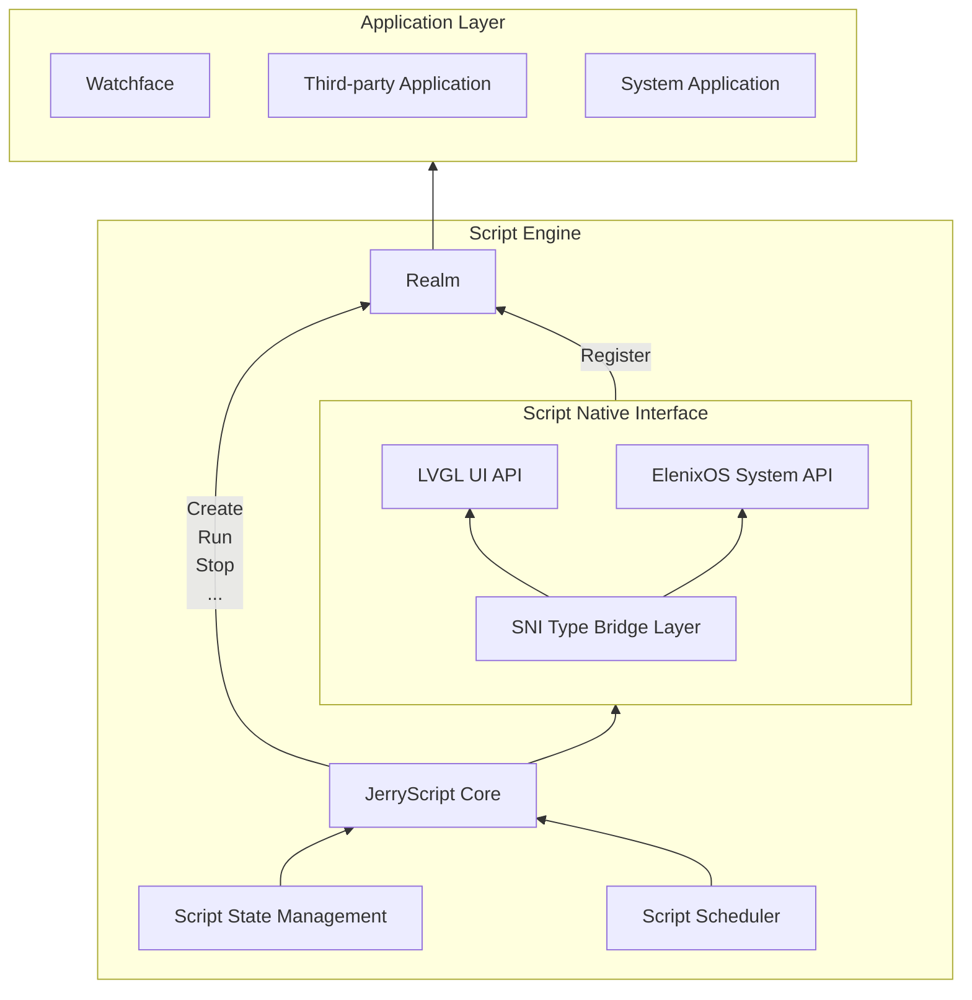
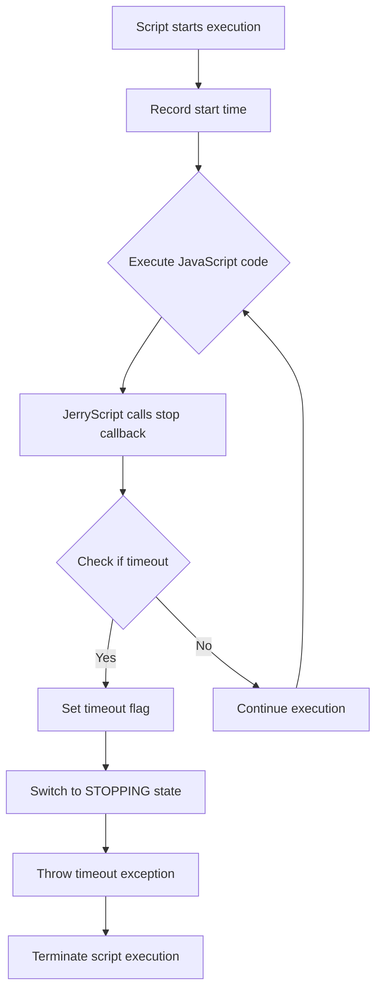
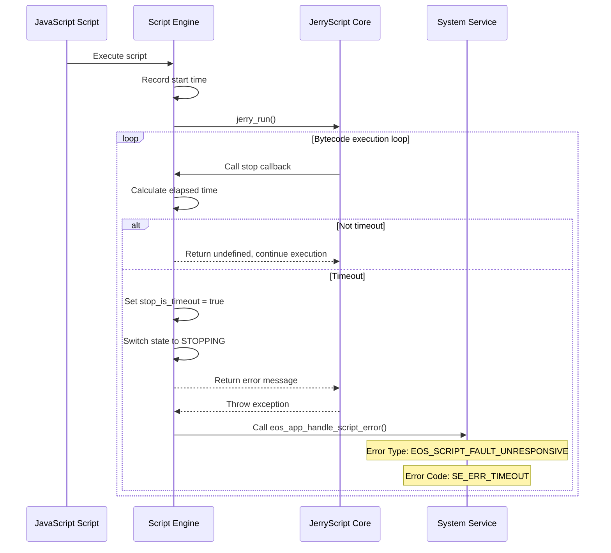

# Script Engine

## Overview

ElenixOS's watchfaces and applications are uniformly driven by Script Engine, which is based on [JerryScript](https://jerryscript.net) for compiling and executing JavaScript code.

JerryScript is a lightweight JavaScript engine designed to run on resource-constrained devices, such as microcontrollers:

* Very little RAM available for engine (&lt;64 KB RAM)
* Limited ROM space for engine code (&lt;200 KB ROM)

The engine supports on-device compilation, execution, and provides JavaScript access to peripherals.

Open source address: https://github.com/jerryscript-project/jerryscript


## System Architecture

The Script Engine is core module of ElenixOS, responsible for operation of watchfaces and applications.

The architecture of Script Engine is as follows:



## Realm

In ElenixOS, each script runs in an independent ECMAScript Realm. Realm is a concept in ECMAScript language specification used to implement JavaScript's multi-threaded execution environment. Realm is a complete JavaScript runtime environment, including global objects, built-in objects, state, and APIs. The role of Realm is to isolate runtime environments between different scripts, ensuring that scripts do not interfere with each other. The system mounts public APIs to each Realm, enabling scripts to safely access UI, system services, and hardware interfaces while maintaining isolation of global objects, built-in objects, and state, thereby achieving a reliable and secure multi-script runtime environment.

Realm can only be used in single-threaded environment and cannot be shared across threads. Each Realm has its own global objects and built-in objects, and scripts can only access objects in their own Realm, cannot directly access objects in other Realms.

## Script State Management

The script state management module is responsible for managing running state of scripts, including script creation, running, stopping, etc.

Script states include:

| State Name | Description |
|------------|-------------|
| SCRIPT_STATE_STOPPED | Stopped: Script has stopped and resources are released |
| SCRIPT_STATE_RUNNING | Running: Script is running |
| SCRIPT_STATE_SUSPEND | Suspended: Script has completed running, waiting for callback |
| SCRIPT_STATE_STOPPING | Stopping: Script is being stopped |
| SCRIPT_STATE_ERROR | Error: Script execution error |

Script state enum type defined by `script_state_t`, used to describe running state of script.

### Script State Description

#### SCRIPT_STATE_RUNNING

Script is running, for example executing `eos.lv_label_create(eos_screen_active());`. In this state, the script engine is executing JavaScript code, which may create UI elements, call system APIs, or perform other operations.

#### SCRIPT_STATE_SUSPEND

Generally, after drawing is completed, the script enters suspended state `SCRIPT_STATE_SUSPEND`. At this time, if external callback is triggered, it can be called normally. In this state, the script engine pauses execution but maintains state of all variables and objects, waiting for external events (such as user interaction, timers, sensor data, etc.) to trigger callback functions.

#### SCRIPT_STATE_STOPPED

Script not started and script closed are in this state. At this time, related resources of the script have been cleaned up, sandbox has been deleted, and no callbacks registered in the script will be called anymore. In this state, the script engine has completely released all resources, including Realm, global objects, and all registered callback functions.

## Startup Process

The startup process of script engine is as follows:

1. **During system startup**: Need to call `script_engine_init` to initialize script engine and create necessary runtime environment
2. **During script startup**: Will create a new `realm` to provide sandbox for isolation, ensuring that runtime environments between different scripts are independent
3. **Automatic registration**: New `realm` will automatically register all functions and symbols, including LVGL UI API and ElenixOS system API
4. **Script execution**: Use `eos.*` in script to access functions and symbols for UI drawing and system calls

## Script Usage

### Basic Usage

Directly call LVGL functions in script to draw UI. After drawing is completed, no operation is needed. System internally calls `lv_timer_handler` to perform rendering operations. System automatically manages UI refresh and rendering, developers only need to focus on UI creation and layout.

### Script Stop

If you want to close the script, use `script_engine_request_stop();`. This function will request to stop currently running script, release related resources, and clean up Realm.

### Script Usage Notes

1. **No Dead Loops**: Dead loops are prohibited in scripts, otherwise they will block UI and cause system unable to respond to user operations
2. **Resource Management**: Objects and resources created by scripts will be automatically cleaned up when script stops, but it is recommended to manually release resources that are no longer needed at appropriate times
3. **Callback Functions**: Avoid executing time-consuming operations in callback functions to avoid affecting UI response speed
4. **Global Variables**: Try to avoid using too many global variables to avoid occupying too much memory
5. **Error Handling**: It is recommended to add error handling logic in key code segments to improve script robustness

## JS API Binding Layer

The JS API layer is interaction layer between Script Engine and underlying hardware resources (such as UI drawing, sensors, peripherals), responsible for converting underlying hardware resources into JS APIs and binding them to Realm.

### JS API Directory

1. ElenixOS System API: [ElenixOS](./script_engine/elenix_os)
2. LVGL UI API: [LVGL](./script_engine/lvgl)

## Timeout Mechanism

### Overview

Since JavaScript is single-threaded, if there are infinite loops or long-time blocking operations in the script, it will cause the entire system to become unresponsive. To prevent this, ElenixOS Script Engine implements a timeout mechanism that can automatically detect and terminate timed-out script execution.

### Timeout Mechanism Principle

The timeout mechanism of the script engine is implemented based on JerryScript's `jerry_execution_stop_callback` mechanism. When JerryScript executes JavaScript code, it regularly calls the registered stop callback function, which the script engine uses to detect whether execution time has timed out.

**Timeout Detection Flow:**



### Core Implementation

#### Timeout Detection Callback Function

```c
static jerry_value_t _vm_exec_stop_callback(void *user_p)
{
    (void)user_p;

    if (engine_ctx.state == SCRIPT_STATE_STOPPING)
    {
        return jerry_string_sz("Script terminated by request");
    }

    if (engine_ctx.script_timeout_ms > 0 && engine_ctx.state == SCRIPT_STATE_RUNNING)
    {
        uint32_t elapsed = eos_tick_get() - engine_ctx.script_start_time;
        if (elapsed >= engine_ctx.script_timeout_ms)
        {
            EOS_LOG_W("Script execution timeout (%u ms)", elapsed);
            engine_ctx.stop_is_timeout = true;
            _change_state(SCRIPT_STATE_STOPPING);
            return jerry_string_sz("Script execution timeout");
        }
    }

    return jerry_undefined();
}
```

#### Key Data Structure

```c
typedef struct {
    script_state_t state;         /**< Current state */
    uint32_t script_start_time;   /**< Script execution start time (tick) */
    uint32_t script_timeout_ms;   /**< Script execution timeout (ms), 0 = no timeout */
    bool stop_is_timeout;         /**< Flag indicating if stop was caused by timeout */
} script_engine_context_t;
```

### Timeout Configuration

#### Default Timeout

```c
#define SCRIPT_DEFAULT_TIMEOUT_MS 3000  // Default timeout: 3 seconds
```

#### Set Timeout

```c
void script_engine_set_timeout(uint32_t timeout_ms);
uint32_t script_engine_get_timeout(void);
```

**Parameters:**
- `timeout_ms`: Timeout in milliseconds, set to 0 to disable timeout detection

### Dead Loop Solution

#### Problem Scenario

Infinite loops in JavaScript scripts cause scripts to execute indefinitely and fail to respond to system events:

```javascript
// Dangerous: infinite loop
while (true) {
    // Do something
}

// Dangerous: long-time blocking
function heavyCalculation() {
    let result = 0;
    for (let i = 0; i < 1000000000; i++) {
        result += i;
    }
    return result;
}
```

#### Solution

The timeout mechanism solves the dead loop problem in the following ways:

1. **Periodic Detection**: JerryScript calls the stop callback after executing a certain number of bytecode instructions
2. **Time Calculation**: Calculate the time elapsed since the script started execution in the callback
3. **Timeout Handling**: If the elapsed time exceeds the set timeout:
   - Set `stop_is_timeout` flag to true
   - Switch script state to `SCRIPT_STATE_STOPPING`
   - Return error message, JerryScript throws exception to terminate execution
4. **Error Handling**: After catching the timeout exception, the system calls `eos_app_handle_script_error` to handle the script error

#### Timeout Handling Flow



### Error Types

The script engine defines dedicated timeout error types:

| Error Type | Error Code | Description |
|------------|------------|-------------|
| `EOS_SCRIPT_FAULT_UNRESPONSIVE` | `SE_ERR_TIMEOUT` | Script execution timeout/unresponsive |
| `EOS_SCRIPT_FAULT_ERROR_EXCEPTION` | `SE_ERR_JERRY_EXCEPTION` | Script execution exception |

### Timeout Detection Timing

Timeout detection occurs at the following times:

1. **When script starts executing**: Record start time `script_start_time`
2. **When callback function is called**: When script resumes from suspended state, re-record start time
3. **JerryScript periodic callback**: Regular detection during execution

### Best Practices

#### Avoid Long-Time Blocking

```javascript
// Not recommended: blocks main thread for a long time
function processData(data) {
    for (let i = 0; i < data.length; i++) {
        // Process each data item
        heavyProcessing(data[i]);
    }
}

// Recommended: process in batches using timers
function processDataAsync(data, index = 0) {
    if (index >= data.length) return;
    
    // Process only a small portion each time
    const batchSize = 100;
    for (let i = index; i < Math.min(index + batchSize, data.length); i++) {
        heavyProcessing(data[i]);
    }
    
    // Continue processing in next event loop
    setTimeout(() => processDataAsync(data, index + batchSize), 0);
}
```

#### Use LVGL Timer Component (SNI)

For computationally intensive tasks, it is recommended to use the LVGL Timer component to split tasks into multiple small tasks to avoid blocking the main thread. By executing in batches through timers, UI responsiveness can be maintained.

```javascript
// Execute time-consuming operations using LVGL Timer
function heavyTask(data, total, current = 0) {
    // Number of items to process per frame
    const chunkSize = 100;
    let processed = 0;
    
    // Process current batch
    for (let i = current; i < current + chunkSize && i < total; i++) {
        // Execute single item processing
        processItem(data[i]);
        processed++;
    }
    
    // Update progress
    const newCurrent = current + processed;
    
    if (newCurrent < total) {
        // Create timer to continue processing in next frame
        const timer = new lv.timer();
        timer.setCb(() => {
            heavyTask(data, total, newCurrent);
            timer.delete(); // Delete timer after completion
        });
        timer.setPeriod(0); // Execute as soon as possible (next LVGL tick)
        timer.start();
    } else {
        // Task completed
        eos.console.log("Heavy task completed");
    }
}

// Usage example
const largeData = generateLargeData();
heavyTask(largeData, largeData.length);
```

#### Set Appropriate Timeout

Adjust timeout according to actual script requirements:

```c
// For simple UI scripts, use default timeout
script_engine_set_timeout(3000);  // 3 seconds

// For scripts requiring long-time calculations, extend timeout appropriately
script_engine_set_timeout(10000); // 10 seconds

// Disable timeout detection (not recommended)
script_engine_set_timeout(0);
```

### Summary

The timeout mechanism is an important security guarantee for the ElenixOS Script Engine. By periodically detecting script execution time, it can effectively prevent system unresponsiveness caused by infinite loops or long-time blocking. When timeout is detected, the system gracefully terminates script execution and notifies the application management module for error handling, ensuring system stability and reliability.