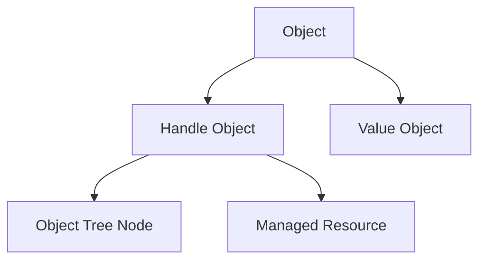
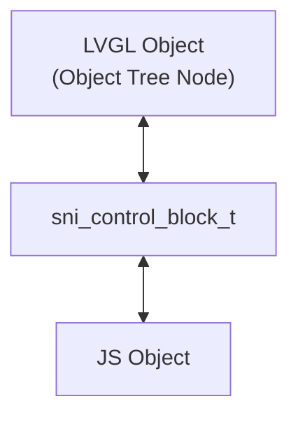
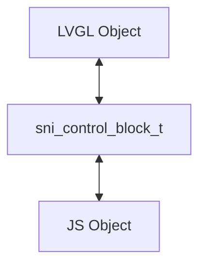
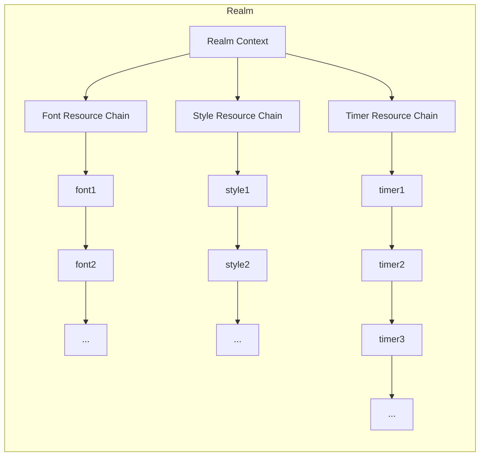

# Script Native Interface (SNI)

The Script Native Interface (**SNI**) is an interface for calling C functions from scripts.

## SNI Type Bridge Layer

SNI classifies structures into two categories: Value Objects and Handle Objects.

To better manage the lifecycle of handle objects, SNI further establishes models and subdivides Handle Objects.

### Model Establishment

An SNI object is divided into Handle Object and Value Object.
Handle Objects are further classified into:
1. Object Tree Node
2. Managed Resource



This classification is to better manage their lifecycles. The essential reason is that the lifecycles of the two types of resources are different: the lifecycle of Object Tree Nodes strictly depends on the LVGL object tree and will be cleaned up along with the object tree when the script stops running; while Managed Resources will continue to exist after creation until the Realm is destroyed.

Here's an analogy:

| JS Runtime | Analogous to |
|------------|--------------|
| Object Tree Node | Stack (structured lifecycle) |
| Managed Resource | Heap (free lifecycle) |

### Basic Data Types

Basic data types include:
- Number
- Boolean
- String

SNI directly uses JerryScript's API to handle basic data types.

### Value Object

**Value Objects** are runtime objects that do not independently own underlying resources and are used to represent pure data or configuration values.

Value Objects do not require explicit creation or destruction, and their lifecycle is typically limited to a single function call or expression evaluation process. They are directly wrapped as JS objects in the bridge layer, and their member variables are directly mapped as properties of JS objects.
They are not registered or tracked by the runtime and do not participate in Realm-level resource management.

The lifecycle of Value Objects is **Stack-Scoped**.

Stack-Scoped: Managed automatically by the JS engine. When the function call ends, the Value Objects on the stack are automatically destroyed.

### Handle Object

**Handle Objects** are runtime objects that represent references to underlying resources. They do not contain resource data themselves but serve as indirect access entries to underlying allocated entities.

Handle Objects can be obtained through explicit creation or by getting existing system handle objects (e.g., getting the active view), and support explicit destruction.
Their lifecycle is directly controlled by script logic, but the runtime provides unified fallback recovery when the Realm ends to prevent resource leaks.

The lifecycle of Handle Objects is **Heap-Scoped**.

Heap-Scoped: Created explicitly by script logic, underlying resources are released by calling specific destruction functions. When all references to the Handle Object are released, the runtime automatically triggers its destruction process. In this system, objects with Heap-Scoped lifecycle are destroyed uniformly when the Realm ends.

#### Object Tree Node

Object Tree Nodes refer to objects that will be mounted to the LVGL object tree. For example, instances created by the `lv.obj` class and `lv.button` class all belong to Object Tree Nodes. They all have corresponding creation functions like `lv_obj_create`.

The lifecycle of tree nodes is complex and will be described uniformly below.

##### Tree Node Creation
When creating a tree node, such as `lv.obj`:
```js
let parent = eos.view.active()    // Get current active view
let obj = new lv.obj(parent);     // Create tree node `lv.obj`
```
Internally, SNI performs type validation and validity validation on the incoming parameters before calling `lv_obj_create()`.

##### Tree Node Destruction
Tree nodes can be destroyed in two ways:
1. Automatic destruction: When the Realm exits, the Realm's resources are automatically cleaned up, and the root View is deleted; while resources on the resource tree are automatically cleaned up, which is done by LVGL.
2. Manual destruction: During Realm runtime, the instance method `delete()` can be called to delete the tree node.

##### Tree Node Lookup
###### Core Idea
Tree nodes are usually accessed extensively in JS, so it must be ensured that JS and C can achieve O(1) complexity to minimize overhead.
Therefore, SNI introduces an independent "Control Block" between JS objects and LVGL objects.
Both sides introduce an independent "Control Block" for coordination:
- Object Identity
- Lifecycle
- Resource State
- Bidirectional Access Relationship
Its structure is similar to:

The control block itself is not equal to the underlying object, but exists as an "intermediate coordination layer between JS and Native".
This enables:
- Strong Identity
- O(1) bidirectional lookup
- Lifecycle synchronization
- Object validity validation
Where:
- JS objects access the control block through `native_ptr`
- LVGL objects access the control block through `user_data`
Both sides ultimately share the same `sni_control_block_t`.

For more information on shared pointer control blocks, refer to:
- https://en.cppreference.com/cpp/memory/shared_ptr
- https://en.wikipedia.org/wiki/Smart_pointer
###### C Lookup

Tree nodes usually have a `user_data` field, which is taken over by SNI. The JS side does not need `user_data` because JS objects can store content themselves.
SNI takes over the `user_data` data type definition:
```c
typedef struct{
    void *ptr;              // C pointer
    jerry_value_t obj;      // JS object
    sni_type_t type;        // Type
    bool alive;             // Pointer alive flag to avoid use after free on JS side
    ...
} sni_control_block_t;
```
Where:
- `ptr` is used by the JS side to access the underlying C object with O(1) complexity.
- `obj` is used by the C side to look up the JS object with O(1) complexity.
- `type` is used for runtime type validation to prevent incorrect type access.
- `alive` is used to mark whether the underlying object is still alive.
SNI completely takes over the `user_data` field of Object Tree Nodes:
```text
lv_obj_t
 └─ user_data
     └─ sni_control_block_t
```
At the same time, the `native_ptr` of the JS object also points to the same `sni_control_block_t`:
```text
JS Object
 └─ native_ptr
     └─ sni_control_block_t
```
Therefore:
```text
JS ↔ ControlBlock ↔ LVGL
```
Forming a bidirectional O(1) access structure.
###### JS → C Lookup
When JS calls an instance method:
```js
obj.setSize(100, 50);
```
SNI will:
1. Get `native_ptr` from the JS object
2. Convert it to `sni_control_block_t *`
3. Validate:
    - Whether the control block exists
    - Whether `alive` is `true`
    - Whether the type matches
4. Get the underlying `ptr`
5. Call the corresponding LVGL API
Pseudocode:
```c
sni_control_block_t *cb =
    jerry_object_get_native_ptr(js_obj, &sni_native_info);

if(!cb || !cb->alive){
    return SNI_ERR_DEAD_OBJECT;
}

if(cb->type != SNI_TYPE_OBJ){
    return SNI_ERR_INVALID_TYPE;
}

lv_obj_set_size((lv_obj_t *)cb->ptr, 100, 50);
```
Since the control block is directly held by the JS object, the entire lookup process is O(1).
###### C → JS Lookup
When the C side needs to get the corresponding JS object:
For example:
- Event callbacks
- Child object lookup
- Object tree traversal
- Native event forwarding

SNI will:
1. Get the LVGL object
2. Read its `user_data`
3. Convert to `sni_control_block_t *`
4. Directly get the `obj` from it

Pseudocode:
```c
sni_control_block_t *cb =
    lv_obj_get_user_data(obj);

if(!cb || !cb->alive){
    return jerry_undefined();
}

return cb->obj;
```
Since the LVGL object directly holds the control block, the lookup is also O(1).
###### Strong Identity
SNI guarantees:
```text
One LVGL object
corresponds to exactly one JS object
```
That is:
```js
a === b
```
Always true when the underlying LVGL objects are the same.
This is achieved through `sni_control_block_t`:

Neither side will repeatedly create new wrapper objects, but always reuse the `obj` in the existing control block.
This ensures:
- JS object identity consistency
- Correct Map/Set behavior
- Stable event targets
- Stable child lookups
- Stable caching logic
###### Lifecycle Synchronization
The lifecycle of tree nodes is determined by LVGL.
Therefore:
- JS objects cannot determine whether the underlying object is alive
- JS can only observe whether the object is still valid
When an LVGL object is deleted, `LV_EVENT_DELETE` is triggered

SNI will:

1. Set:
```c
cb->alive = false;
```
2. Clean up:
```c
cb->ptr = NULL;
```
3. Throw object invalid exception on subsequent JS access
Thus avoiding `use after free` issues.

#### Managed Resource

The lifecycle of Managed Resources must be completely taken over by SNI and strictly controlled by SNI.

Managed Resources continue to exist after creation until the Realm is destroyed, at which point these resources are cleaned up uniformly.

Managed Resources often do not have a `user_data` field, making it difficult to achieve O(1) complexity access. Therefore, linked lists are used to store Managed Resources by category:



##### Managed Resource Creation
Managed resources are generally created similarly to tree nodes, directly using native creation functions. However, some resources do not have creation functions but have initialization functions, such as the style resource `lv.style`. SNI unifies the semantics for managing such resources, allowing creation through `new`. SNI will allocate these resources through certain methods at the bottom layer (such as directly calling `eos_malloc` to create heap memory or obtaining pre-allocated continuous memory), and then initialize them, so that the object returned by `new` is immediately usable without requiring `init` initialization.

##### Managed Resource Destruction
Managed resources all provide a `delete()` method to destroy resources. If resources are not destroyed after the JS lifecycle ends, SNI will reclaim all managed resources in this context uniformly.

##### Managed Resource Lookup
Resource lookup is difficult to achieve O(1) time complexity, so SNI directly uses categorized linked lists to store managed resources. When looking up managed resources, the resource linked list header is obtained according to the category first, and then the linked list is traversed to find the resource. This categorization can greatly reduce the lookup range, reducing the complexity from O(n) when all resources are mixed in one linked list to O(n/k) when filtered by type.

## API Export Layer

The **SNI API Export Layer** is responsible for exporting APIs to JS Realm, making them directly callable in scripts. APIs are defined through **API Description Tables**.

The description table includes:
- Functions
- Enums
- Constants
- Sub-namespaces

This layer is mainly responsible for API structure organization.

### API Description Table

The API Description Table is an array of C language structures, where each element represents an API entry.

Each API entry contains the following fields:
- Name
- Type
- Value

:::danger
In the last element of the array, the name field must be NULL to mark the end of the array.
:::

**API Types**

Currently, SNI supports the following API types:
- Functions: Function pointers of type `jerry_external_handler_t`
- Constants: Integer constants, floating-point constants, string constants
- Sub-entries: Pointers to sub-entries for implementing recursive namespace structures

#### Function API

Function types are actually function pointers of type `jerry_external_handler_t`. You need to implement functions of this type to handle JS calls.

The parameters and return values of this function must comply with the requirements of the JerryScript engine. For details, refer to https://jerryscript.net/api-reference/#jerry_external_handler_t.

#### Constant API

Constant APIs refer to integer values, floating-point constants, and string constants defined in the description table. They are directly exported as constants in JS.
They are usually enumeration types or constants defined by macros in C code.

#### Sub-entry API

Sub-entry APIs refer to pointers to sub-entries defined in the description table, used to implement recursive namespace structures.

For example:

```c
jerry_value_t my_lv_obj_create(const jerry_call_info_t *call_info_p,
                               const jerry_value_t args_p[],
                               const jerry_length_t args_count)
{
    // Parameter checking
    // ...
    // Parameter type conversion
    // ...
    // Execute C function
    // ...
    // Check return value
    // ...
    // Return created Handle Object
}

const struct sni_api_entry_t lvgl_api_desc[] = {
    { "obj", SNI_ENTRY_NAMESPACE, { .sub_entries = lvgl_obj_api_desc } },
    // Other sub-entries...
};

const struct sni_api_entry_t lvgl_obj_api_desc[] = {
    { "create", SNI_ENTRY_FUNCTION, { .function = my_lv_obj_create } },
    // Other sub-entries...
};
```

In this way, you can call the C function `my_lv_obj_create()` through `lv.obj.create()` in JS.

### API Export Process

API export consists of the following processes:
1. Obtain description table code
2. Parse the description table
3. Mount the API

#### Obtain Description Table Code

Description table code is generally generated through Python scripts.

For example, the description table code for LVGL API can be generated with the following command:

```bash
python3 generate_lvgl_desc.py
```

Of course, you can also write the description table code yourself according to your needs.

#### Parse Description Table

To parse the description table, simply call the `sni_api_build()` function to build the API description table. If the build is successful, it will return a JS object of type `jerry_value_t`, with all API entries mounted under this object. This object is usually called the Global Native Capability Object. For example, `lv` is a global native object.

#### Mount API

The API mounting process is relatively simple. Just call the `sni_api_mount()` function to mount the API description table to the specified JS Realm.

For example, mounting the LVGL API description table to a specified Realm can be achieved with the following code:

```c
jerry_value_t lvgl_api_obj = sni_api_build(lvgl_api_desc);
sni_api_mount(jerry_realm, lvgl_api_obj, "lv");
```

After successful mounting, the LVGL API can be called directly in the JS Realm.

For example:

```js
lv.obj.create();
```