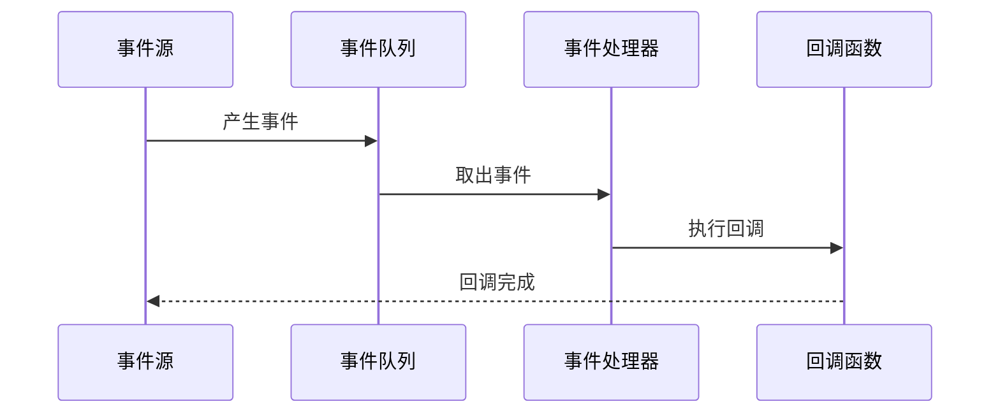

# 事件系统

ElenaOS 的事件系统是一个核心组件，负责处理系统内部的事件传递、分发和处理。它提供了一套完整的事件注册、派发和广播机制，支持同步和异步事件处理。

## 事件注册与派发

### 事件注册

事件系统允许组件注册事件监听器，以便在特定事件发生时得到通知：

```c
// 注册事件监听器
eos_event_handler_t handler = eos_event_register("event.name", event_callback, user_data);

// 事件回调函数
void event_callback(const char *event_name, void *data, void *user_data) {
    // 处理事件
}
```

### 事件派发

事件系统负责将事件派发给相应的监听器：

```c
// 派发事件
eos_event_t event = {
    .name = "event.name",
    .data = event_data,
    .data_size = sizeof(event_data)
};
eos_event_dispatch(&event);
```

### 事件注销

当不再需要监听事件时，可以注销事件监听器：

```c
// 注销事件监听器
eos_event_unregister(handler);
```

## 全局广播机制

ElenaOS 支持全局事件广播机制，允许事件在整个系统中传播：

### 广播事件

```c
// 广播事件
eos_event_broadcast("system.event", event_data, sizeof(event_data));
```

### 订阅广播

```c
// 订阅广播事件
eos_event_handler_t handler = eos_event_subscribe("system.event", event_callback, user_data);
```

### 广播层级

事件系统支持不同层级的广播：

1. **系统级广播**：在整个系统范围内广播
2. **模块级广播**：在特定模块范围内广播
3. **应用级广播**：在特定应用范围内广播

## UI 事件与系统事件

### UI 事件

UI 事件是与用户界面相关的事件，如触摸、点击、滑动等：

| 事件类型 | 描述 | 触发条件 |
|---------|------|----------|
| `ui.touch` | 触摸事件 | 用户触摸屏幕 |
| `ui.click` | 点击事件 | 用户点击控件 |
| `ui.swipe` | 滑动事件 | 用户滑动屏幕 |
| `ui.long_press` | 长按事件 | 用户长按屏幕 |

### 系统事件

系统事件是与系统状态相关的事件，如电池状态变化、系统启动等：

| 事件类型 | 描述 | 触发条件 |
|---------|------|----------|
| `system.startup` | 系统启动 | 系统启动完成 |
| `system.shutdown` | 系统关机 | 系统即将关机 |
| `battery.change` | 电池状态变化 | 电池电量或充电状态变化 |
| `sensor.data` | 传感器数据 | 传感器数据更新 |

## 异步回调时序

ElenaOS 的事件系统支持异步回调，确保系统的响应性和稳定性：

### 异步事件处理

```c
// 异步派发事件
eos_event_dispatch_async(&event);

// 异步回调函数
void async_callback(void *data) {
    // 处理异步事件
}
```

### 回调时序

1. **事件产生**：事件源产生事件
2. **事件入队**：事件被加入事件队列
3. **事件处理**：事件处理器按顺序处理事件
4. **回调执行**：回调函数在适当的时机执行



## 事件优先级

事件系统支持事件优先级，确保重要事件能够优先处理：

| 优先级 | 描述 | 适用场景 |
|--------|------|----------|
| `EOS_EVENT_PRIORITY_HIGH` | 高优先级 | 系统紧急事件 |
| `EOS_EVENT_PRIORITY_NORMAL` | 正常优先级 | 普通用户事件 |
| `EOS_EVENT_PRIORITY_LOW` | 低优先级 | 非紧急系统事件 |

### 设置事件优先级

```c
// 设置事件优先级
event.priority = EOS_EVENT_PRIORITY_HIGH;
eos_event_dispatch(&event);
```

## 事件过滤

事件系统支持事件过滤，允许监听器只接收特定类型的事件：

### 事件过滤器

```c
// 创建事件过滤器
eos_event_filter_t filter = eos_event_filter_create("event.*");

// 注册带过滤器的监听器
eos_event_handler_t handler = eos_event_register_filtered("event.name", event_callback, user_data, filter);

// 销毁过滤器
eos_event_filter_destroy(filter);
```

## 事件系统实现

### 核心组件

1. **事件管理器**：管理事件的注册、派发和注销
2. **事件队列**：存储待处理的事件
3. **事件处理器**：处理事件并执行回调
4. **事件过滤器**：过滤事件，只传递符合条件的事件

### 实现细节

- **线程安全**：事件系统是线程安全的，可以在多线程环境中使用
- **内存管理**：事件系统会自动管理事件相关的内存
- **错误处理**：事件系统会处理事件处理过程中的错误

## 使用示例

### 注册和处理事件

```c
// 注册事件监听器
void battery_change_callback(const char *event_name, void *data, void *user_data) {
    battery_info_t *info = (battery_info_t *)data;
    printf("Battery level: %d%%, Charging: %s\n", info->level, info->charging ? "yes" : "no");
}

// 在初始化函数中注册
void app_init(void) {
    eos_event_register("battery.change", battery_change_callback, NULL);
}

// 派发事件
void update_battery_status(void) {
    battery_info_t info = {
        .level = 80,
        .charging = true
    };
    eos_event_dispatch("battery.change", &info, sizeof(info));
}
```

### 异步事件处理

```c
// 异步回调函数
void async_task(void *data) {
    printf("Async task executed: %s\n", (char *)data);
}

// 派发异步事件
void schedule_async_task(void) {
    char *message = "Hello from async task";
    eos_event_dispatch_async("async.task", message, strlen(message) + 1);
}
```

## 最佳实践

1. **合理使用事件**：只在必要时使用事件，避免过度使用
2. **事件命名规范**：使用清晰、明确的事件名称，如 `module.event`
3. **回调函数设计**：回调函数应简洁明了，避免执行耗时操作
4. **错误处理**：在回调函数中妥善处理错误
5. **资源管理**：在不再需要时及时注销事件监听器

## 总结

ElenaOS 的事件系统是一个强大而灵活的组件，它通过统一的事件注册、派发和广播机制，实现了系统内部的高效通信。通过合理使用事件系统，开发者可以构建更加模块化、可维护的应用。